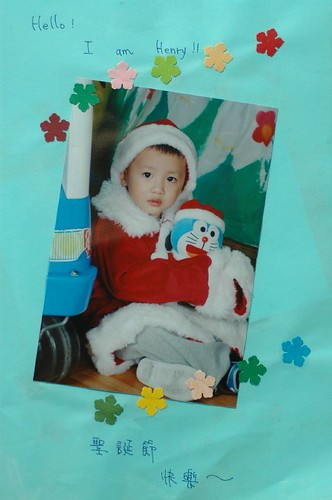

上學期末幼稚園發回阿徹這一學期的作品本以及照片集  
看著照片感受著阿徹在學校的點滴  
突然有種吾家有子初長成的喜悅  
還記得一開始去唸書時學校發回學生資料表要填寫  
上頭問些對小孩教學的期望我們皆邊不著際的寫些希望阿徹快樂之類的話  
甚至連對於未來期許也是希望阿徹以後成為頂天立地的男子漢  
呵呵 有點戲謔的回答  
但是說真的打阿徹出生到現在對他的期望真的只是希望他每天健康 快樂 是個喜歡自己也同時被別人喜歡的小孩

雖然在去接阿徹時常常會有阿公阿嬤級的人用著可憐的語氣說著  
"是幾歲阿 書包都快比人大了"  
"這麼小就來上學阿"  
總讓我內心浮起對阿徹小小的愧疚感  
但是看著這些日子來阿徹的成長與學習  
我想這起碼不是個太糟的決定

阿徹的成長甚至該說鬼靈精怪 從他的言語就可窺得一二:  
(被媽媽教訓一個鐘頭後準備睡覺的時刻)  
徹爸"你睡不著阿"  
徹"嗯 我好難過"  
徹爸"為什麼難過"  
徹"因為媽媽不喜歡我 爸爸不喜歡我"  
徹爸....

(某個早上媽媽抱著阿徹下樓梯 準備出門上學)  
徹媽"阿徹這幾天好棒 都乖乖起床出門上學沒有哭哭鬧鬧 我覺得你好可愛喔"  
徹"爸爸媽媽生氣的時候 我也好難過"  
ㄟ...看似無關的兩句話 其實有點因果關係存在

(媽媽抱著妹妹要請求阿徹幫忙的時候)  
徹媽"阿徹 可不可以幫媽媽拿那各東西"  
徹"我正在烤肉爺 我沒有辦法幫你耶..."

(準備從阿嬤家回家而阿嬤抱著妹妹時)  
阿嬤"妹妹跟阿嬤住好不好"  
徹"不行 他會好吵 他會哭哭耶"  
呵呵...說了這理由應該沒人可以再抱著妹妹騙哭阿徹了

(生了阿徹一整天氣的徹爸)  
徹爸"你都不乖 爸爸好難過"  
徹"爸爸不乖 我也好難過"  
呵..應該是想說爸爸擺臭臉給他看 他也很難過吧
