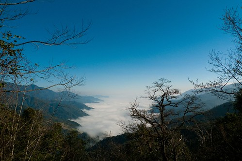

不是我...不是我...這次真的不是我... 

雖然我一直思思念念著武陵的櫻花(我想這應該也不是啥秘密了) 身體裏也三不五時有個粉紅佳人跳出來對我高喊"櫻花好美 不去會後悔喔" 但我那一腳還真的很不好意思就給他踢出去 曾經試探性的跟徹爸說"真的好想去武陵賞櫻 你覺得這麼樣 " 徹爸都悠悠卻一臉認真的跟我說"我想想"  可是卻都沒下聞 (這樣算是敷衍我嗎)

而事情的發生就在2月20幾號的那週 看到了魔鬼甄竟然夜奔武陵賞櫻 哇勒!!! 連他都夜奔去了 我......這個自稱中了武陵毒的人卻竟然還沒看過武陵最美的時候 這..................真的情何以堪阿!!!!!!!

給徹爸看了魔鬼甄的網站後 我提起勇氣小聲的問徹爸"我們來去好不" 徹爸總算給了一個大於50%機率的"我想想..." 然後我們盤算著各種可能去的時間點 住宿點 考量兩人的工作以及住宿情況後 這趟賞櫻行的困難度還真的有點高 問了徹爸"當日來回 你可以嗎?"  徹爸一臉堅毅的對著心愛老婆說"我可以的!" 於是我們決定也要來搞"夜奔武陵" 這對於從來不透早摸黑出門的我們來說還真是"破天荒"阿 雖然兩人直搖頭說"瘋了 瘋了 真的瘋了 " 但是好開心喔....

決定夜奔之後剩下的兩天 我三不五時上武陵農場的網站查詢最新花況 有網友在討論區寫著 "請問228到底還可不可以看到櫻花盛開ㄚ? 還是都掉ㄉ差不多~ 麻煩請回答詳細點~不要給模糊ㄉ答案必竟那路途有點遙遠~不想白跑一趟 煩請據實告知~~" 語氣之嚴重 可見賞櫻對大家來講是多大 多重要的一件事阿!!

總算在週五的回應中 看到農場人員回覆目前櫻花剩7成 3/1(週日)櫻花預估5成 嗚~~~看到七成五成這數字 我的心都涼一半了 5-7成的櫻花好像就不太値得幹夜奔這種傻事了 於是我下了決定 跟徹爸說"算了!還是明年再去吧 週六還是照本來計畫帶阿徹她們去苗栗採草莓" 真的喔~ 我下了決定後就沒有再想了(反倒有種解毒了的感覺) 是徹爸週五下班回家後說"還是去武陵吧! 就算只有5-7成的櫻花 還是很壯觀吧!" 於是衝著徹爸難得下的決定  (真的是他最後決定的喔! 關於玩這種事他很少會下決定的) 我們的武陵第三彈 就這樣發出去了~~~~

既然決定要清早5點就出門 週五晚上我們趕著把所有東西打理好 然後11點前就上床睡覺了 週六早上四點半鬧鐘刺耳的響起後(平常都沒覺得這麼大聲) 我跟徹爸起床刷牙換衣 剛好阿徹也起床尿尿然後就醒了 接著愛愛也醒來討ㄋㄟ喝 既然兩個小人都醒來 我跟徹爸樂得輕鬆不用摸黑扛小人上車 於是5點10分 我們的車出了車庫的門 6點下了北宜高速公路

在員山買早餐/中餐時 天還有點暗而且還下著絲思細雨

(阿徹的新歡: 狐狸"小莉"在他早上起床尿尿時 不小心掉到馬桶裏 可是阿徹堅持還是要帶著小莉一同去野餐 於是小莉被"曬"在這裡)

而小人也還在補眠中 (阿徹ㄍ一ㄥ到下雪燧後才沉沉睡去 但三不五時起來看窗外 然後念著"到了沒"或是"好美")

   

進入台七甲的河床便道時 還可以看到山頭上白雲裊裊

一路的陰霾在接近思源啞口時全開了 因為我們已經在比雲層還高的地方了...

熟悉的藍天烈陽迎接著我們

過了啞口 一家人都完全醒來 心情隨著沿路出現的櫻花越來越雀躍...

8點30分我們抵達了武陵 (前兩次上武陵都還沒這麼早出門勒) 看到了想望已久的櫻花~~~~

很多花瓣都已掉落  看的出來櫻花已經過了盛開期  (心底有小小失落一下的) 但就如徹爸說的 就算只剩5-7成還是很可觀的 這幾年陸續賞了淡水天元宮 阿里山 九族的櫻花 武陵這5-7成的花況還是No.1

(小愛撿了顆超小的松果 不小心在照相的時候又遮住了自己的眼睛)

藍天襯著櫻花  唉~ 真的美阿

平常8點半都還睡眼惺忪的小愛看的出來還沒完全醒來 ( 需要媽媽哄一下)

喝個豆漿補充體力 今天要開開心心的賞櫻~

辛苦早起開車的徹爸 精神看起來還不錯喔 甚至有點振奮  忙於小兩和小P的PK大賽(徹爸的新廣角小DC 有興趣者歡迎洽詢徹爸)

才八點半遊客中心前已經停滿車輛 聚集人潮 果然大家還是比較喜歡賞花(尤其是櫻花) 之前賞楓賞梅時還不見這樣的人潮

YA!  對於這瘋人之舉 我跟徹爸可得意的哩!

遊客中心前短暫停留後 我們便租了台電動三人車漫遊武陵 好好享受最美季節的武陵....

茶莊前的櫻花也早已吸引滿滿的車潮人潮

櫻花樹前的那顆大楊柳被襯著很突出 但楊柳的青嫩感覺卻很難拍出來

騎著電動車的好處是看到美景說停就停 說拍就拍 還可以懶惰的不下車 在車上用懶人拍照法 (小愛常笑他爸 又在懶人拍照法了)

兒子女兒不買單  今日我是徹爸的最佳Model

要照到正常版的小子需要碰運氣

徹爸本來只要照小愛的 阿徹哥哥硬是過來湊熱鬧 不過很喜歡這張的感覺

遠眺茶莊步道 看來那的櫻花開的有旺喔 等還完電動車後 再去那走走好好品味

往桃山瀑布的路上 很多一叢一叢的櫻花林

雪霸國家公園管理站前的櫻花道 這是上次賞楓時 有人在這寫生的那個view 時隔才3個月多一點點 便是完全不同的色彩景緻

覺得武陵最美的地方 在於順著這條路延伸出去的視野

進入武陵農場收費站前 沿路的山上偶而會有一兩株白白的霧社山櫻出現 萬綠叢中一點白煞是美麗 可是進入武陵後反倒很少有  寥寥可數 但這一株有大 而且站在樹下望上去的感覺很棒 難怪很多人架著腳架在樹下照櫻花 (徹爸一直念說 這些人拿腳架是拿怎樣的 太陽這麼大腳架到底要幹麻啦)

遠看櫻花也許都一樣 反正就是一駝紅一駝白 但站在不同櫻花樹下卻有著不一樣的景緻 感受

我跟徹爸真的超愛這條山路的 去程上哇哇叫 拍的不停 回程上依然還是哇哇叫 大喊怎麼這樣看又不一樣 怎麼這麼美麗...

騎著電動車慢速的行駛著  伴著溫暖陽光 微風徐徐 吼~破表的幸福~~~

過些日子 如果可以在這踏著腳踏車一定又更幸福了

哈哈~~忍不住貼了好多這山路的照片

真的喔~ 如果有機會來武陵 一定要這樣放慢腳步 好好享受漫遊其中的愜意舒適 不同季節 不同景緻 不同感受 但一樣美麗

耀眼的星芒  好閃阿!!!

偶而的谷風 帶來陣陣的櫻花雨 在高興的哇哇大叫時  可得小心花雨不小心飛進嘴巴裏了

徹爸努力的 極期盼的想要錄下櫻花雨的樣子 可是他的運氣真的很背 雨來的時候來不及掏相機 嚴令以待時卻怎樣都不再起風了

花了一個半小時左右騎著電動車來回約1/2的山路 回到遊客中心前已是11點鐘 人潮更多了...

富野渡假村下的櫻花道滿是拍照的人們 還有男女在櫻花樹下的野餐桌拿著高腳杯細細品嘗紅酒

今天徹爸拍很少櫻花的特寫   完全走數大就是美的路線 今日的武陵難得白雲朵朵飄 更是幫徹爸的照片添色不少

遊客中心前的櫻花

昆蟲館旁的櫻花

藍天 白雲 粉紅佳人櫻花...

野餐過後 我們又開著車再進入往桃山瀑布的山路上 有櫻花的地方就有人 就有一台台對著櫻花的相機

哈! 忍不住又拍這路了 不同的藍天白雲帶出不同的感覺ㄇㄟ...

真的很假的白雲跟藍天...

整條路上隨處可以一團團照相的小聚落 我們無聊的每個聚集點都停下來看看到底人家在拍什麼

徹爸這張算是螳螂捕蟬黃雀在後吧! Fu很好的一張照片 少了那幾個人可就少味了

接近桃山瀑布的山路旁有幾個整理好可讓遊客住宿的農莊房間

住在這應該又是另一番的旅遊趣味

再次巡禮完後 我們回到了茶莊停好車 走過兆豐橋 進入茶園步道 這的櫻花(應該是山櫻花吧)大大盛開著阿

一段段的櫻花小徑

不同於遊客中心附近的櫻花景色

當然這也是要花時間 好好走在其中細細享受的

櫻花盛開的樣子大概就是這樣吧

高山 櫻花 茶園 三個完全不相搭的東西卻搭在一起了

茶園步道置高點望下去的view 雪霸國家公園管理處(人家野生的地方)置身在美麗的林間花海中

走累了 涼亭小憩一下

其實從一大早到現在有一點點累了 但覺得今日的夜奔武陵真的很値得  謝謝徹爸的堅持

2點多回到遊客中心買飲料關東煮當作下午茶點心 補充體力準備下山了 剛好廣播說遊客中心有觀霧山椒魚的紀錄片播放 於是應阿徹的要求我們便又進去看影片 順便讓徹爸休息補眠一下 阿徹真的長大  已經看的懂聽的懂了 20分鐘的紀錄片看的津津有味 事後直呼著好好看 下回去還要再看...

三點鐘我們總算離開武陵 結束今日的6小時賞櫻幸福時光

過了思源啞口 進入霧茫茫的雲層中 通過這個雲層 我們就要從人間仙境回到人間煉獄了...

下到宜蘭果然陰雨綿綿  好個仙境煉獄的差別阿.................

後註 : 一日七小時車程+六小時賞花行程下來 徹爸的精神竟出乎我意外的好 問他累嗎?  他說還好哩~ 恩~ 看來以後可以多來搞個這種夜奔一日遊了 武陵的蘋果花 滿樹蘋果 等我阿~~~
