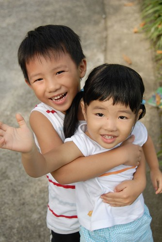
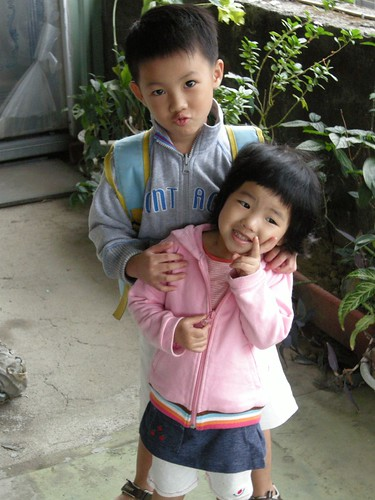
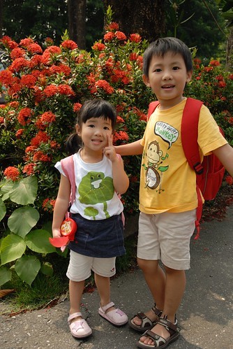

之前去參加愛愛的家長座談會時聽到Elieen說 " 愛愛真的很喜歡他哥哥耶 每次看到哥哥送餐盤上來 愛愛都會好高興的比著一直說"我哥哥耶" 哥哥在遊戲區也常會去抱抱妹妹 親親妹妹 他們兄妹倆的感情好像真的很好..." 兄妹倆在外人面前果然表面功夫做的有好…哈哈!!

不過我也真覺得阿徹算是個好哥哥 除了會把爸爸媽媽訓導他的事也拿出來訓導他妹外 也能在每次畫圖寫字看書時容忍他妹在旁邊瞎搗蛋 且耐著性子教他妹玩他所發明或規定的遊戲 雖然妹妹霸氣搶他的東西時 阿徹總會氣急敗壞的大喊"妹..妹…" 然後跟我們告狀 而我們總是說"你可以不要讓妹妹 讓她就這樣一直哭下去 她我們不會怪你 但是如果可以的話 我們還是希望你可以讓妹妹 慢慢的讓妹妹懂 因為你小時候也是這樣…" 然後阿徹只好自己捶著心肝說"好啦~"後拱手讓妹 在這麼長期的"柔性"勸導下 阿徹似乎越來越明白現實的無奈(妹妹番就是番)而去調整心態 所以常擺出老大哥的姿態教導她妹但卻也寵愛他妹 妹妹搶他東西時(當然還是得哥哥心情好的前提下) 阿徹還是笑咪咪的說 "好吧 先讓你玩 但是等一下要換哥哥喔…" 那一幕兄友妹恭的畫面雖然有點噁但真的很令人窩心…

雖然沒有姊妹的我一直很羨慕家裡有姊妹的 甚至最近偶而會有殘念"要不要為了愛愛拼一個妹妹" (幸好理智還是克制了我) 但說實話我覺得有哥哥的感覺真的很好 (起碼在兄弟變成別人的之前) 那種哥哥保護妹妹 罩妹妹的感覺............. 
