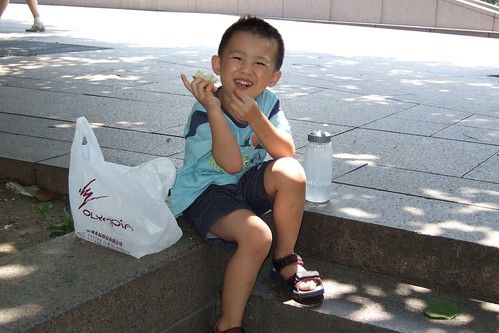

  
  
最近如果太早(5:40分前)去接阿徹  
阿徹都會澳嘟嘟的跟我說"你為什麼這麼早來接我阿"  
不是抱怨沒能讓他看完卡通  
要不就是抱怨讓他沒跟Ella Apple玩到  
徹爸說"你兒子可能怪你打斷他在趴七ㄚ"  
唉~果真是長大了 大到朋友都快比媽媽重要了…

阿徹常會把Ella Apple掛在嘴邊 (還有陳佳菱)  
常開心的說著他們今天又玩了什麼遊戲  
一起玩爸爸媽媽的遊戲  
一起玩光之美少女的遊戲  
我說"你的好朋友怎麼都是女生阿 沒有男生阿  
阿徹認真的想了一會說"有一個男生"  
我說"誰" 徹說"Yellow"  
我說"只有一個阿"  
徹說"因為Yellow會跟我們玩爸爸媽媽 其他男生都會玩甲蟲王 我不敢玩…."  
ㄟ…難怪你都只跟女生玩扮家家酒的遊戲

有朋友笑說"小心阿徹這麼愛紅色愛洋娃娃 以後性向有問題"  
哈哈~我想不會吧  
看他這麼哈女生的樣子還常說要跟陳佳菱結婚 應該是愛女生的吧  
況且看他拿著洋娃娃玩著機器人的打打殺殺  
我想手上拿的到底是洋娃娃還是機器人倒也不重要了

tk4
