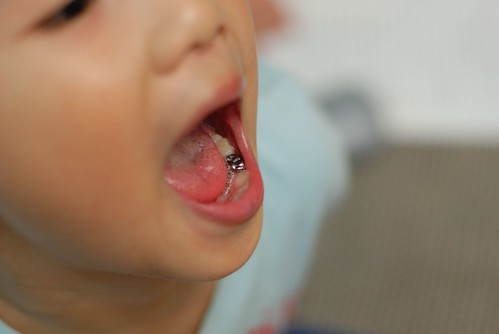

上週三帶阿徹去把補好的牙 套上牙套 閃閃發亮...  
  
第三次到牙醫阿姨那 阿徹越來越神色自若   
這回阿姨嘗試不要上麻藥 直接把器具套在牙齒上(會緊緊的)  
然後鑽ㄚ磨阿 花了20分鐘套好牙套  
過程中阿徹完全沒喊痛 連眉頭也都沒皺一下  
還利用空檔拿小鏡子猛瞧自己的牙齒  
讓那天才剛經歷過中班胖小子踢打的醫生護士阿姨更是對阿徹的穩定平靜讚不絕口  
套上閃閃發亮的牙套 阿徹很開心  
三不五時就說"我很喜歡我的新牙 你知道嗎"  
一點都不能體會因為蛀牙得套上牙套對媽媽來說是多麼大的恥辱阿  
不過看到他這麼喜歡 得意他的新牙  
我也只能用著誇張的語氣說"我知道阿 你的新牙很漂亮 閃閃發光哩"  
有天上學看到大太陽 阿徹還問我說"大太陽的時候 我的新牙是不是會更亮了"  
ㄟ...是阿 小心會刺傷眼睛哩....  
  
那天除了套上牙套也順便塗氟 草莓口味讓阿徹吃的津津有味  
出了診所後我問阿徹 "你好勇敢喔 沒讓牙齒先睡著 這樣子不是會很痛很不舒服嗎"  
阿徹說"會ㄚ 有一點點痛 但是一下下就過去了 "  
恩 果真是有勇敢 難怪上次看完牙醫後可以大顏不慚的跟徹爸說"我一直很勇敢 難道你不知道嗎"  
勇敢的小男孩 請你每天也勇敢乖乖的讓媽媽刷牙好嗎  
不要蛀牙再讓媽媽蒙羞了...(其實媽媽自己蛀牙也不少)  
  

