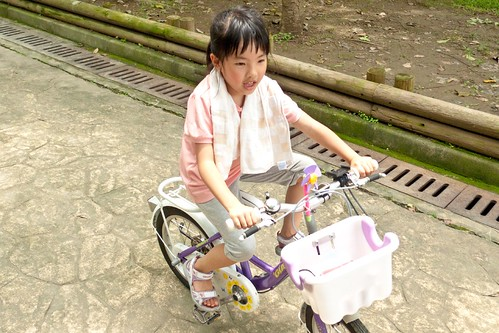
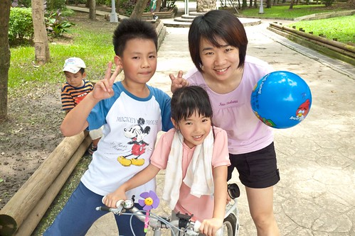
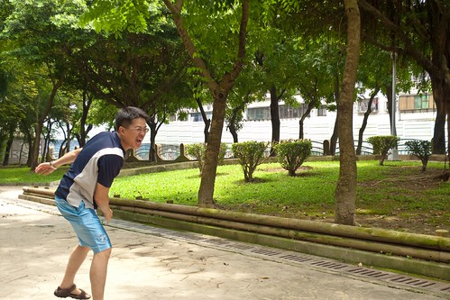

這一年來偶而的晚上或週末下午 時間允許 心情又配合的話 總會讓愛愛去公園繞騎個幾圈除了是作為單車旅行的訓練外最主要還是希望藉由這樣的有養運動來強化愛愛的心肺功能 讓愛愛的氣管過敏體質獲得改善而既然...

端午節隔天的週日 愛愛一如平常的七點多起床後便開始吆喝著"我要騎車去鶯歌" 還賴在床上的我心裡OS著"媽媽前一日的隨便說說沒想到愛愛還真當真了" 可是爸爸今日想在家好好愜意 我只好跟愛愛說"媽媽前一天包粽子腰痠沒法去鶯歌 去公園就好" 所幸愛愛雖然有點失望但還是欣然接受了 離家裡5分鐘路程的公園是愛愛練車的好地方  除了平坦的直路還有上下坡道可練習 而週末下午的公園 散步慢跑或嬉戲的人不少 愛愛更要學著小心駕駛 尤其在上坡的時後更是肌力與平衡的大考驗  筆直的平地則是練習加速的地方 愛愛常興奮的告訴我"剛剛我有騎到14(或多少)耶"  雖然徹爸總是擔心的告訴我"小心跌倒 摔著 破相了" 但我還是喜歡小孩子這樣恣意的騎著 成長著 雖然愛愛很愛當公主 但我相信她一定也想當個動靜皆宜的公主!

愛愛練車的時後得自己一個人 要不然看著哥哥或朋友 她就容易因為貪玩而想偷懶 所以那日也是騎的差不多後 爸爸跟哥哥才到公園打球一起玩耍 哥哥打完羽毛球後 愛愛要爸爸也要給她訓練一下  爸爸餵球給愛愛打   練習幾回後5球全打中 愛愛好開心 只是隔天愛愛的手臂就痠痛了  打完羽球 接著玩躲避球  不太會丟也不太會躲的愛愛是大家愛欺伍的對象但也是我們歡樂的爆點  接下來的一整天 愛愛的心情都超High 超有活力 我說愛愛早上去公園騎了車還打了羽毛球與躲避球 所以這樣開心 運動果然會讓人釋放快樂的賀爾蒙!  徹爸一直不願意刻意的培養小孩子運動能力 覺得年紀到了自然就會接觸與學會 而且徹爸深刻的認為運動應該是在生活中養成且易親近的 所以這樣去公園 或是扯鈴 或是騎車 或是玩球 就是徹愛現階段的運動  不過看著阿徹上小學後學會越來越多運動 我心裡滿是欣慰(起碼不是像媽媽這樣的運動白癡)  甚至還強壯到已經可以跟爸爸在場上廝殺了  我想小男孩  小女孩再沒多久就會追過我們了  謝謝徹爸給了徹愛這麼棒的身教示範! 希望在他帶領下家裡每個人都是頭好壯壯!! 
