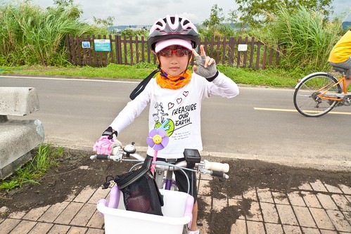
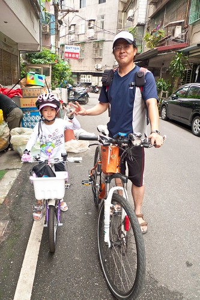
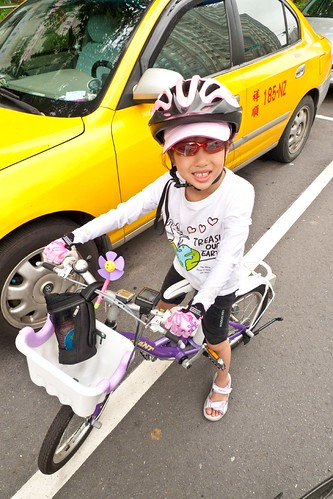
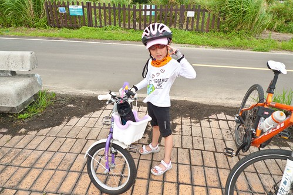
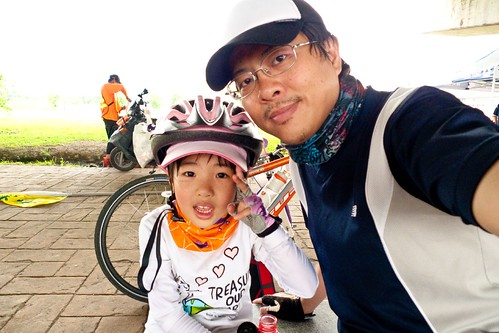
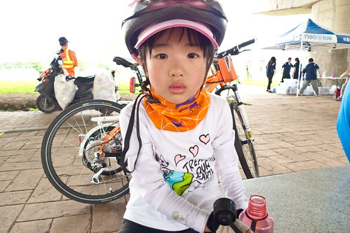
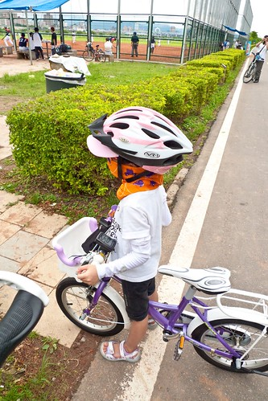
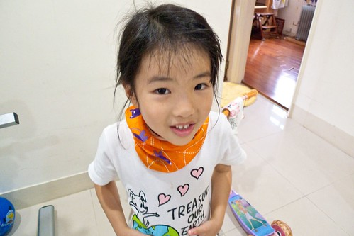

話說去年去花東騎車時 給徹爸載的愛愛超級羨慕可以自己騎車的哥哥回來後愛愛發憤要好好練車  三不五時要媽媽帶他去公園騎車而她也真能80%遵照我們的要求 每次繞騎公園2-30圈 約2-3公里的...

沒下雨的陰天  還有點風其實是個騎車很舒服的好天氣 早上10點父女倆就這樣臨時成軍的騎車去  這應該在往堤外自行車道的萬板路上  去程時的休息 徹爸說去程休息了幾次  抵達浮洲橋 喝水吃飯糰補充體力  11點多在家的我接到父女倆打回來的電話 原先心頭有些不安 但聽到他們騎到浮洲橋了 我心想愛愛果然棒 這麼快就騎到了 但徹爸說愛愛跟我講電話講著講著好像都快哭了 ㄟ...原來騎車不苦 想媽媽比較苦 回家後我跟徹爸討論檢討 我說我覺得愛愛好像還沒騎到累的地步(要到撐才會開始激發潛能與毅力) 徹爸好像有那麼點不好意思的笑說對 我說果然爸爸對女兒都是心軟的 不若對兒子那般鐵的訓練  回程 愛愛完全沒休息的一路騎回家 直到華江橋下停下來看人家打壘球  總共花了3小時時間完成20KM的騎程  徹爸說路上愛愛說 她總算明白為什麼以前去花東騎車時 哥哥都會說她真好可以被爸爸載 看來開始嚐苦頭的愛愛總算明白與體會被人載的幸福了 回家後愛愛不再像之前那樣嚷嚷著"我要騎去鶯歌" 當我們提起什麼時後再去挑戰鶯歌 她也裝傻不正面回應 過兩三天後 我突然明白了的問她"你那天是因為騎的很累 還是因為想媽媽 所以提早回家" 愛愛說"想媽媽" 我說"那一次我們一起騎去鶯歌 我跟爸爸輪流陪" 愛愛總算開心的說好 願意再次挑戰騎去鶯歌 跟徹爸說起愛愛願意再挑戰鶯歌 徹爸很受傷的說"愛愛欺騙(傷害)爸爸的感情" 哈哈~有沒有這麼嚴重阿~ 不過我想全家人一起開開心心的去騎車應該才是愛愛最喜歡的騎車方式 所以期待下回愛愛的之二訓練 順道回味一下阿徹版的鶯歌挑戰: [blog.yam.com/hmchen1975/article/22108479](http://blog.yam.com/hmchen1975/article/22108479) 我真的覺得同樣時期的兄妹倆 哥哥真的是比較強壯點 耐操耐凍點的樣子 忍不住也順道回味愛愛四歲半學會騎車的樣子 [blog.yam.com/hmchen1975/article/29505356](http://blog.yam.com/hmchen1975/article/29505356)
