燒的喔~ 難得來篇熱燙燙的文~ 話說我們一直把從板橋到鶯歌來回40公里的單車行視為徹愛幼稚園畢業的考驗與見證 這大半年裡我跟愛愛母女倆也常念著"該是去騎車了" "好想騎車去鶯歌阿" 但總總的理由與藉口卻讓這事一直多磨著 磨到愛愛這小一新生都已過了蜜月期 總算在這光輝的雙十國慶日 我們一家子陪著愛愛一起挑戰她的鶯歌單車行 雖然愛愛個頭小力氣小 但愛愛用著超乎我們期望的速度與鬥志 輕鬆愜意地完成 而經過這單車洗禮 我們家愛愛也正式脫離幼兒階段  堂堂正正邁入她人生中的下一個階段~ 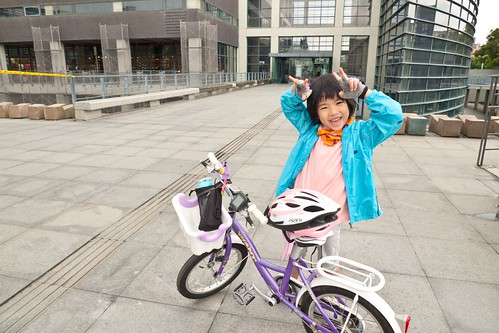 

這挑戰本來是定位於徹爸與小孩子之間的專屬任務與回憶 但怕愛愛這個小女生容易會有情緒問題出來攪局 因此媽媽決議一家子陪她一起去鶯歌 愛愛一路上好心情 好振奮 雖然嘴巴說個不停 但小短腿也努力不停的踏著 只是有點苦了阿徹哥哥  大半年沒騎的單車不知不覺間已經變的這麼小 加上配合妹妹的慢速  阿徹哥哥騎的意興闌珊 甚至背影看起來就像鄉間老人家那般隨性 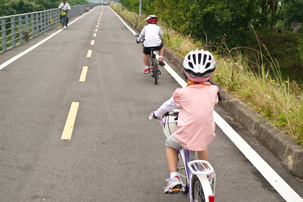 一路上大部分都是平緩好騎的 除了一些堤防的上上下下與極少部分的爬坡段特別費力外 愛愛的均速大部分維持在10-12間 甚至還常出現15-18的飆速 相較於哥哥第一次鶯歌行 6-9KM的速度 真是好太多 而上坡時 愛愛努力踩著她那台小小16吋的兒童車也很是令我與徹爸欣慰(媽媽都不好意思變檔了) 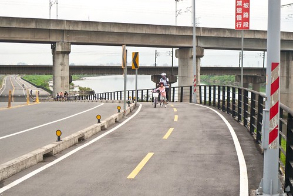 坡爬不上去時 吐吐舌頭 乖乖下車牽著走 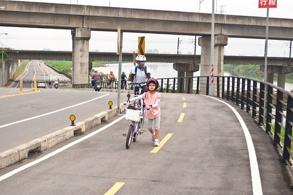 遇到道路屏障想辦法自己通過 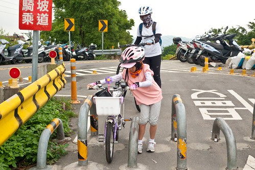 這些是這年紀面對這樣行程所面臨的最大耐力與耐心考驗 很高興 愛愛通過她幼兒單車訓練的最後一堂考驗 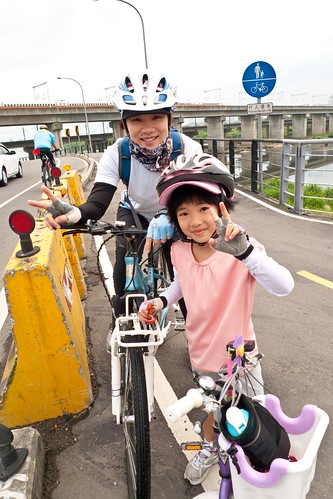 在我與徹爸輪流的伴騎下 愛愛一直維持著好心情 好體力 加上今日天氣涼爽 不熱不冷 風也不大( 真是好個天時地利人和) 沿途愛愛休息的次數不太多 而且每次好不容易追趕上早已休息好一會的哥哥時 哥哥便又迫不及待喊著可以上路了 愛愛其實休息的時間很少 悲情到我都覺得有點好笑 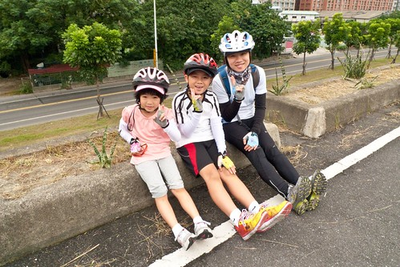 另方面 當我的26吋大輪胎在每次踩踏後總能輕鬆的滑行好長一段路時 愛愛卻還是只能一直踩著她的車 好讓她的小小16吋可以維持一定速度 我心裡雖然欣慰但也有那麼點不捨 自己忍不住OS著"當我們家小孩子好辛苦阿" 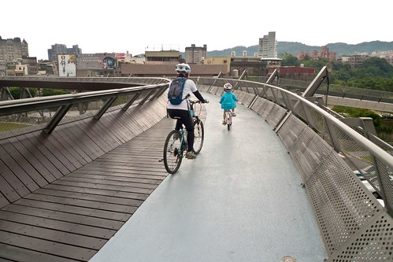 不過這一切的一切都不算什麼 甚至根本不是什麼 因為愛愛超乎我預期的順利且愉悅(這是重點)的抵達鶯歌 驕傲的在鶯歌陶瓷博物館前留下這紀念性的一幕 (因為哥哥在這裡拍過 徹爸很執意的非得騎過長長的天橋且把愛愛的車大剌剌擺到博物館前) 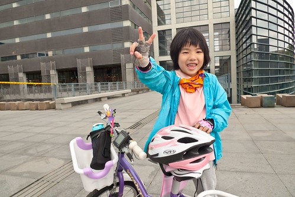 我跟阿徹也開心的一同慶祝愛愛這歷史性的一刻 只是阿徹哥哥在做什麼阿? 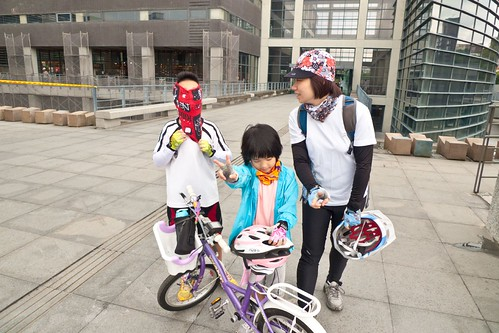 哈~ 原來阿徹哥哥搞笑來個開喜婆婆造型 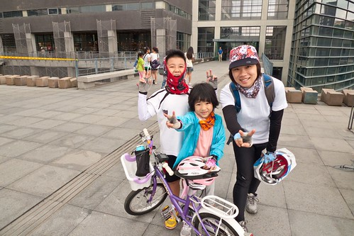 看的媽媽大樂喲喝一起來個搶匪造型 可惜阿徹大喊不要後逃到一旁去 而愛愛則堅持只能小丑造型 (我覺得我這張臉真的不錯) 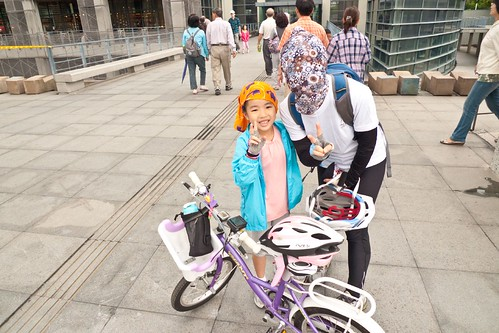 照完紀念照後 趕緊去小7吃點中餐 只怕逗留過久 愛愛會精力消失殆盡 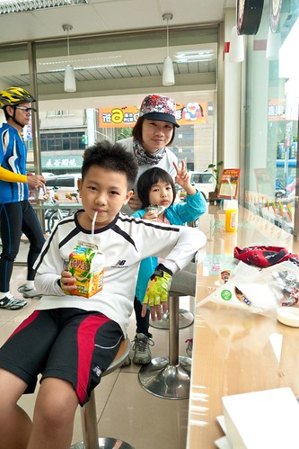 最近運動量大增的愛愛 胃口也明顯增加著 午餐跟哥哥嗑完一樣份量的一個御飯糰與茶葉蛋  為回程的20KM儲備體力 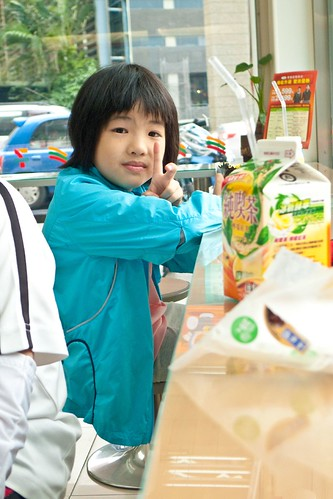 同時在鶯歌買了一些三峽金牛角後 我們冒著寒風與細雨往回程努力 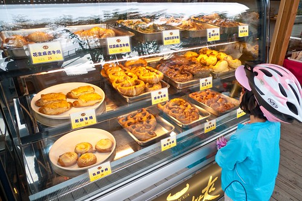 所幸天氣後來好轉 加上半路轉走大漢溪右岸 2個鐘頭時間 我們就騎回到板橋大漢橋下 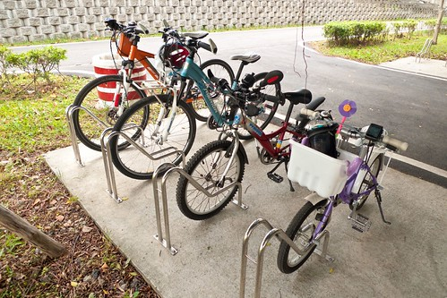 後半段路程都是徹爸陪著愛愛 據說她們一路上有時候玩著大風吹(嘴巴吹) 有時候玩語詞接龍 (跟我的時候還有背了幾輪弟子規 也是很猛) 然後咻的 總能很快就趕上在前頭休息的我與阿徹 果然是最佳拍檔的騎車二人組阿! 給這對父女一大個讚 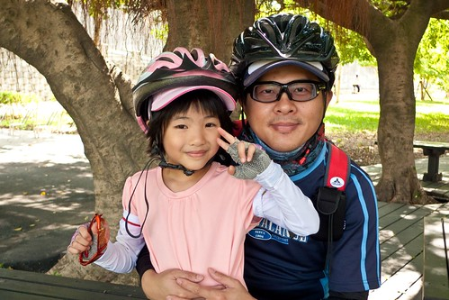 快到家的愛愛心情High到極點 完全沒有被40km揉擰過後的疲累 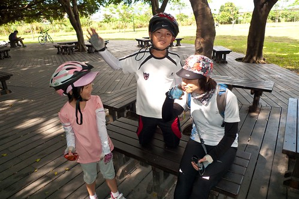 我想鶯歌行的挑戰成功 絕對是這陣子因國語學習不佳而低潮的愛愛 最是開心與振奮的一件事 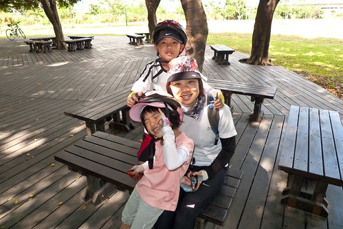 真的! 我總是相信每個小孩學習 成長的速度不一樣 所以我堅信愛愛(阿徹)總有一天會大聲的唱出屬於他們自己的歌 只是大雞蠻免會晚了點... 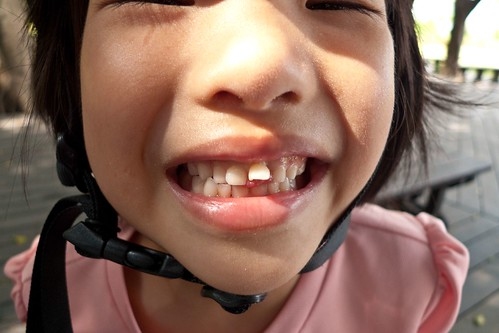 早上8點半多出門 2點初回到家 總共騎程42KM 雖然回到家後 愛愛說鶯歌沒有什麼 腳沒有什麼酸 人也沒有什麼累 但還是要給我們愛愛拍拍手! 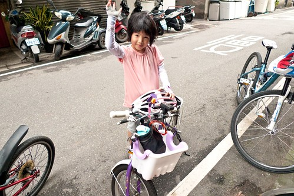 回家後 履約帶愛愛去找麥叔叔 看著她認真又滿足的啃著只有她有兩隻的炸雞腿(徹爸跟哥哥只能一隻才能突顯愛愛兩隻的意義) 我們肯定今日絕對是她人生中難以忘懷的一天ㄚ! 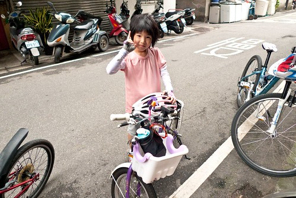 PS. 最後回顧一下阿徹哥哥當年的英勇: [blog.yam.com/hmchen1975/article/22108479](http://blog.yam.com/hmchen1975/article/22108479) 話說那時後的阿徹好苗條 清秀阿! 不過愛愛相較之下更顯單薄了 得努力養壯點...
