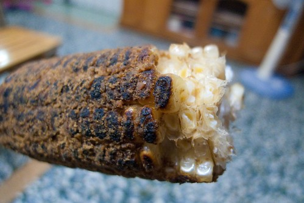
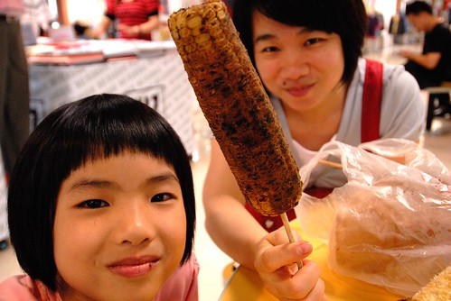
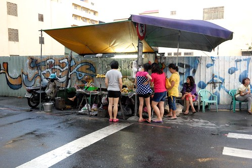

 

不小心讓自己的芋頭酥被神化了 實在不是當初所預期... 其實只是單純喜歡那樣不甜不膩簡單的味道而想與大家分享(當然還有賺錢) 但真的沒大家那樣誇張說的好吃 所以如徹爸說還沒收到貨的朋友們期望放低點以免屆時失落了! 這兩天烤了兩天甜餅 更是想念嘉義的烤玉米 真的! 這才是正港好吃到絕對一輩子會記得的好味道!!!  

 

玉米攤就在嘉義市的民族路與成仁街路口 這兩年我們每每開車經過 總會看見一旁等候的人潮  讓我們很是好奇這玉米到底有什麼魔力 果然 估狗後才發現這是隱藏版的嘉義美食名攤阿! 總算有一次我們又開車經過時  忍不住停車去購買 但沒想到老闆說"要等兩小時" 啥咪!!! 這是我聽過最最最久的等候時間了  我們只好悻悻然的走了 再又隔了好幾個月後 我真的真的很想吃這玉米 於是我們抱定等兩小時的決心再次來到 反正傍晚訂貨 晚上吃飽飯後再騎10分鐘車出來拿就好 沒想到這回卻只要等20分鐘!!! 等我們拿到熱騰騰的玉米也正好是晚餐飯前的時間 實在有尷尬了... 但我們四個人還是嗑了起來 因為真的太香忍不住嚐一口 而嚐一口後就停不下來了....  玉米看起來很夠味 實際上也真的很夠味 但卻一點都不鹹不燥且超軟Q 更神奇的是烤玉米放冷後一樣好吃且風味又迥然不同了 而這個堪稱我這輩子吃過最好吃的烤玉米 價錢竟然50元不到 烤玉米烤紅臉且駝了背的老婆婆才真的是佛心來著阿~ 烤玉米是御香屋葡萄柚綠茶之外 另一個令我們著迷的嘉義好好吃!!! PS. 話說 因為嘉義有太好喝的御香屋 我完全不相信會有比他更好喝的飲料 所以前對於清玉 我是完全的無動於衷連試不都想試 而最後果然證明還是嘉義好啦!!!  

#2
