這兩年歲末回嘉義時 都剛好會碰到嘉義的管樂節 阿嬤家樓下漫畫店的老闆娘總會跟我們說"有管樂節的踩街喔 很熱鬧喔" 而我跟徹爸才因此知道嘉義有這樣的活動 但也一直沒放心上... 但這一年的嘉義市區街頭常可看見"2011管樂在嘉義"或是"2011國際管樂節"等的看板或旗幟 徹爸上網查了查才發現原來嘉義每年歲末舉辦的管樂節已經連著18-9年頭嚕 且從一開始的只有嘉義市高中職參加 到現在全台各地都有團隊參與 嘖嘖! 身為嘉義人的我們豈可沒見識過ㄋ! 特別今年又是國際管樂節... 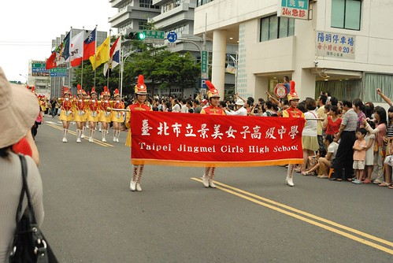

原本都是歲末十二月舉辦的管樂節活動 今年可能為了配合"國際性"所以在7月初舉行 10天的活動有管樂踩街 室內外音樂會  定點表演 晚會...等各項活動 而第一天的踩街活動從中山路噴水池一路熱鬧到體育館 超級的全市總動員 我想不用門票的踩街活動 絕對是可能一輩子沒聽過音樂會的市民們最易親近也最有參與感的音樂活動了 所以今年我們也帶著徹愛一起來第一次管樂踩街嚕~ 活動是7/2 週六的下午五點到七點 我們4點初從家裡出發 考量活動的交通管制 我們繞了大半個嘉義 從吳鳳南路的阿公家到吳鳳北路與中山路交叉口 後來證明真是涯給 下回直接從阿公家走到踩街路線後半段還省事些 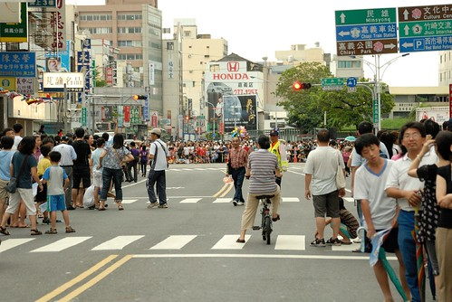 不過4點半多到達後 看到沿路層層等候的觀眾 我們很是訝異還真有這麼多人來看哩 尤其噴水池的中山路上人頭竄動 人滿為患 來年真的得早到些... 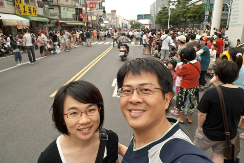 沒參與過這樣街頭活動的徹愛 直問著"要開始沒? 好無聊喔! 腳好痠喔" 還搞不清到底是什麼活動 所以感受不到等候的動力 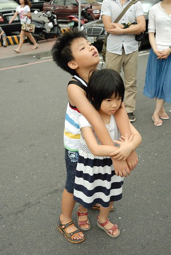 於是先讓愛愛坐在路旁停車場旁等 愛愛一臉搞不清楚的呆樣 哈! 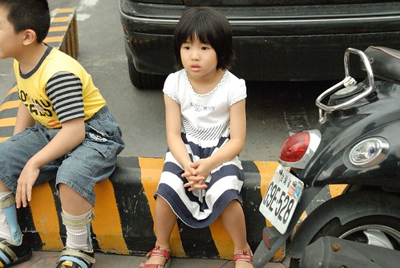 看到很多民眾帶著小椅子 甚至一旁的住戶就直接從家裡搬椅子出來坐 后~ 以後我們也有經驗了 知道要帶椅子來 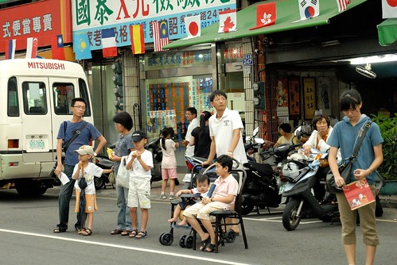 我們就不用這樣刻苦的坐在馬路邊了... 不過人生難得幾次機會可以坐在平常車水馬龍的大馬路邊ㄋ! 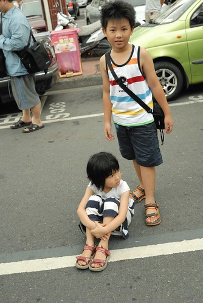 我們引頸期盼好一會 總算看到打頭陣的嘉義女中儀隊出現 嘉義女孩各個帥氣又美麗 看的我們眼睛都為之一亮了 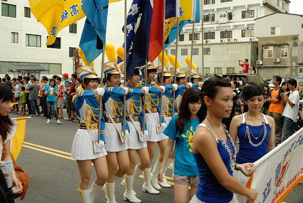 今年總共有30支左右的隊伍與10台主題花車參與踩街 除了嘉義市的各級學校隊伍或單位外 還有幾個國外團體以及其他縣市學校隊伍 這個國外女團體 各個身材姣好阿! 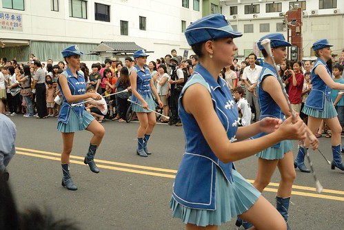 而國內隊伍中 則偶會有美女出現 讓人為之驚豔 (應該是來看管樂的 怎麼像是來看美女的 真是不應該) 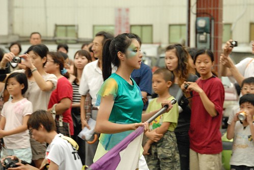 看網路上去年的踩街活動照片時 對於東石國中徐徐如生的戰鬥車隊伍很印象深刻 今年東石國中依舊勇猛 派出直升機戰鬥隊 那台直升機做的超像的 尤其那長長的 轉著的螺旋槳 我們還得小心別被它給掃到了 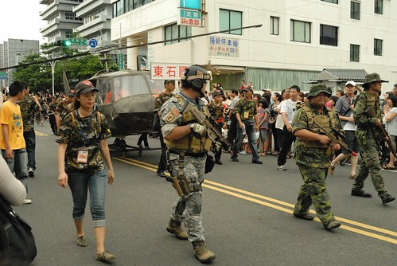 景美女中的儀隊也有參加 氣勢有不凡 (還有中正預校儀隊 不過剛好在休息所以沒有照片)  學校隊伍中會穿插著一些地方性的社團或宗教團體 尤其一輛輛貼著"財神爺廟" "地藏庵" 啥啥廟的主題花車 老實講會讓踩街氣氛有點冷了下來 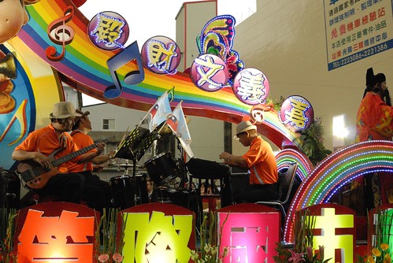 不過有些老人很厲害 活力十足且超認真 超投入 我想或許這就是嘉義管樂節吸引人 一年比一年盛大的原因吧 因為全市不管老老小小都動起來了... 我喜歡這種凝聚城市 顯現城市力量的感動! 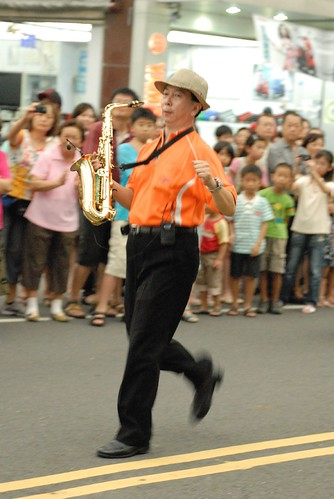 這是高雄三信家商的啦啦隊 超級活力有自信的 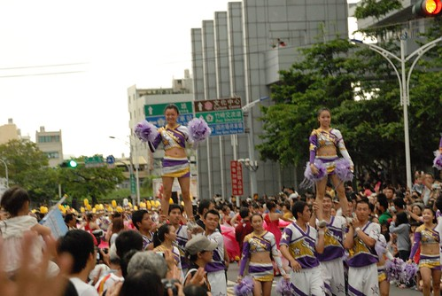 嘉義市某國小的啦啦隊 (我認為幼稚的愛愛應該是羨慕這種層級的) 老實講要這樣3.5公里沿路踢過去真的很累很厲害哩! 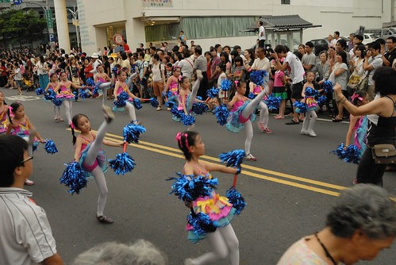 嘉義市某國小的管樂隊 要吹3.5公里也是很累很厲害.. 所以常可見隊伍隨行家長或同學一臉緊張的替表演著遞水灌水 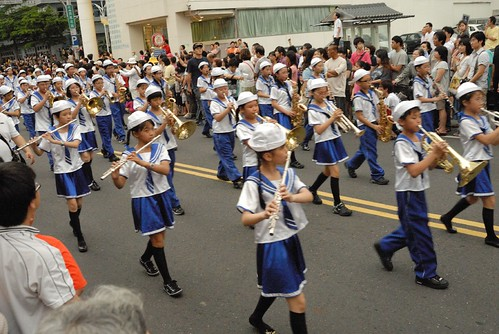 這是某國中隊伍最後的大紅燈籠高高掛 看的我只能用"妙"來形容 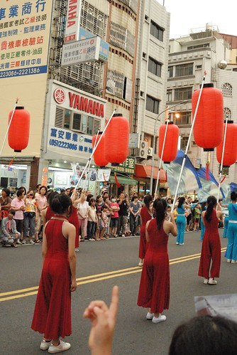 竹崎高中隊伍還派人沿途發竹崎的荔枝跟學校DM 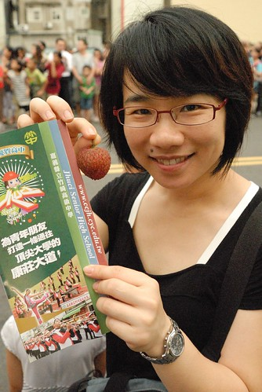 接下來這隻隊伍 我給它"今日最屌獎" 誰想的到管樂踩街活動裡竟然也會出現法輪大法 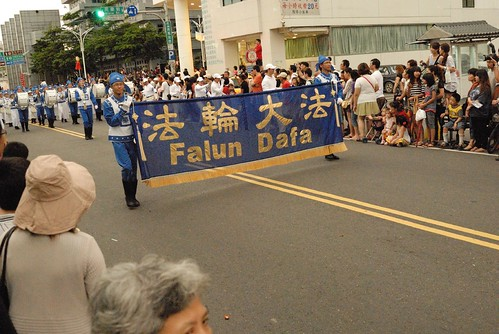 而且還是今日最長的隊伍阿! 加上徹爸說"他們的衣服 好像衙門的兵喔" 真的很像!  讓我看了五分鐘他們的隊伍後 竟然不寒而顫了起來... 不過可見宗教動員的力量有多大!!! 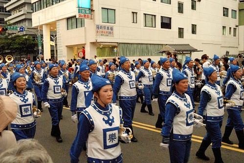 接近七點時分 我們所在的路口結束了所有的踩街隊伍 我們隨著人潮往阿公家方向走... 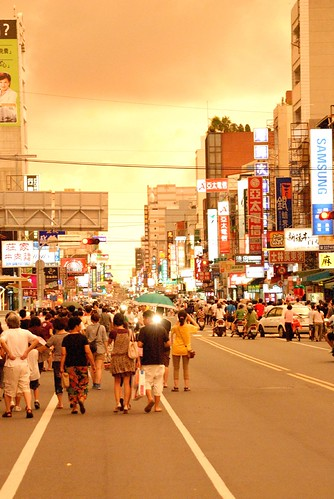 路上當地居民設置的休息處 發放著茶水與壽司 一個弟弟拿著壽司往我手上放 哇賽! 就像阿徹說的看完遊行還有壽司吃真是太讚了! 一盒壽司也暫時舒緩了徹愛的飢餓 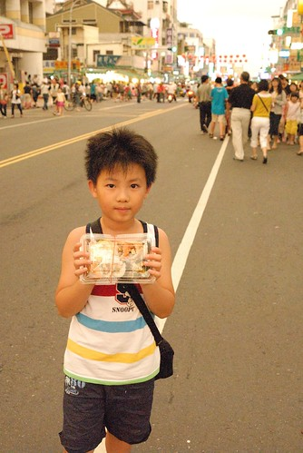 這回因為我們位在從中山路轉過來吳鳳北路的第一個紅綠燈路口附近 所以剛好是很多隊伍休息 整隊的空檔 而幾週後看到電視上廖駿的旅遊節目介紹今年嘉義的踩街活動時 我們更是確信了 隊伍從中山路的噴水池出發時隊隊都賣力十足的表演著 也難過到我們這路口時剛好是喘口氣的時間 而節目裡也看到了踩街活動結束後在體育場的開幕晚會表演 好精采阿! 我們說明年除了要早一點到中山路卡位外也還要去看晚會!

看完踩街後 愛愛直呼著"好好看 以後還要再來看" 而且還跟我說"以後阿 如果我也去表演 就是像我們今天看的那樣 你們也可以來看喔" 我問她"你最想表演哪一個" 原本以為她會嚮往那些畫著美麗彩妝 穿著五彩繽紛衣服的啦啦隊女孩的說 結果愛愛說"我要拿旗子 就是排在第二排的那個" 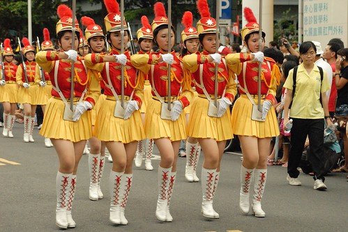 哇塞! 掌旗手耶! 想不到最吸引愛愛 最讓她嚮往的竟是這個只有一個動作一個眼神的掌旗手 這有屌!!! 不過爸爸說"那首先你得長得比爸爸高 這有點難...." 媽媽說"那你更要努力多吃飯 多喝牛奶 多運動喔!" 愛愛大力點頭著! 10多年後 我們家愛愛會不會有機會這樣神氣 誰知道?! 不過有夢最美啦!
