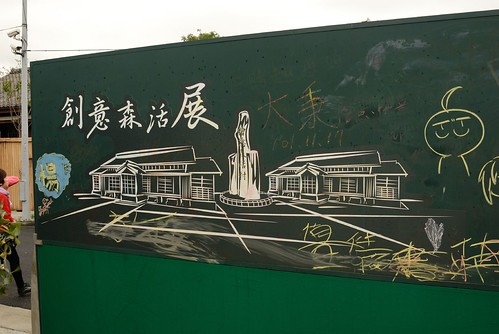
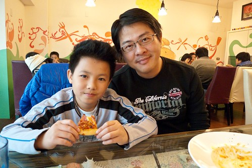

過年前的農曆16尾牙日 娘家一大家子全聚在一起吃掛包 包潤餅 席間阿徹突然說"媽 他們北部人好像都是過年前吃潤餅" 這個"他們北部人"惹的小舅舅又好笑又好氣的說"講的你們不是北部人的樣子" 我哈哈大笑說 "因為嘉義都是清明吃潤餅阿" 我想年節大節都在嘉義婆家過的我們說自己是嘉義人應該一點都不為過吧! 況且我的身分証第一碼還跟徹爸一樣都是Q開頭的ㄋ 嘉義出生但從嬰兒起便在台北長大的我ㄧ直很慶幸因結婚而真正變成嘉義人! 真的! 我越發喜歡嘉義的人事物地 尤其嘉義真的越來越好玩...  

元旦的四天假期 雖然張嬤們去新竹徹伯家而不在嘉義 我們卻還是回嘉義住了兩晚 一來因為台北太久的溼冷讓人需要回到溫暖的南部曬曬太陽 再者是四天的假期在台北還真不知道上哪去ㄚ (尤其我們特不愛連假旅行的) 加上嘉義2012管樂節的踩街與晚會剛好在假期的第一天 因此我們抱著出門旅行的心態回到熟悉不過的嘉義 也才發現用觀光客的角度看嘉義還真是有趣~

12/29星期六 我們在下午四點來到嘉義市舊體育場 等著2012管樂節的晚會  這時候也剛好是下午踩街活動的隊伍 陸續從從中山路噴水池遊行抵達終點  管樂節已成為嘉義每年的盛事 不只各級學校樂團踴躍參與表演 嘉義當地居民們也都熱情參加/觀賞活動  我們連兩年參與後越加體會 "想不到管樂節這樣熱鬧 這樣深入嘉義市民心中" 是很棒的一個地方級活動  雖然今年不若前一年的國際管樂節那樣盛大 但參與的各級學校 機關與國外團體仍舊每一支都很熱情洋溢  只是我們打錯算盤了 因為坐在高高觀眾台上看踩街真的少了站在街頭觀看的那種親臨感 而且等天黑 晚會才開始時 我們卻已經肚子餓得去覓食 於是好不容易坐到的好位只能放棄 而最終沒能愜意的觀賞完晚會  晚會的開幕是由十鼓+台灣管樂團+嘉義在地樂團組成的X百人大演奏  氣勢很大 只可惜整場的音響/擴音效果不是很好讓人聽的不完整  而之後是部分學校樂團的隊形變化表演  (景美女中動員龐大)  是還蠻精采的 只是後來觀眾太多 我們吃完晚餐回來後只能坐到很遠很遠的兩側邊 而話說晚會最後壓軸的圖瓦共和國奔馬國家管樂團 數十匹馬騎進場的聲勢真的很浩大 只是內容卻遠不及我們景美 建中這些高中生的精采與高亢  看完晚會後 我們回到阿公家 這是我們第一次四個人獨自在阿公家 徹愛說好像住民宿喔 我說對阿 這是我們這次旅行的民宿 有哪家民宿能像這家民宿主人這樣好 冰箱放了許多水果還有我們喜歡的羊肉與米血  真的是讓人賓至如歸的好民宿阿  第二天早上我們來到創意森活村  之前我們有去過另一邊的農業精品館與故事屋([blog.yam.com/hmchen1975/article/40917874](http://blog.yam.com/hmchen1975/article/40917874))  這回來的則是木材藝術區 7棟的日式建築空間內正有為期3個月的創意森活展: 以『森林』自然素材為主題佈展，展館包含實踐森活館、創意森活館、童趣森活館 、藝術森活館、家居森活館、志工森活館、百大精品館等7大主題  當中 吳靜芬老師的2.5D紙雕展  舊時代背景下的每一個作品都栩栩如生  讓人看的目不暇給  

 每各作品我們都好喜歡 觀賞許久也討論許多 而透過這些紙雕作品 徹愛更能了解以前生活方式與趣味  而除了紙雕外 展區還有其他創作者的木雕 創作品展示 

 甚至還有一些木製小玩具可玩賞  從日式建築房子本身到其內的木材相關藝術創作展示 一整個都很有味道 也難怪元旦假期跟過年期間 每每經過這裡時都能看到絡繹不絕的遊客 真是嘉義市的新亮點!  村子外牆有幾面大黑板讓人塗鴉  徹愛看到黑板 拿起粉筆大塗鴉  (愛愛畫的女生 眼睛有夠亮晶晶的)  兄妹倆畫的一發不可收拾 說也說不走  殊不知錯估天氣的爸媽身上只穿兩件衣服抵抗寒流的10度低溫 難得冷的嘉義 那一天真的有冷到! 跟前一天相差10多度的溫差讓我們直喊冷  而後庭園邊剛好有管樂節相關表演活動的綵排 吸引了大家的注意  愛愛看的都呆了  有濃濃日式風味的檜意森活村在修復古蹟同時賦予新生命 表現真的挺不錯 是值得大家來嘉義時 走走看看的新景點!  離開檜意村後 我們沿途走到嘉義博物館 經過北門車站軌道區 看到亮紅色的火車讓人莫名的high  尤其以為停駛中的阿里山森林火車想不到竟又出現在林森路平交道上 我們雖然不明就裡 但抓起相機猛拍  之後網路上看到相關新聞才知道 原來森林鐵路已經復駛北門到竹崎段 雖然只有短短一站 但很是讓我期待改日搭森林小火車去竹崎玩 肯定別有趣味  為了尋找管樂節紀念品發售點的嘉義博物館 我們一路從森活村走到文化中心然後迷路了 (這一區塊其實很適合散步 大樹很多 街景也很漂亮 還有火車可以看)  問路之後才知道 原來文化中心內也有一個九曲洞 走過這美麗又彎曲的庭園後就是了  穿過文化中心後便看見很新很大的市立博物館 (我們只有在兩年前來看音樂會時停車在這過 哈哈~)  博物館的外圍很多跟管樂相關的藝術裝置  真的!  嘉義人的我們竟到這一兩年才知道原來管樂節歷史已經這樣悠久而且每年如此盛大 以後每年的12月都要多加留意管樂節消息 別再錯過每年這樣熱鬧又有趣的踩街活動 因為真的是很難得如此平民且熱鬧的音樂嘉年華會阿  雖然沒買到要購買的紀念品  我們一家子卻在博物館內逛了起來 看到蓋章區 蓋章先  爸爸放在相機包裡隨身帶著的集章本 累積收集好多我們旅行的紀念章  這是管樂小雞 放在嘉義市大家長旁邊更是別具指標意義阿  其他就是一些跟美術或啥相關的主題展示  不是太有什麼所以沒照相也全忘光光了

離開市立博物館後 我們到同樣那區塊的一家網友們推薦的義式餐廳用餐 每人點份主餐便可pizza 烤雞腿 飲料 甜點無限享用  如獨棟住家的建築物 想不到店內氣氛卻營造的很溫馨 而且服務生的服務態度很好 真不愧是嘉義人阿(而且都長的很可愛)  至於餐點內容 當然嚕.. 很難比的上徹媽牌pizza跟意大麵啦 不過不難就是  況且今天我們是觀光客! 怎樣都會是開開心心的享用每份餐點  結束用餐 我們一家子又去市中心逛嘉義市最大的書局然後再去耐斯松屋逛39元商店 我們說"今日嘉義一日觀光真是充實"  偶而這樣當觀光客真的很不錯!

PS. 第一張照片就是在餐廳對面拍的 從餐廳窗戶望過去真的是超漂亮的一幕 喜歡在城市裡發現這樣小角落的驚喜!
