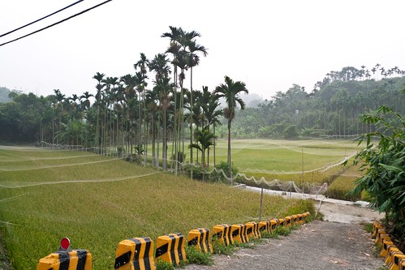
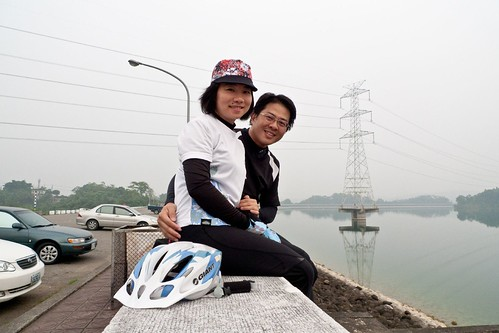

話說徹爸在大學畢業等著當兵的那個暑假 為了讓自己清瘦點當兵好過些 每天清早出門騎單車 路線就是以S型把蘭潭以及仁義潭繞一區 外加繞了大半個嘉義 沒想到 時隔十多年後 有一天老婆竟然主動開口跟他提及想去騎那條路線 於是涯給夫妻於雙十節假期很涯給的把兩台單車載回嘉義 然後大清早來個雙潭"懷舊"單車約會! 如徹爸那早一再強調的 "是ㄆㄚ七仔! 不是練車喔..." 

在嘉義最廣為人知的散步/約會地點除了嘉義公園 中山公園外 我想應該就是蘭潭跟仁義潭了吧 因此在我還是小姐的時後 也是跟徹爸騎摩拓車或是開車遊潭過好多次的 只是當時壓根沒想過 有一天我們倆人會一起騎著單車遊湖!

連假的第二天 趁著阿徹愛愛都還在睡覺而且有阿公阿嬤可以幫忙照應 我跟徹爸大清早六點起床出門去 兩人先去7-11好好的吃個早餐 而且還喝了杯從沒喝過這麼燙的熱拿鐵 因為徹爸一直說是約會 所以我就不客氣的放鬆心情喝咖啡了 喝完後才開始擔心起等會馬上到來的山路怎麼辦?!  從嘉義家裡出發 走立仁路接彌陀路 很快的就來到228紀念碑處 從這轉進去就是前往嘉義大學以及蘭潭與仁義潭的路  沿著八掌溪河畔的這條路 原來也是嘉義市的自行車路網路線之一阿  其實腳踏車是嘉義人很重要的交通工具之一 尤其是學生 路上到處可見騎著腳踏車去上學 補習 買菜 趴趴造的大人小孩... 所以看到這樣的"立牌" 老實講覺得有那麼點突兀說 不過現在全台各縣市好像都會想辦法搞個自行車路網出來 所以嘉義人怎麼可以輸ㄋ!

經過嘉義大學蘭潭校區時 徹爸問要不要來個一張阿! 我也不知道在熱血什麼的 開開心心的來張地標照!  過嘉義大學往仁義潭的路邊 可以看見一畝畝的結穗稻田(南部可以種三期稻 現在應該是第二期的結穗) 而很多稻子上都蓋上蚊帳般的薄紗 以防小鳥的偷食吧! 其實這樣的田間風光是很美麗 愜意的 但到處林立的檳榔樹對我來講很煞風景(就會想到土石流還有被人吐在地上的紅通通檳榔汁...)  開始上路後10分鐘便是徹爸說的今日第一硬處 連續10多分鐘 真是爬坡的爬坡過去後便能抵達今日的第一站 仁義潭 嘿嘿! 雖然路真的也沒多長 但是我不落地的抵達仁義潭讓我小小驕傲了一下(接下來就不怕啦)  我跟徹爸把車子停在壩邊 享受這難得的清早湖光水色  蘭潭與仁義潭都屬於八掌溪水系而且還是像隔壁鄰居那樣的近 不過蘭潭歸嘉義市而仁義潭則歸嘉義縣 此外, 蘭潭相傳為三百年前荷蘭人所建但仁義潭則興建於民國六十九年(76年才開始蓄水) 目前, 兩者都是大嘉義地區的主要民生水源! 仁義潭對於我來講是多些感情的 因為陳家的老家就在潭口而且聽說陳爸部分田地因此被徵收了  仁義潭最美的地方應該是那個長長的 看不到盡頭的長堤  週末時分 總是聚集很多的大人小孩 情侶 祖孫來這散步或放風箏 而清早七點 只有一些些來散步運動的人 長堤更有種靜謐之美了  以前走在長堤上 看著堤邊的那段斜降坡的道路 總會想像著騎著車一路溜下去應該有著溜滑梯的快感吧!  哈! 真的很爽快的溜滑梯阿! 我大笑著滑下去  徹爸說"滑的都要還的阿! 滑多少就要爬多少阿!" 我說"剛上山不是今日最硬  所以這是剛剛的路還我的啦! 接下來 接下來再說了" 結果想不到 緊接著是一條我們覺得好美的路阿 道路又平又乾淨 而且兩旁綠地如蔭 樹木扶疏!  真是愜意騎車的好路!  徹爸也開心到拿出相機邊騎邊自拍! (叔叔有練過 小人勿模仿)  瞧 我開心愉快的樣子! 真是不枉費千里迢迢把單車帶回嘉義還有家裡扛上扛下的! 

不過正開心的時後 家裡的徹嬤打電話來說前一日又發燒又上吐下瀉的阿徹人在不舒服 ㄟ...怎麼這樣ㄋ?  早上出門前 確認阿徹體溫正常 肚子整晚也沒狀況阿 不太相信阿嬤說的話 於是徹爸直接與阿徹講電話 了解狀況也說了該說的叮嚀話後 我們夫妻兩人繼續我們的路程 這時候更是深刻體會小孩的堅強意志有多重要 尤其在上吐下瀉的時後 爸媽除了堅持小孩禁食外 什麼事也不能做 所以只能期勉小孩忍過去 痛過去 總會漸入佳境的! (既然這樣 於是我們繼續騎下去)

繼續回到我們的路線中.. 話說仁義潭環潭路線大部分皆為丘陵地形 坡度不大的上上下下 所以我一路騎來倒也算輕鬆 直到最後要出潭 到達陳爸的老家前的那段路  給他很洩志的下車了兩次 不過幸好都只有牽小小一段路 還不是太不長進!  環完仁義潭後接大雅路 再從崇仁護校前轉進蘭潭風景區 (轉彎前我們有打電話回家確認阿徹狀況 才再繼續的 所以不是完全那麼不負責任的爸媽的)  徹爸說以前唸高中時 常在月考完的那一天跟某同學一起騎車到蘭潭 有個坡每每得讓他們下車用牽的   然後兩人邊騎邊罵但還是每次考完就來騎來這 但我今日一路環下來 我笑說不是徹爸以前的車太遜就是現在太強啦! 因為一整個就像花蓮鯉魚潭那樣的好騎而且風光明媚阿  那一刻我突然感動的想要找潭附近的老房子開民宿 民宿主打就是這蘭潭自行車環潭親子逍遙遊 可是徹爸說 這好像沒有路可以繞蘭潭一整圈哩(所以說我們今天是s型環雙潭) 真是可惜了!

 我覺得蘭潭整個週邊的風景是比仁義潭漂亮的 週邊也有不少歨道可以走 而所謂的'蘭潭泛月'更是嘉義的八景之一 (還真沒晚上來過 有機會該來這賞月的) 歡迎大家除了來嘉義吃雞肉飯 買御香屋外 有機會也能來蘭潭散散步  最後我們花了2小時 完成23公里左右的嘉義雙潭S型環潭路線 YA! 成功! 而今日最大的收穫應該就是讓我更想挑戰嘉義的其他路線了!  後記; 回到家時 愛愛才剛起床沒多久在吃早餐中 而起床已兩小時的阿徹 狀況果然如我們想像的不是太糟(其實我們是故意要考驗阿徹的阿) 不過我們後來還是很盡責的帶他去醫院掛急診了  果然花了醫藥費後突然間又好多了....

[http://ridewithgps.com/trips/417834/embed](http://ridewithgps.com/trips/417834/embed)
