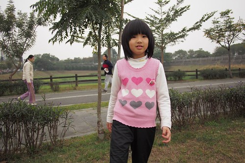

 

2013年裡 雖然過夜旅行少了不少 但小地方小旅行倒是累積不少 只是這些小旅行 因為我的提不起勁常在草稿夾裡一躺就是幾月幾年的過去(寫花東卻是很帶勁阿) 今日來勁 就從最近一次的回嘉義寫起吧!

嘉義市這幾年的改變真的有目共睹 除了噴水雞肉飯一家家氣派的開著外 許多老房子 老園區的文藝復甦更是令人驚艷 而同時 硬體公共建設也配合觀光發展進步著 不容小覷 每次開車從中埔上高速公路時 我總會被八掌溪畔旁的公園給吸引目光 12月底的週六下午 心血來潮的我們總算來一探究竟~

後來上網看到嘉義觀光網站的介紹才知道原來這是嘉義市河濱運動公園(冠上"運動"兩個字感覺就了不得) 上頭寫 : 河濱運動公園位於八掌溪南岸，沿著吳鳳南路往南行，過了軍輝橋左轉，順著八掌溪堤岸即可抵達 這完全是從徹嬤家出發 徒步走到公園的路線   在台北發霉很久的我們  難得可以在好天氣下散步格外的開心 而這段20分鐘的路程也更顯得輕鬆愜意  每次開車經過總會多看幾眼的就是這兩大片的生態池  如地毯般 綠盈盈的水草讓人看的就好舒服  雖然並不如大安森林公園那樣廣大與豐富 但已是嘉義難得且不同以往的公園型態  發現還真有不少市民或是一個人來跑步健走 或是一家子扶老攜幼來野餐玩耍 讓"運動"公園這二個字 還不是亂乎巄放上的  我們今天也是有備而來運動的喔~  耳聞阿徹這個板凳足球員許久 今日總算親眼一睹廬山真面目  煞有架式的~  只是努力空間也很大~  另頭 明顯看出我跟愛愛是來鬧場的  愛妹妹踢足球還抱著球不放 亂很大~  所以最後母女倆公園內散步去 留下徹哥與徹爸進行男人間的對決  小而美的運動公園 以後回嘉義多個可以跑跳的地方了!  

同場順道記錄中秋節時 我跟愛愛母女倆在軍暉橋另一邊的小散步  這裡是尚未過軍暉橋前就右轉的八掌溪道 沿途的台灣欒樹正開著黃花煞有美麗  走個十來分可來到行嘉吊橋的入口  是因為這幾年總在嘉義市區裡看到行嘉吊橋的路牌指示 才知道這麼一座吊橋的存在 吊橋建立於2007年 是由民間行善團出錢出力所興建 美意在於方便八掌溪兩岸居民與學童的往來與通學  所以稱不上是景點  但站在吊橋上看著八掌溪卻也別有一番風情! 
