小年夜大清早天都還沒亮 我們便啟程返鄉 回到嘉義才八點初 是我們平常放假日的起床時間 我跟徹爸接了徹嬤的手  一個幫忙打理廚房年菜 一個清掃兩層樓的地板與廁所 一上午的勞動 雖然忙碌但卻讓人馬上浸身於過年的氣氛中 看著徹嬤因為我們的分擔而得以好好炊蒸蘿蔔糕 我的心頭也跟著蒸籠一起暖了起來! 或許就如徹爸開車於嘉義市區時跟我說"你有偷偷在記嘉義的路ㄏㄡˊ" 我說"好歹當嘉義媳婦也快10年了" 很多不習慣的習俗或是不能再有的童年習俗 就算不習慣也成了一種習慣了 而且能夠跟徹爸與徹愛 四個人在一起 那就是我的年! 那天下午趁著空檔 趁著過年前的好天氣(原以為過年天氣都不好) 來趟新港小旅行加上意外發現的油菜花田! 那個我這輩子看見過最密集 最大片的油菜花田 我說我的這個年已經值得了! 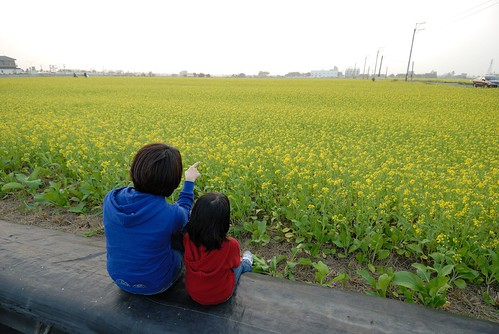

這片油菜花田的發現真的是個大意外! 只因為當我們從新港要回嘉義市時 徹爸開在沿著高鐵的道路上時 覺得傍著高鐵的那條路真是壯觀美麗 於是在完全不知道那條路要通往哪的情形下 決意要一直一直開下去 直到道路的盡頭 因此我們沿著高鐵來到嘉義高鐵站附近 然後在高鐵大道上看見遠方稻田怎麼好像一片片黃 於是我們發現了這個意外的年節大禮物! 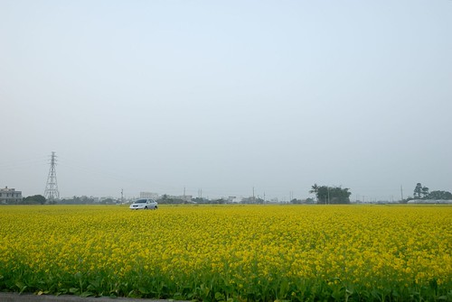 我對油菜花真的超沒抵抗力的 莫名的喜歡這種一大片黃澄澄的感覺! 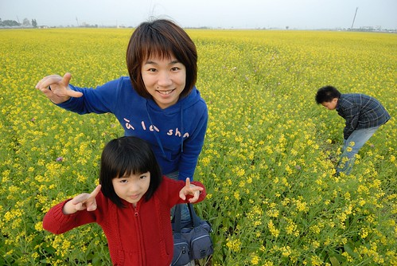 非得拉著一家子來個大合照 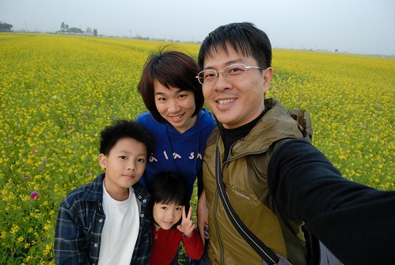 然後再跟徹爸來個親密自拍照 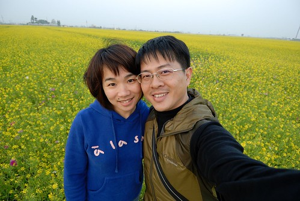 這片油菜花 真的有大片 有美! 虧我這幾年一直往花東尋找油菜花 卻沒想我們的故鄉 嘉義就有這樣的美景 雖然沒有山當背景 但這好似看不到盡頭的花田有著濃濃南部故鄉味 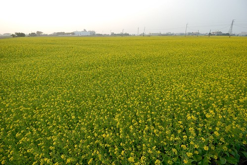 看到一對情侶坐在田埂間的浪漫背影 我拉著愛愛也來依樣畫葫蘆一番 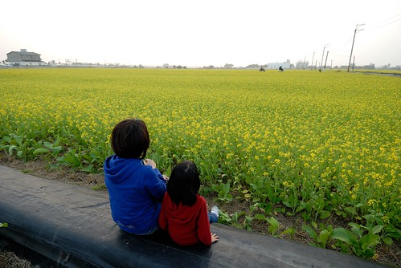 這一坐下不得了... 那個坐下來的視野跟站著又不一樣了 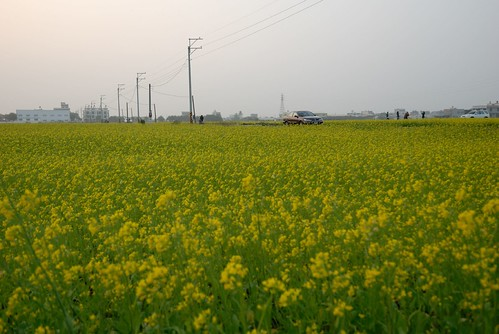 而且準備回家的太陽 就像一個橘色圓圈圈剪紙般的貼在前方的畫布上 真的好美的一個夕陽 好美的一個年前下午!   謝謝老天爺給了份讓人開心的大禮物! 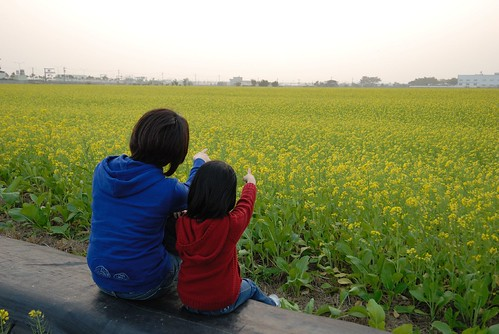 太陽下山後 我們心滿意足的要回家時 車子駛過田間小徑後才發現原來這裡是太保的有機稻米區! 有著冬日油菜花滋養的稻米一定特別的好吃! 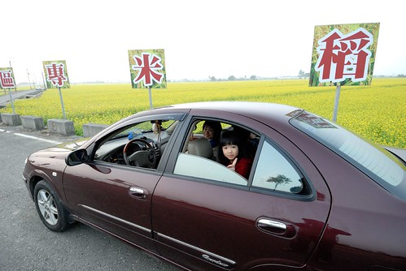 這片油菜花田 我記得了! 這將是以後我的嘉義年節回憶之一! 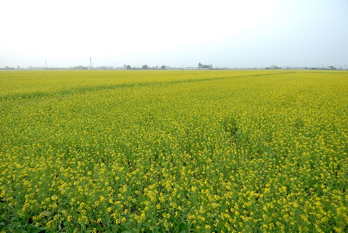
