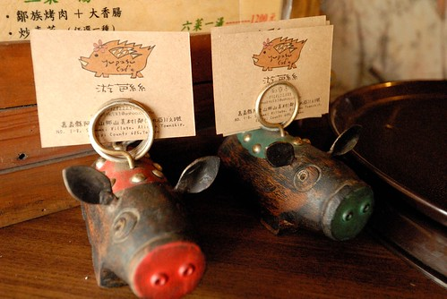

隙頂家族旅遊的集合前 我們加碼先去山美的游芭絲小館來頓原住民風味餐 美味又平價的鮮食 果然如眾網友或當地人推薦的那樣好吃! 

游芭絲就在阿里山公路往達那伊谷小路的轉彎處 (阿里山鄉山美村的一鄰) 跟原本誤以為的坐落在原住民村落裡的小店很不一樣 因為真的就是在前不著村 後也似不著村的馬路邊 不過我第一眼就喜歡上這家從店門口便散發濃濃風味的小店  跟我們一起來的還有張三姐以及張大哥兩家子人 人多有個好處 就是可以多點好多不同的菜色 於是我除了點個八人份的六菜一湯外 還外加double的香腸烤肉 南瓜洗粉 溪蝦以及一大缸的檸檬愛玉... 結果我當然就是最捧場也吃最多的那個人!

等著上菜的空檔 坐在位子上觀看著店裡的佈置 我喜歡這個桌上散發淡淡香味的野薑花  有這個季節山裡小溪的味道  我也喜歡柱子上掛著的木板 昭告著今天店裡有什麼新鮮的 好吃的  沒多久..飯來了 菜也開始一道道的上著  店裡的招牌: 只有沾鹽下去烤的山豬肉 再佐上阿里山特產的山葵胡椒鹽 有著多層次的好美味  伴有大量新鮮飽滿蔥珠的胡椒溪蝦 雖然蝦很鮮很酥 但蔥也美味的快要壓過真正的主角  看到網友介紹後 讓我今日第一指名想吃的南瓜米粉 帶有徹爸形容的統一肉燥麵味道的炒法 雖然也是好吃但我心裡有點小小的失望 因為我覺得南瓜味可以再多些 濃些  不過愛南瓜的我還是很捧場的吃掉一半  涼伴檳榔花  很爽口但好像不是其他人能接受的食材 所以大半還是都我解決掉的  其他還有炒高麗菜 炒龍鬚 三杯竹雞 炸溪魚以及勇士湯(樹豆湯) 每樣菜的味道 我都很喜歡也很努力的盡量把他清光光... 我也很喜歡這裡的食器 不論是飯勺 盤子以及用來盤飾的芭蕉葉(老實講 我不確切知道這是什麼葉子) 看似簡單 但個個都很有特色與風格  而今日讓大夥最最最讚不絕口的則是用阿里山山愛玉洗的檸檬愛玉 佐的剛剛好的甜度 酸度與冰度 讓不愛吃愛玉的阿徹也讚不絕口 喝了兩大杯 可惜徹爸沒有照到那缸山愛玉 只能留待記憶去想像與回味! 飯畢 大伙竟然就像在自家裡那樣的休憩起來(這裡的溫度真的很舒服)  我跟徹爸則是到店門口好好的 仔細的"品嚐"這家店... 店的一側是烤肉區 剛桌上的美味山豬肉與香腸都是老闆在這大馬路邊烤出來的  大塊大塊的相思木樹幹(樹幹都比愛愛的腰圍還大了)燒出關鍵的高溫度 可以讓肉與香腸鎖住本來的美味 但同時也燻上了相思樹的好氣味  聽完老闆的解說後  更是覺得剛下肚的烤山豬肉 烤香腸異常美味阿 即使肚子已經好飽好飽　還是忍不住對著烤盤上的肉吞著口水...  除了烤肉區 店的櫃檯區以及店門口也別有洞天 儼然就像個小雜貨店 店裡賣著阿里山的名產還有一些原住民的手工藝創作品 而店外則是附近居民拿來這賣的山的菜 山的果  每樣菜 看起來都好新鮮 好美味 好健康!  而裝著菜的小籃子也見證著原住民文化的歷史 老闆說 籃子已經10多年的歷史 是以前的耆老用黃藤編織出來的 比那些菜還更是珍貴  這山上的栗子也保證就像故事書上 森林裡松鼠吃的那樣新鮮  我買了半斤回家 簡單的用水煮一煮(還不小心放了一週才煮) 雖然有點難剝 得像松鼠那樣用門牙刮阿刮 但是栗子真的好甜好鬆好好吃! (難得看到新鮮栗子的愛愛也忍不住拿起來假吃一番)  除了那些山裡的蔬果裝飾著 店裡店外也隨處可見一些有意思的創作品 例如張大嫂很感興趣的掛在牆上的魚(因為女兒很喜歡 還問老闆這魚有沒有賣) 我很喜歡的吧檯前的漂流木小桌子 高腳椅!  這是家貨真價實 感受到濃濃原住民風味與用心的一家店! (雖然老闆是平地人 (但是老闆娘是原住民))  後記: 游芭絲在鄒語的意思是帶來財富 老闆希望來用餐的不只吃的開心還"金好運"! 以後運氣不好的時後 就來這裡發財一下吧!
