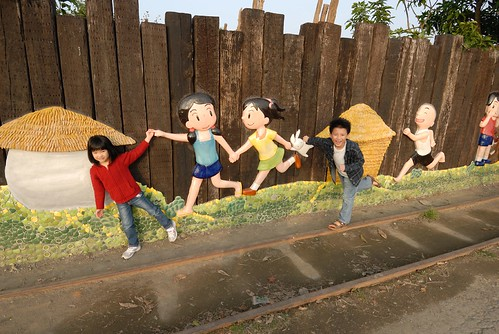

這兩天台北的天氣很像小年夜那天在嘉義的天氣 太陽曬久時會覺得有點熱 但大半的時後覺得太陽的熱度跟強度好舒服好溫暖 是個好適合郊遊 曬床單 或是看著天空發懶的好日子! 這一週我使無前例的腸胃炎病的厲害 拉燒痛輪番來 極虛弱的模樣讓徹爸跟徹愛三人直呼"從沒看過媽媽這樣狼狽" 不過覺得徹愛真的長大了 常主動問我身體好些沒以及兩人乖乖自己玩好讓我盡力睡覺 昨天下午趁著身體好很多 帶著愛愛去公園騎車 公園裡人很多 小人們努力地在遊戲區裡玩 一旁的婦老則愜意的坐在有樹蔭的一側享受好天氣 唯獨我 坐在太陽正對著的那一側  是享受難得的太陽 也是好好把自己給殺菌一下 媽媽的健康是一家子幸福的來源 所以媽媽要努力的頭好壯壯 勇如牛! 新港交趾陶是我這一年來一直很想去的地方 一個透過社區營造而發展的觀光小村落 村子裡一幅幅的交趾陶畫/作品把我們帶回記憶中的童趣 即使那不是徹愛所知的那年代 但在裡頭的徹愛還是演很大 玩的很開心!

我們把車子停在陶板窯園區旁的停車場 才把車子停好就被到處的作品給吸引住 徹愛看到這一幅幅可愛的作品 直喊著"我要拍" 而且還跟著主角一起裝模作樣起 所以在社區裡的散步 我們就是一直這樣的演 這樣的拍 套句攝影師徹爸說的"你們真愛演 演很大" 呵呵! 真是太可愛了ㄇㄟ..  況且也是要年前遊客稀少 我們才可以演這樣大! 

愛愛站在迎娶對伍中 吹著笛子  我跟阿徹在灌蟋蟀  冥想的愛愛與張望的阿徹  一旁牆壁上的花 每一朵都好精巧好美麗喔!  每次出門看到愛心形狀的任何東西 我們總會大喊"愛愛 你的愛心耶"  原先以為這樹怎麼長的這樣怪 後來才發現原來它也是一個藝術品 很獨特 很逼真的一棵神奇樹 讓人忍不住想摸摸他的葉子  徹爸說我跳的不好 換他跳 結果上下兩張照片中 最搶鏡的還是徹跟愛兩個人 好開心阿!  一幅幅的壁畫都敘說著一個那個年代的生活與故事  連方向指引圖都可以這樣美麗  是個很貫徹執行的藝術村  一整排以牛為主題的創作 是以前農業社會的重要精神象徵  就像出身農家的陳爸陳媽一輩子堅持不吃牛 因為牛是農人重要的工作伙伴  我拖著載著新郎與新郎的喜車  台灣盛產糖的時代 建構的糖廠鐵道或許比高速公路還長吧(現在各地都有糖廠冰可以吃 糖廠五分車可以坐) 這裡也曾經是嘉義到北港之間的糖廠鐵道  一系列以小孩子為主題的創作很逗趣 阿徹與匆匆忙忙急著去上學的小孩揮手道再見  我們五個人一起趴在圍牆上偷看  愛愛可愛的連小羊都忍不住湊上前親她一把  至於貪心的阿徹則齊人坐想二羊  徹愛互相指著對方說"他! 是他打的!"  愛愛老師生氣了喔 怎麼可以偷爬圍牆翹課出去玩ㄋ  快躲好! 免得被人家發現了! (徹爸整理照片到這張 忍不住大呼"你們真的很愛演")  小朋友 你們急著要跑去哪裡玩阿  我們都是自在飛翔的鳥  愛愛就是那個可愛溫柔的小妹妹 而阿徹則是那調皮搗蛋的哥哥  還真是這樣  順著鐵道我們繼續散步著  雖然這段路沒有童趣但有陽光下的寧靜  愛愛很好笑 明明是錯把兩步算一步 還洋洋得意自己的五步跳好遠  徹爸看不下去 好好教育一下小女子步伐的正確算法 不過爸爸要小心阿! 可別不小心就把手上的相機給甩出去了  我們切到稻田邊的小路繼續順著方向散步著  我穆然回首找徹爸時  赫然才發現"哇! 好美的天空"  總算我們走到堤防邊的百年大鐵橋  這裡也是考古園區喔  堤防牆上有幾幅美麗的大壁畫  這是橋下的美麗黑夜  美麗花還有許多栩栩如生的蝴蝶與昆蟲  守護著板頭村的婦女  這棵樹很精巧很美麗 可是看到趴在堤防上擺POSE的遊客 感覺樹有點委屈了  這裡有個小巧的茶水間販賣著一些小點心 飲料與冰淇淋 大放送讓徹愛各自吃一球冰淇淋 兩人大開心  吃得滿嘴甜膩膩也笑的甜蜜蜜  堤防邊第三幅大壁畫 美麗的真的讓人佩服這些創作者  我們打算順著防汎道路繼續散步的路 我們想應該可以繞回原點的 雖然這段路好像讓人多走了許多路 但乾淨的路面加陽光微風 走的好舒爽  走著走著 看到堤防上的這兩張椅子 忍不住走上提防坐在椅子上  這是徹家的"這些年 我們一起玩的地方"  我們有點迷路 有點搞不清方向的最終總算走回村子裡 雖然這時後的小人總是會有點擔心 有點碎唸 但放心啦!有爸爸媽媽在  再看到畫 就表示我們回到村子嚕  繞著板頭藝術村兩小時的散步 讓人就像畫中女孩那樣的自在與快樂!  哎呀! 剛剛演不夠  徹愛還在繼續演  手牽手一起來板頭村 真的很好玩喔!  在這還可以體會捕魚樂 看! 連愛愛都捉到魚了  若是在這騎著單車 我想一定也是很舒服的一件事  我們今天真的把圖上中間的路都走了 完成藝術村的巡禮  不過可惜 我們今天只完成交趾陶藝術村的部分 沒到另外半邊的頂菜園鄉土館部分 那裡又是另外一個故事了 沒關係! 都是在嘉義 很方便的 嘿嘿嘿!

後記: 年初三我們又當地陪 陪著徹愛大姑姑們走一趟新港 結果 哇賽到處都是人 真的好慶幸我們是在沒人的小年夜來的 才能演得這樣開心 而且那天風超大 沒有帽子頭會迸迸痛 所以愛愛才會被我們包成開喜婆婆 這可是哥哥主動說要貢獻他100元零用錢給妹妹才讓愛愛心甘情願戴上的 真是好哥哥 
