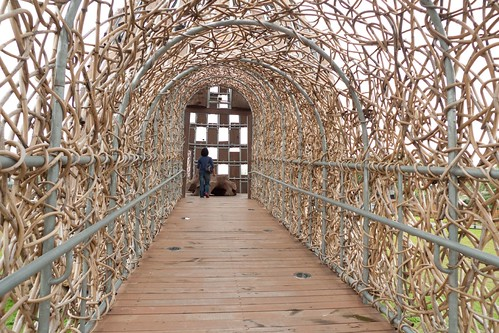
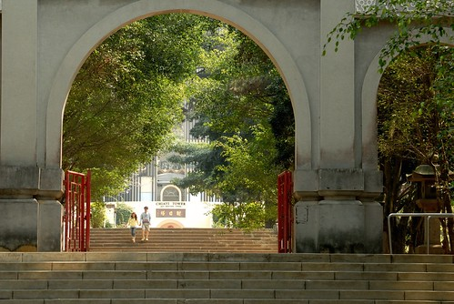

這幾週BLOG寫的少 沒得看的徹爸好像有些小失落 直唸是因為他都沒整理照片 所以我沒照片得寫 其實草稿狀態的文章還好幾篇 是徹爸想太多了 沒有勁加上天氣熱倒是真! 前幾週進入夏天炎熱天氣後 母子三人發願這個夏天要少開些冷氣 所以只有到睡覺時間前 我們才會開房間裡的冷氣 也因此每天從4點多回到家 寫功課 做家務 準備晚餐 遊戲 吃晚餐... 熱能累積到晚上8點後 我們總是想趕緊把所有該做的工作做完 然後洗個澡 一身舒爽的待在開了冷氣的房裡 我說這是不開冷氣的附帶效益  不拖拉的準時上床睡覺 也多了好多睡前的閱讀時間! 這個夏天才開始沒多久 我期待也好奇我們可以這樣撐多久.........

去年看到格友的分享後 才知道嘉義多了兩個裝置藝術品 森林之歌與月影潭心 說是景點 我們覺得還太牽強  不過看的出嘉義市正努力的打造成藝術城市 就如我常跟徹爸說的 嘉義市潛力無限阿! 她有成為另一個古都台南的本事的!! 我深信不疑!!!

今年春天分了兩次探訪森林之歌與月影潭心 兩件藝術品同出自藝術家-王文志之手

月影潭心 「月影」代表泛月美景，「潭心」為湖心波紋，諧音「談心」，傳達蘭潭「月、水、遊潭」的地景意象。 作品是由鋁片編織而成，中間鳥巢上半部如桃子，象徵嘉義市的古地名「桃城」；側邊造型猶如火雞尾，令人聯想到嘉義市特色小吃「火雞肉飯」，造型融入地方文化與觀光特質。 簍空造型的月影潭心，白天看就像美麗的鳥巢佇立在蘭潭旁邊，晚上隨著七彩的燈光，而讓月影潭心呈現不一樣的炫彩面貌  出門溜搭的順道 我們來到蘭潭一探究竟  雖然網友一面倒分享的都是夜晚的月影潭心 甚至有人說白天來看可能感覺就是一堆鐵而已 但因為我們向來對人工聲光效果沒啥興趣加上回嘉義的晚上總是懶得出門 我們還是在烈陽高照的上午來到  而其實太陽映出的網狀影子也是別有韻味  只是洋鋼味真的重了點  我不知哪裡來的傻 把頭伸進洞裡 想看看這樣看出去的蘭潭是否會不一樣 答案是 一樣的蘭潭 只是回家後看到這張照片 我啞然失笑  因為好像上斷頭台阿 難怪被徹爸偷拍...  不到3分鐘  我們便從這頭走到另一邊的那頭 心得是 "嗯~ 觀光建設... 就走走看看唄"  倒是一旁一株木棉花正盛開著 別有一番詩情畫意  因著這藝術裝置的夜晚聲光表演 蘭潭邊也多了些許相關小裝置 而潭裡更是多了台水舞表演的舞台(裝置) 老實講 我心裡感覺不是太舒服....  覺得算是老景點的蘭潭還是維持本來的樣子最美  坐在潭邊 尤其傍晚時分 吹著風 看著360度的一切 舒服愜意的讓人發自內心覺得"回嘉真好"~ 

另一個位在嘉義市文化中心(博物館)後的森林之歌: 運用嘉義縣林務局所提供的漂流木、廢棄阿里山鐵路鐵軌、黃藤以及石頭等，打造出的藝術建築，起初的發想來自於阿里山神木的高聳，以及鐵道的歷史，將大量的樹木綑綁環繞，一層一層的堆疊成高塔，進入建築本體之前的廊道，是運用黃藤所編織而成，像進入山洞般的穿越高塔，象徵著嘉義林業的興盛，以及鐵路的重要性。 白天仰望高塔可以透視天空，感受陽光灑在身體上的感覺，就像在森林般的舒服純淨，晚上運用七彩燈光，將森林之歌的整體造型點綴的夢幻非凡，浪漫的另人捨不得離開，遠處看就像佇立在城市中的亮眼巨蛋，近看彷彿置身森林般的寧靜浪漫  這個地方就在北門車站附近 可以想見將與北門車站 檜意森活村 火車公園串連成嘉義最具代表性的森林火車之旅  只是... 個人覺得...有些牽強的感覺 好啦.....是我主觀太強 藝術涵養又不夠  一樣的 網友口中一樣是夜晚很美的藝術裝置 而我們一樣在大辣辣的白天造訪  不同於月影潭心的鋼強  兩旁的藤編感覺柔和  而當站在"蛋口"下  哇~ 有魔幻的感覺  置身其內看出去的嘉義市區  或許用"公園"來稱呼這裡更為切當些 希望假以時日樹木福蔭 且漸漸成為嘉義人生活的一部分後 這裡真的成為人氣景點! 

其實上面兩個景點的立意都很好 只是自己喜歡老東西遠甚於新事物 所以若有人問我嘉義哪好玩 我一定都會說"嘉義公園走一走挺不錯的" 尤其有小朋友的話 這是我們回嘉義時最常去散步的地方 特別在不知道去哪但又想去哪走走的時後  有百年歷史的嘉義公園內有兩處遊憩區 舊神社地改建的射日塔 史蹟資料館 以及緊臨植物園  公園內新舊併呈 也有些地方歡樂 有些地方沉靜  是個通吃各年齡層的大公園 也是嘉義人生活裡 記憶中重要的一個地方  這兩年看到很多來嘉義遊玩的格友似乎特別喜歡公園內的史蹟資料館 好奇的我 總算10年來第一次的走進資料館  嘉義市史蹟資料館乃日治時代嘉義神社附屬的齋館及社務所 台灣光復之後，神社改為忠烈祠，而齋館及社務所曾由國軍828醫院借用，至民國76年歸還嘉義市政府。 後經建築物的修復及展示軟體的設計規劃 ，民國87年核定為市定古蹟並定名為【嘉義市史蹟資料館】。館內展示有關嘉義的人與嘉義的事，以過去與現在的時光交錯，呈現各自的風華，藉以激發民眾愛鄉愛家的情懷。 (以上摘自官網)  館內有很多詳細的嘉義人事務介紹  讓嘉義媳婦我恍然明瞭好些事(當然也很快就又忘了) 只是老建物的修復 我們覺得有些地方可以更細膩 更好些... 

當我跟徹爸在史蹟資料館訪古時  徹愛兄妹倆正獨自在3分鐘路程的遊憩區裡玩沙畫 到公園畫沙畫 打彈珠 套圈圈 開碰碰車 是徹愛兩人從有記憶裡來每次回嘉義都要阿公阿嬤帶去做的事  只可惜這一年來因市府的嚴格取締 這樣的機會已經可遇不可求 那一天幸運的遇到警察偷懶 兄妹倆玩的好開心 

 莊嚴肅穆的百年古蹟與忠烈祠前 小人駕著碰碰車馳騁著 這樣衝突的一個畫面 但很棒的感覺~ 

最後就用阿徹這學期的一篇作文作為結尾   我想嘉義的好吃 好玩盡顯無疑~ 作文題目:去奶奶家 每個月我們都會去奶奶家探望奶奶，可是奶奶家在嘉義，都要開好久的車才能到，在車上都好無聊。 在奶奶家，因為樓下是漫畫店，所以要看什麼漫畫都有，而且都不用錢哦！真希望同學也可以來。 以前都會請阿公帶我去公園玩，會開碰碰車、打彈珠、畫沙畫、套圈圈，可是，後來就很少有這些攤位了，不過這次回嘉義大部分又都出現了，就只差套圈圈沒有擺攤，但我們還是玩的好開心。 每次回嘉義我們都會去一家很有名的飲料店，因為葡萄柚綠茶果肉香甜又多，所以客人很多，可是我都只喝珍珠奶茶；我們也會去買鱔魚麵、砂鍋魚頭、蛋捲，尤其是過年到奶奶家的人很多，鱔魚麵特別好吃，我有一個3歲的妹妹也愛吃。 每次回台北心裡都有一點捨不得，因為嘉義有好多美食，好多好玩的地方，和有好多漫畫，就像在渡假一樣，奶奶家真棒！
