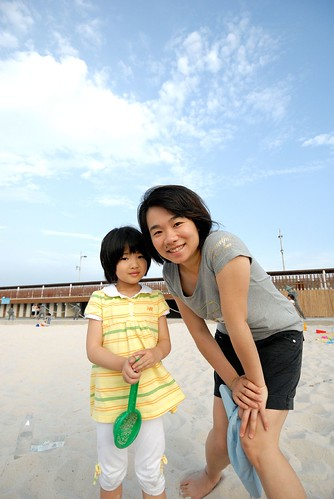
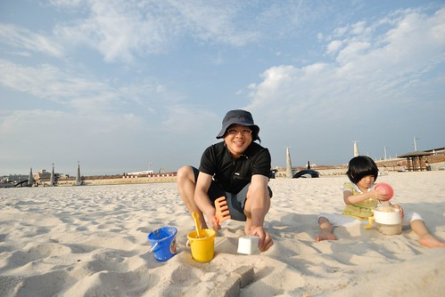
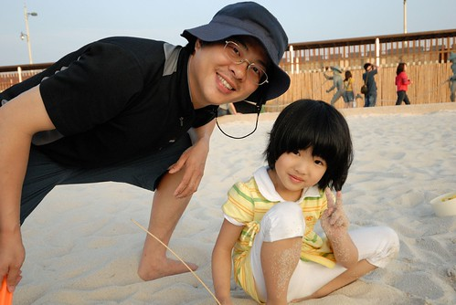
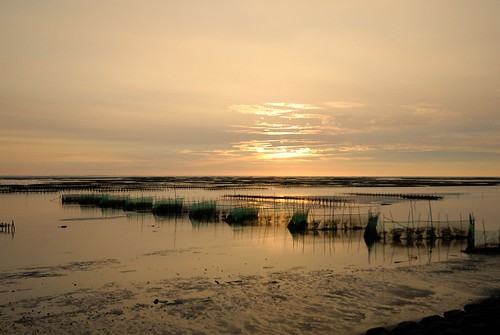

台北有個淡水漁人碼頭 在嘉義也有漁人碼頭喔! 就在東石! 印象中 淡水漁人碼頭我只有5年前去天元宮賞櫻時順道去晃過外 沒再想要去.. 但是我很喜歡嘉義東石的漁人碼頭  特別是那片可以讓小孩玩很開心的人造沙灘 只是我不喜歡風大的時候去(會頭痛) 也不愛太陽太酷熱的時候去(會曬到只想回家) 一年四季中 我覺得4-5月的時候最適合了 天氣有點涼又不是太涼 有點熱也不是太熱 就是一整個很適合吹風 曬太陽啦! 

母親節週六下午 我們快4點才從嘉義阿嬤家出發去東石 走快速道路加上不若台北到處的車潮 我們花大約40分鐘時間到東石 路上 越往海邊接近越能趕受到這時節的宜人好天氣  到達東石後 我們仿若熟客般的直闖沙區 一看到沙 兄妹倆就開始嚷"可以下去了嗎?" 我說"這裡人太多 進去裡面些" 穿過大半沙區了 見我還是沒停住腳的意思 父子三人一起開始哀"媽媽 你要走去哪阿? 這裡就很好啦!" 可是我邊說"還沒 還沒"邊繼續走... 直到快到沙灘的另一頭 雖然對於晚了幾分鐘玩到沙 兄妹倆嘀咕了幾句 但我說"這裡人少比較好好阿"   (大家明白這家的老大是誰了吧 哈哈!) 待我說"這裡可以"時 兄妹倆馬上跳進去開戰嚕~  穿越沙灘的路上看到有一家人蓋了美麗的沙堡  阿徹跟徹爸羨慕的發下豪誓也要蓋一座"堡" 所以阿徹二話不說 馬上就開始堆沙山  堆完山後 徹爸開始著手建立城牆  同時間 沒有參與感的愛愛自個在一旁瞎玩  而我這媽則悠悠哉哉的坐在一旁曬太陽 看著大家玩沙 徹爸父子倆說"媽媽 你很偷懶揶" 我說"我之所以找你們來東石 之所以要走到這麼裡面 就是想像這樣 坐在這享受而已阿" 聽到這 父子倆同時露出一臉誤上賊船的表情 然後對我大大"厚~"了一聲.. 哈哈!  好啦! 那我幫大家拍照好了 (所以上面跟下面大半都是我拍的)  真的啦! 這樣的藍天白雲 這樣28度左右的溫度 真的是太宜人了 小孩子看到沙會瘋狂 但是成熟的大人一定是會先好好享受這好天氣好氛圍的  本來在玩沙的徹爸抬頭看到我後 驚為天人似的說"不要動"  不明就裡的我又驚又喜的... 原來徹爸指的是背景的天空讚啦! 於是自拍二人組又很high的拍起照來  顏色多柔和多漂亮的天空阿!  還有越來越像的母女倆阿!  陪老婆搞FU完的徹爸開始認真的做沙堡了  徹爸還發揮RD精神 研究嘗試各種方式及沙與水的比例  徹爸跟阿徹說"你堆三座山 然後我們做個圍牆把山圈起來 圍牆沒做好不下班" 於是阿徹不客氣的堆了三座山  悶頭苦幹半小時卻只砌了幾道牆的徹爸 看到阿徹三座山如此大的範圍 哀嚎著'太大啦! 做到七點也不能下班!' 於是徹爸決定心肝小一點 把大山圍起來後 就要下班了  一塊塊的沙磚還煞有其事的樣子ㄋ   不過城堡看起來還是荒蕪一片阿  於是我只好也下沙了  認真的幫忙提水 幫忙在沙堡上做些有的沒的  愛愛則在一旁練習做沙蛋糕 而且還是有造型圖案的...  經過徹爸的技術指導 愛愛也是個玩沙好師傅  經過一小時全家一起的努力  總算 總算...我們沙堡的樣子出現了 好不容易圈了一圈的城牆 還有歨道 還有媽媽做的仙人掌怪物 還有啥不巄東一堆...  而當中 這個樓梯最有感覺了.. 徹爸很是得意  徹爸圍好一圈城牆後就下班收手了    夫妻倆繼續納涼去 好一會後 我們才赫然發現阿徹不坑聲地學著徹爸 繼續砌著牆  他說他要做城門  阿徹做的並不甚成功 於是老師傅再度下沙指導 徹爸提醒了幾個要訣後 很快地阿徹就抓到了訣竅 自己也可以用的很好了  然後我跟徹爸再繼續看著藍天 聊天拍照著...徹爸還學人家美少女十秒連拍 可是就像徹爸說的怎麼美女隨便怎麼擺就怎麼美 而他怎麼擺怎麼醜 不過我喜歡這張 我要求徹爸回去後要把fb的大頭照換成這樣以示愛意 哈!  同時間 愛愛也繼續挑戰著他的大蛋糕  (我說愛愛的愛心真是越'寫'越好看了 )  噹! 歷時一個半小時 我們的家的沙堡完成嚕~ 雖然亂七八糟一通 但從這角度看過去還煞有其事一番ㄋ  我們心滿意足的留下沙堡 然後去堤岸邊看夕陽 吹泡泡  我們剛好趕上了這最後的夕陽  好美  好個夕陽無限好!  而我們何其幸福的有它伴著 吹著泡泡  我說這感覺真是太棒了 衝著這夕陽 這夏天回嘉義的時候可以多來這走走 只是要傍晚時分才可以  天完全的黑了後 我們也準備要回家了 雖然家裡阿嬤準備好晚餐 但是我們還是嘴殘的去吃了盤臭豆腐還有蚵仔煎 我說都來到東石了 怎麼可以不來一盤蚵仔煎哩 啟不浪費了.. 雖然我向來不愛吃蚵仔 可是這一盤真的好吃 蚵鮮皮Q+夠味醬汁  一整個讚啦! 我們一家子心滿意足的結束我們四小時的東石行! (包含車程才4小時喔)  補充說明一下 這裡的沙有個好處就是玩完後 把身上沙子拍一拍即可恢復一身潔淨 起碼就是不會黏不會髒讓人不舒服啦! 可能是因為這裡的沙顆粒較大的緣故... 不過阿嬤就說 這裡的沙不好 因為走在上面會痛 哈! 感覺這種東西果然是很主觀的阿!

附帶介紹一下當天中午去市區吃的中餐 其實徹爸家超少吃外食的  這日中午因為阿公阿嬤要去喝喜酒 於是我們決定趁著難得機會 去吃些所謂的嘉義美食 (大家都說嘉義小吃有名 可是嘉義人的我們還真不知道也很少吃說) 徹爸上網搜尋了好一會 最後我們去了有極多網友推薦的沱江小館 難得去到'名店'的我們 看到菜單上的清單 一堆想吃看看的 於是失心瘋的點了一堆: 四樣小菜+青菜  餃子 小龍包 炸醬麵 兩碗湯  還有牛肉湯麵  紅油炒手  點到最後 我一直唸著我們怎麼可能吃的完阿 但就如徹爸一開始所說'我們可以的'  我們三個人真的很厲害的吃光光了 是三個人喔 因為那個吃正餐很遜的愛愛除了貢獻些小菜外 只跟一小碗的麵奮戰著... 滿桌的空盤對照愛愛一臉無奈的吃相 有夠對比的... Orz  不過這的東西都還不錯吃(尤其那個牛肉湯麵 推! ) 算是物美價廉 來嘉義玩的人 可以參考看看喔!
