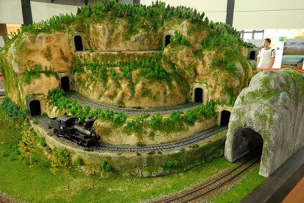
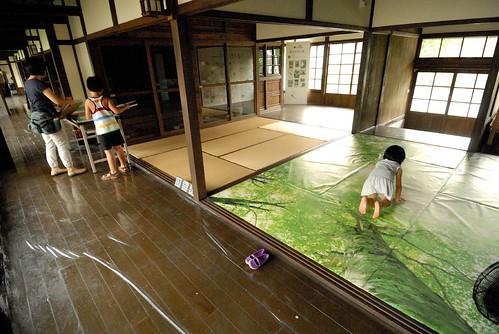

很多人都以為我們家很愛玩很常出去玩 常問我"這週末要去哪玩阿" 天地良心阿! 其實我們家出遊的頻率與拼勁真的沒有了不得阿... 我想了想 大概是因為我們大約三個禮拜就回一次嘉義造成的假像吧! 再加上2-3個小時的隨意走走也能被我說的像是一段小旅行的原因吧! 不過既然有回嘉義這個地利之便 我說我就每次回去都來寫個一篇嘉義之好好玩 希望藉由這動力 我們能好好多去了解嘉義這個地方! (講真的 徹爸對於嘉義的好吃好玩真的很不熟)

這一兩年每次要開車去耐斯松屋百貨時 都會在林森南路看到一個大範圍的整建工程 每次經過 我們心裡就很是好奇這裡到底會變出什麼新的公共建物.. 前陣子網路新聞看到"嘉林故事屋"開張了   看到這名稱 直覺地認為應該是在嘉義 上網估了一下 找到了故事屋也因此找到了檜意森活村  原來這是嘉義的新亮點!

往北門車站的林森南路一直以來都是很綠意盎然的 過往不多的車輛 配上鐵路平交道 是很有FU的一條美麗道路 而現在在這美麗的道路口旁又多了個美麗的檜意森林村  林務局的相關介紹如下: 日據時期，阿里山與太平山、八仙山並稱台灣三大林場，嘉義市為阿里山森林鐵路起點，曾列為台灣四大都市之一。...不再於阿里山伐木，遺留下近百年歷史的北門驛、營林俱樂部、小火車修理工廠、林場宿舍及辦公廳、製材廠、動力室等，已成為珍貴的林業文化資產。為延續保存珍貴林業史蹟，本計畫將利用製材廠、動力室、林場宿舍、貯木池等區域，面積約13.76公頃（阿里山林業村）及歷史建築群暨所屬營林俱樂部週邊區域等，面積約3.15公頃（檜意森活村），以現有建物整修再利用，整合營造成為一處林業文化藝術新據點。

　「阿里山林業村」及「檜意森活村」係配合「嘉義火車站附近地區都市更新」案，打造嘉義市成為「嘉雲南藝文休憩中心」，以林業為核心價值之經營主體。延續保存珍貴林業文化史蹟、維護及動態保存森林鐵路歷史資產、並能呈現早期阿里山林場風貌  農業精品區是檜意森活村的其中一部分 包含一個一心二葉館 兩棟歷史建築以及一座戶外舞台 當中 一心二葉館是森活村裡唯一的全新建物 是依照阿里山茶葉的一心二葉概念所設計  不只建築本體外觀(雖然好像是要從天空看起下來才看得出來)像一心二葉  欄杆上也隨處可見一心二葉的圖案 該館為展示館 目前正展出「檜來嘉義，意起郵鐵道」展覽  除了郵展外 一樓大廳裡的鐵路模型很吸引大人小孩的注意  以前知道阿里山鐵路是採之字型行駛的 今日看到這說明才明白原來"之"字只是其中的一個小技巧 這個"獨立山螺旋登山"才是真屌阿  標高有817公尺的獨立山，看起來像打了好幾個蝴蝶結的軌道， 火車要先以順時間的方向繞兩個圓圈後，再走個8字型才能順利駛出山體  本來我們沒注意到有火車在跑 突然看到一輛小火車冒出頭來 忍不住驚呼 徹愛甚至還跟著火車一起走 期待他上山表演螺旋法 結果一旁的阿伯跟我們說他只在山下繞圈圈啦 不過這蒸氣火車的真實縮小版不只會快飛 會ㄨㄨㄨ 還會冒出蒸氣白煙 真是逼真可愛阿!  這是站在二樓看的一二樓空間 很是舒服  緊臨著一心二葉館旁是一座說它可以住人都不為過的廁所 "檜木"廁所這這這...未免太奢華的低調  再接著廁所旁是T30與T31 是1914年建立的林業日式宿舍群  對啦! 我要找的就是這一味啦!  (不過我那剛睡午覺起的眼睛怎麼這麼張不開阿 ..)  而且門前還有一顆結著龍眼的龍眼樹哩! 我要徹爸幫我在樹下拍一張 徹爸一整個不明就裡覺得這有什麼好拍 他殊不知老房子的門前配上這樣一棵大樹(最好也要夠老) 是我多盼望的夢想阿  整修完成的宿舍有兩群 分為T31與T30 T31裡一半為農業精品的展示 一半則為開放空間 播放著森林村整修的紀錄片  榻榻米 聞起來好香 踏起來好柔... 舒服的讓我都有衝動以後家裡也來鋪個榻榻米  走廊裡還擺了張原味的長木凳  硬是要徹愛坐在這讓徹爸照個一張  離開T31 依著個小生態池走向T30 (後方建物就是檜木廁所)  小水池襯著的T30又更是一番詩情畫意了  如果這是我的家該有多好   "客人 歡迎光臨!"  T30裡分為三個空間區域 前兩個空間裡除了展示一些竹創作品以及植物相關的展品外 倘大的房間里主角分別是一隻黑熊 (我們沒有破壞公物喔 是志工說可以坐我們才想到也才敢上去的喔)  還有一隻山豬  (愛愛你也未免倘的太舒服了)  而一半的區域則是吸引我注意到進而找到這的嘉林故事屋 這個空間 週六都會有有志工在此進行說故事活動 日式建築裡 坐在榻榻米上 盤著腿或是翹著腳 聽著故事... 我光用想像的就覺得好愜意阿! 進入這區 我跟阿徹第一個注意到的是長桌上一本本的繪本 沒想到吸引愛愛的卻是鋪在榻榻米上的那"片"大樹   小姑娘啥都沒說的就自個爬上去了  還躺了下來!! 要不是因為要拍照 叮嚀她把裙子拉好 把腿靠緊些  愛愛可是躺的大辣辣的(幸好都沒人)  我拿了本繪本 打算好好的享受在榻榻米上看故事的愜意  愛愛跟阿徹紛紛湊到我身邊 聽我說故事 或許榻榻米上更適合這樣的親子同樂畫面  只是那個愛愛又不小心太愜意 真把這當自己家 腳翹的這樣高...  房子的前後都是落地的木頭玻璃門  真住起來一定很通風 採光又好 大人在房子裡忙著 抬頭就能看見在戶外玩耍的小孩 我想像的美好畫面  房子的其中一牆介紹著台灣各地的著名歨道  希望大家有機會多親近森林 來段與森林的奇遇記! Ready!! GO!!!  我們從一心二葉館的外圍樓梯走上二樓外陽台 剛好看見即將落日的太陽 以及右側建物的瓦片屋頂 真是祥和美麗的一個畫面  陽台上我們也看見了一顆光禿禿正在吊點滴的大樹 固定他的繩子上掛了好些個鈴鐺以及像是祈福的飾品  希望他可以大病痊癒 以後活的支密茂盛  徹爸拍照的時候  愛愛看到樓梯上的這鐵欄杆竟然就練起他最近新學的朝天凳 可能這很像舞蹈教室的欄杆 真是太有練舞的fu了 (其實愛愛的腳可以凳的更直的 只是礙於穿裙子不出適合露出小褲褲 只好叮嚀她含蓄點)  本來我們逛到此時此刻 是準備要回家了 卻碰巧剛好遇到熱心的志工伯伯跟我們說 晚些六點在故事屋有壓花DIY 其實前幾天看電子新聞 我就知道今日有DIY 只是以為是下午 而在一心二葉館裡我也看到DM上的活動時間 只是我不想讓阿徹知道 不想讓他一心在DIY上而沒能好好跟著我們一起走走看看 所以我抱著隨緣的心 想說如果時間有接上有看到再說... 結果沒想到老天爺果然是疼阿徹的 還是讓阿徹給遇到了

於是為了打發等候時間 我們多在園區裡走走看看 我們從T30與T31中間散步出去 才發現這側門好有日本的FU喔  徹爸笑說如果讓人看照片 說這裡是日本 大家也會相信吧!  側門出去後 沿著小巷子我們走到了北門驛  北門驛是阿里山森林鐵路的實際起點 1912年完工啟用至1973 目前為嘉義林業歷史展覽館兼辦公室使用 並指定為市定古蹟 為嘉義市第一座修復的舊建物  車站仍保留著候車月台 鐵道以及運載木材的拖板車.. 一整個很有FU的地方  坐在車站外的長椅上 猜想這裡必定見證過很多的人的故事...  車站廣場前的左側還坐落著數間雅緻的矮平房 我忍不住上前窺探到底是哪樣的人家有這樣的好福氣住在這阿 尤其門前還有這棵大樹 光是想像夜晚時分坐在這樹下納涼聊天 就讓人好生羨慕  徹爸又比著廣場的右側建物說 如果那間來做民宿應該很不錯 嗯! 隱藏於都市中的一個懷舊小天地 好像值得投資的一個地方喔!  (我們的民宿夢無時無刻不存在著阿)  六點我們回到故事屋準備做乾燥花DIY  參與的每個人都可以領一份材料 製作一個屬於自己的壓花鑰匙圈  愛愛手腳最快 很快的就做好一個五彩繽紛的鑰匙圈  看愛愛開心的樣子 志工姊姊請愛愛讓她照一張相 愛愛也不扭捏的配合著  我們花大約10分鐘即完成每個人自己的鑰匙圈 阿徹跟愛愛的都很有自己的想法 作品也都很有特色與美感 反倒是我跟徹爸對著一堆花材 不太懂得如何配置 做好的作品也似乎少了那麼些創意與美感 不過一趟2小時的懷舊小旅行 加上最後有這樣的小禮物 真是讓人心情愉悅阿! 今日嘉義好好玩 出擊成功! 
