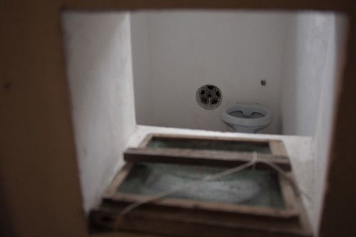

12月底同個週末的週日上午 我們一訪耳聞許久的嘉義獄政博物館 出門前聽到我們要去嘉義監獄 徹阿公有些難以理解"那種地方也好去" 的確! 監獄給人感覺的確有點陰 常人沒事最好不要去 雖然置身其中的確偶有冷風拂過的越走越冷 但真的只是因為寒流來襲... 如果沒忌諱 這裡是來嘉義遊玩時值得一訪的景點 絕對讓小孩看過後不敢作惡犯監!

  獄政博物館目前開放 且有志工帶領進入並解說的時段如下所示  因為不需事先登記也沒人數限制 所以碰到人多的時段時得想辦法卡位才能好好聽到解說(幸好很多人也只熱衷拍照)  嘉義監獄是日據時代所建(1922完工)  是目前世界上唯一原地保留的賓夕凡尼亞式監獄建築 (還有一所日本北海道那的監獄也是這種 但已經過遷移改建) 民國83年因不敷使用 嘉義監獄遷移至嘉義縣鹿草鄉 而這裡變成嘉義分監 作為體供法制教育與人權演進教材與場所 並在民國九十多年定為國家古蹟後進行修復與保留  很幸運的 為我們解說的志工是出版"嘉義小旅行"的作者 有趣又豐富的許多小故事與歷史介紹 讓我們大開眼界也了解我們無法窺見的獄中世界  解說的動線從關女受刑人的婦育館開始 小小的區域 小小的入口 好神秘的感覺  大家尾隨志工 好奇的窺探著這彷彿第三世界的空間  不可思議的小小空間 關了人 心也封了  考量媽媽對於嬰兒不可或缺的重要性 女受刑人的小孩三歲內是可以跟著媽媽一起在獄中生活 這是到目前都還一直實行著的獄中政策  除了晚上睡覺的小小寢室外 獄中最主要的活動空間與活動就是工作的工廠  在工場裡 擺了好多可愛的人形立牌與名牌提供遊客照相  徹愛超難以接受的不願意當犯人  只剩為娘一個人樂中作苦  (躲遠遠的愛愛幸災樂禍的樣子)  雖然不願意當犯人 兄妹倆卻是樂於當神氣鼎鼎的警察   在工廠旁還有一間小會客室  這一幕大家就有熟悉了.. 電視上常有!  婦育館建物圍著的這片小草坪  我們想應該是受刑人最常凝望的地方吧  看著舒服 但也益加渴望出去外面的世界  不能說也不該說這裡好美 但這裡的氛圍真的很美 很像不會說話卻自己說著故事的一本老書  參觀完婦育館 接著來到主監獄  沿途所見的每一景物都是由受刑人所做 很厲害阿  (這個疑似下水道孔的小水池是執行處罰的水牢  真的有恐怖阿)  這區域的解說由三座工廠的解說開始  各工廠裡紛別有台灣區各監獄新舊園區的模型展示  解說志工非常詳細的帶領我們了解新舊間與不同地區監獄間的差異與特色  工場裡還有許多受刑人作品的展示  利用印刷鉛版塊的藝術畫  監獄相關物品再利用的藝術創作  幾可逼真的模型製作  還有許多年度燈王作品(元宵節的花燈比賽)的展示  用上萬隻牙籤做出來的虎年生肖主題花燈真的很精細也好可愛  11隻狗的狗年花燈  用香菸盒做成的龍船  真的! 監獄裡臥虎藏龍的 也許因為在裡頭什麼都沒有就是時間最多所以能完成這些巨作 也或許聰明的人容易反被聰明誤 所以進到了這...... 今日帶著徹愛走這一趟 他們心中肯定也別有一番體會與明白!  大量運用阿里山木材建造的嘉義監獄在仍保留歲月痕跡下被保育的很好  是值得走一遭的古蹟園區  而且超有FU~  我們的參觀繼續來到受刑人的住宿區  本以為天花板上的木條是美觀裝飾用 沒想到上頭竟是空中走廊阿 監獄管理人員走在上頭便可一目瞭然的巡視每間房間  在還沒有燈的時代 夜晚房裡唯一的光源就是兩室隔牆上共用的一盞煤油燈  一般牢房都是兩人一室 只有新人剛進來時是住在一人的新收房裡(因為還不了解新人的習性)  除了一個馬桶跟水龍頭外 甚麼都沒有的小小空間  真的像徹爸同學說的 關上門人真的就被完全的關住了 (徹爸同學去參觀時 站進裡頭關上門 體會感受了一番)  走到中央控制台後 嘉義監獄建物的特性一覽無遺  三排放射狀牢房的設計 讓各處顯而易見 便於獄中管理  在中央台的後上方還有從日據時代就一直每天拜到現在的神甕 祈福又求安  過了中央台後 最後來到的是行政辦公區 典獄長辦公室裡有典獄長制服可穿著拍照 但徹愛一樣的怎樣都不願意...  本來擔心兄妹倆置身在獄中會害怕 不喜歡 沒想到兩人卻是聽故事聽的津津有味 而且問題不斷 只是牽我的手也握的很緊...  不忌諱的父母 蠻值得帶正準備進入青春期的小學生來走一遭  讓他明白 歹路真的不能走阿~ (阿爸握拳狀)  一個半小時左右的解說 時間過很快 但愉快又豐富 以後我也可以跟人家推薦 嘉義的獄政博物館很值得去喔~  不過我們的愛愛很搞笑  之後看到穿橫條紋衣服的人 都會小聲跟我說"他穿犯人衣耶" 話說 為什麼犯人的對外形象是穿橫紋衣阿?!!! 
