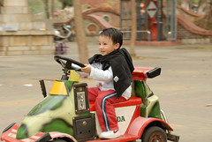

平均3週回一趟嘉義  
很多朋友聽到都說"哇~很勤喔"  
但也有朋友笑說 "這是週一十五吃素 比起天天吃素好太多"   
老實說 若要與公婆住在同一屋簷下 我內心是有障礙需要克服的  
但這樣定期帶小孩回嘉義 對我們來說反倒像是回去渡假  
阿徹跟著阿公阿嬤不是去獨角仙農場玩沙便是到中山公園餵魚  
而我跟徹爸不是趁機偷懶睡覺就是帶著小愛去逛逛書局或買東西  
這樣的小度假真的很優閒很愜意  

回到嘉義 不止我跟徹爸嗑著嘉義好吃的羊肉爐 鴨米血 水煎包   
連小愛跟阿徹也是放肆的不停吃吃喝喝  
  
  
  
阿公的搖椅成了回去孫兒們的新寵 大家搶著坐  
連小愛也會央求要上去搖阿搖  
  
  
  
雖然是入冬以來最強的寒流來襲  
還是無聊的跟徹爸還有阿伯到高鐵嘉義站湊熱鬧  
純粹參觀真的很像劉姥姥逛大觀園   
建築物等大的設施很有機場的氣度   
但是購票機器還有入口夾等機器卻簡便的有點小家子氣 反倒像是捷運站  
  
  
  
帶著小孩子在車站內嬉戲 好像有點"鄉下俗" 哈哈~  
  
  
  
車站內還有摩斯漢堡可以消磨等候的時間喔 (人家是等火車 我們是等徹爸拍照)  
  
  
  
週日早上往往阿徹都跟阿公阿嬤去外頭玩到瘋  
可是今早不肯吃粥 在媽媽脅迫"沒吃早餐就不准去玩沙"下 阿徹選擇在家玩就好了  
雖然後來願意吃粥了 但已錯失去玩沙的時機  
不過徹爸還是很有義氣的願意帶他去中山公園  
想想也好久沒有跟徹爸帶著阿徹去公園玩了(都是放給阿公阿嬤帶去的)  
公園裡看到阿徹打著彈珠 溜著大溜滑梯 熟練的駕著小汽車  
才驚覺原來阿徹已經在不知不覺中長大了  真是越來越會玩了  
   
認真的打著彈珠   
很厲害喔打了12排可以獲得親親蘆筍汁一罐(不像媽媽都只能換到沙士糖)  
但我們自動降價換11排的吹泡泡一罐  
  
  
  
  
套圈圈時也大心肝的想套最後排的大型辦家家酒玩具  
雖然大家都勸阿徹套前排的小玩意就好  
但他還是堅持的要套最後那排  
認真的讓我 阿公跟徹爸都忍不住下海了  
四個人不知不覺中就奉給老闆60 /70元銀兩  
雖然最後還是讓阿徹滿抱遺憾的離開  
但我們承諾他每次回嘉義到這公園就會讓他套20元 直到他套到最後一排的玩具   
  
  
到公園來怎麼可以不玩玩溜滑梯ㄋ~  
  
  
  
連小愛也獻出了他的處女秀  
  
  
  
小愛第一次可以在公園裡暴走  
等再大一點 就可以跟著哥哥一起跟阿公阿嬤四處玩啦  
  
  
  
看到超大型水泥溜滑梯 阿徹也躍躍欲試  
脫了鞋襪後 一個小人就這樣衝衝衝的走上坡 溜下來  
溜了6-7趟 累的都要扶著旁邊把手才能走上去了 還是要溜  
媽媽忍不住的去溜了一趟  哇~爬那一趟就有點喘了  
阿徹這6-7趟是怎麼做到的ㄚ  
果然年輕人體力比較好  
  
  
  
然後到草坪上吹泡泡  
媽媽賣力的吹著泡泡而阿徹奮力的追著大大小小的泡泡  
  
  
  
阿徹還跟爸爸媽媽比賽賽跑   
10多度的低溫下 玩到滿頭汗溼透衣服 你就知道阿徹有多麼認真在玩了  
  
  
  
最後的小汽車 真的真的讓爸爸媽媽看的張大嘴睜大眼睛  
哇~很猛哩    
速度夠 轉彎漂亮 還會閃躲障礙物  
儼然一個身藏不露的小賽車手  
跟徹爸兩人忍不住驚呼"阿徹真的長大了"  
原來這麼久沒跟著阿徹來公園 忽略了阿徹已經在不知不覺中長大了  
  

