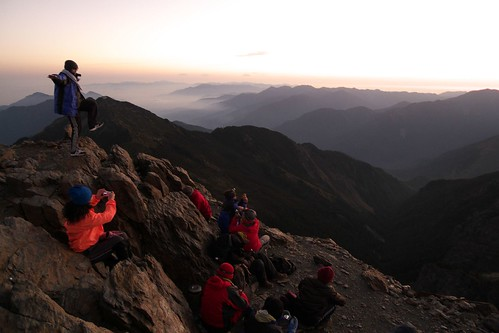

 這是徹爸五月底去爬玉山登頂時的照片 今天晚上聽了阿徹的嚎啕大哭後 突然很想搭著這張照片紀錄下些什麼

阿徹很久沒有這樣嚎啕大哭了.... 雖然很常被我跟徹爸嘮叨責備 但他漸漸懂得哭泣是種情緒的宣洩 生氣或難過時 躲到房裡哭一哭發洩一下  情緒平復了再回到外頭依舊一尾活龍

今天阿徹在學校得背經 若沒過則今日的下課都不得出去玩 週末時雖然想起一兩次有背經這回事 但他還是到週日上床後才想起隔日要背經這回事 所以他當然今天的背經沒通過了(雖然我們心裡還是期待奇蹟的發生) 回家的路上問起他這件事 叮嚀了他那晚上要多練習多背幾次喔 阿徹搖搖頭說了句"不要"後 便什麼都沒再多說 等到徹爸回家再問起這件事 阿徹一樣消極的回應"沒過也沒有什麼" 徹爸唸著我 怎麼都當作沒聽到這件事 沒好好處理一下 於是在幫阿徹洗澡時 我好好的跟阿徹"溝通"了一下 (大人都這樣都自以為在溝通 其實還是獨裁) 阿徹說 這次的背經對他難說太難了 他不可能通過 "理性"的大人,我當然就得跟他說"既然難 那就更要多練習幾遍"之類批哩啪拉的話 阿徹說 "沒過又怎麼樣"(還是"過了又怎麼樣") "理性"的大人,我總算忍不住說"不會怎麼樣 只是因為你是小學生 那是你該做的事 所以你就該努力去過" 好狗屁的理由喔..... 就像平日教他們時常說的"沒有為什麼 因為我是你媽(爸)所以你就該聽我的"

洗完澡後又被徹爸小關切一下 阿徹總算忍不住趴在床上嚎啕大哭了起來 哭的枕頭棉被都是他的鼻涕+眼淚 徹爸對阿徹說’你要看看別人比你多認真　多努力所以才會過的阿’ 又對我說"阿 你是怎樣打翻人家的醬油的啦" 我說"不用說別人怎麼樣　那本來就是阿徹該面對的．．．" 或許現在跟阿徹講’人生本來就有很多無耐或是沒有理由的事’真是太早也太苛責沒良心 但我真的認為這也是種學習阿　而且生活的方式跟快樂與否真的可以掌握在自己的手裡．．．

我腦海裡一直在想阿徹說的’沒過又怎麼樣’．．． 是真的不會怎麼樣阿．．．． 或許我不能接受的是這樣消極　這麼早就看輕自己的阿徹吧 我跟徹爸平日最常掛在嘴上跟阿徹兄妹倆講的一句話就是’結果怎樣沒關係　重要的是有認真’ 而我也堅信認真的過程絶對都是種收穫　只是收穫或許是在很久以後才發現自己有收穫了 所以阿徹!　加油阿! 　要像爸爸說的’人家旋渦鳴不輕易放棄的’ 真的希望你就像你自己說的’人家只是哭一哭發洩一下而已’．．．．

就像阿徹不喜歡的爬山　為什麼要爬的這麼累　為什麼要這樣向自己挑戰 因為登高才能望遠阿．．． 

才有機會看到美麗的日出阿．．． 

當爸媽真的好難　好難的修行．． 明明如果換做自己都會很痛苦的事該如何去引導小孩ㄋ．．真的是傷腦筋阿．．．

Note: 本篇純敘述／紀錄／牢騷文　沒事!　別擔心!!
