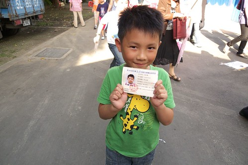

話說上周一二阿徹連著兩晚因為背經這事帶著眼淚睡去....

周一晚上媽媽利誘他"明天背經過 送你一本喜洋洋 後天過我出一半錢 再多一天我再少出一半錢.." 阿徹聽了很開心 可是開心後還是一臉困惑的跟我說"可是真的很難 我真的做不到.." 周二晚飯後徹爸要阿徹拿出三字經 比照學校模式兩人輪流背誦 結果背個幾頁後 徹爸忍不住大喊"(詞)太像了 阿徹早亂掉了.." 然後無疾而終 那晚上徹爸下通牒"下周一(學校的驗收期限)沒過我不管 但是家裡還是得一個月內背完" 害的阿徹那晚又是又惱又憂的哭著睡著...

星期三早上阿徹不到七點便起床 精神奕奕的到廚房跟我道早後就一如以往的到遊戲區看圖畫書去 我來到遊戲區關切他的心情 擔心他會陷在這兩晚的不好情緒中 結果看到他沒什麼的笑咪咪模樣 忍不住跟他說 "媽媽以前念書的時候 很喜歡利用早上一大早剛起床後背課文背單字 我覺得這樣效果很好" 講完我便回到廚房繼續我自己的工作

10分鐘後當我再度到遊戲區看到阿徹嘴中唸唸有詞的覆誦著三字經 我眼睛一整個的亮了 阿徹笑著跟我說"我已經念完一遍了喔"  然後到吃早餐時阿徹說他已經念過兩三遍了... 沒再交代他任何有關學校背經的事 但徹爸說在上學的路上 阿徹信誓旦旦的跟他說"我今天讀經一定要過關" 看來早上的讀經給了他很大的信心 跟徹爸兩人在MSN談論這事時 我說"希望阿徹今天讀經可以過了" 結果徹爸說"如果沒過就更慘了 信心全失" 徹爸這麼一說 害我挫了起來.. 真的 好不容易鼓起的勇氣跟信心 如果這樣失敗了 真的會跌落得更慘

幸好去接阿徹時迎面就看到阿徹飛撲而來開心的大喊著"媽咪 我讀經過了" 真的是幸好阿..................................................... 徹爸說 阿徹又幸運了~~~ 上回的期中考也是徹爸口中的幸運 一直跟阿徹說那是他運氣好 而我們私下的討論時 徹爸也說"給阿徹點甜頭 他會比較認真念書的" 是阿~ 學習上的成就本來就是push學習一個很重要的動力 就像很多數學不好的人都是因為一開始的幾次考試成績不好後 喪失信心 開始認定自己數學就是不好 然後更不花時間練習 那當然數學就真的越來越爛了... 所以我們還蠻欣慰起碼到目前為止阿徹很幸運 偶而能有個好成績鼓勵他 奢侈的希望 可以這樣慢慢建立起阿徹念書的習慣....(指的不是時間/方式問題 心態問題)

照片中是阿徹5月初去參加英文檢定考時的照片... 阿徹幼稚園小中大班都是念園裡的全美班 每天早上都是外師進行的英文課程 三年下來 讀寫不行 可是聽說方面 我個人覺得有花錢還是有差 (不過我家的標準很低啦 而且我們花錢的目的也不在學英文啦 純為了更活潑多元的教學而已) 大班時就曾經有英文檢定的測驗 同班的同學好像都去參加了 就只有阿徹沒參加 Freda還為了此事難得的打電話跟我討論　她說＂學了這麼久去測驗驗收一下阿＂ 我說因為阿徹不要所以就算了　而對我們來講是真的沒有驗收的必要

小學後阿徹依舊在一樣的幼稚園上著安親班　英文課一開始是參加外師一周一次兩小時的課程 上兩個月後因為背單字的痛苦（我也盯的痛苦　更慘的是還常忘記盯）阿徹嚷著要上中師的 於是就轉班換去上中師的一周兩次每次一個半小時的課 不可否認中師的教法比較不是我們樂見的（這也是我一開始要求阿徹上外師課的原因） 但起碼還是有持續在學英文...（要求真低） 只是看著阿徹愈來越少開口亂說英文　越來越羞於說英文　甚至越來越（其實是一直）潦草寫作業 我常在想這樣學習英文　到底所求為何　為的是什麼 但是沒送去專門的英文學校就算了　要這麼斷然停掉英文課　老實講我還真沒勇氣哩

三月時阿徹拿著英文檢定報名單給我們說他想去考 我跟徹爸兩人質疑他＂你會想去考?!＂ 雖然阿徹說＂我想看看我的英文能力阿＂　可是後來還是不小心露餡了 原來是去考試得到多少成績便可以獎賞多少點數  徹爸笑說好像花錢買點數喔... 雖然報名了但是阿徹在家沒做任何的準備　而我們當然也一如平常的沒替他做任何的事 結果...結果...還不到５月初的檢定考 阿徹就因為不知道是作業太多　還是課堂中密集的練習以及考試式的學習／要求　唉唉大叫不要上英文課 而這回阿母我也總算鼓起勇氣跟他說＂好　５月中課程結束就不上英文課了＂ 安親班老師跟Freda聽到後都跟我說　三年咖啡熊英文的學習就這樣放掉很可惜瑘 我也知道可惜阿　可是阿徹這樣的學習態度跟方式下去講真的除了花錢外我看不到任何的'未來' 我現在想做的是　起碼不要再扼殺'學習英文'這件事了

因為我自己是個很討厭制式學習的人　很不喜歡被扣著帽子去做事情的人 我可以體會這種明明學習的很痛苦但又得耗在那的煎熬 所以就當作是放了自己跟阿徹一馬吧！ 我一直覺得語言的學習環境最重要　沒有講英文的環境怎麼樣的學習都不會有成效 就像我自己算是很會考試的　現在工作中的英文讀寫也不會有太大的問題（起碼有基本能力） 可是生活上的英文完全一整個的不行　完全不能的跟外國人做對話 歸咎原因就是因為沒有說英文的環境　對英文的學習都僅止於考試跟念書 而自己高中同學中很多當初英文不算好的同學後來念了英文系外文系 結果現在一堆是英文老師或是從事需要大量英文溝通的工作　英文講得嚇嚇叫 更加證明環境阿。。。。

所以就輸在起跑點吧　等時間到了再快馬加鞭吧 就算不加鞭也沒關係啦　是自己的東西最重要....
