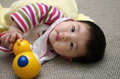
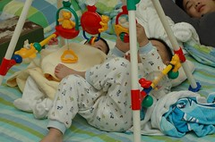
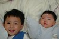
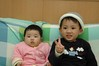

好久沒有說說小愛的狀況了  
上週六帶去打四個月的預防針順便健檢  
四個月又10來天的小愛  
體重5.8 只比滿二個月時多0.3公斤  
身高59  
頭圍42  
身高跟體重的成長百分比都只有25%(100人中只贏了25人)  
但是頭圍的成長百分比卻高達90%  
真是打從在娘胎時就是大頭妹阿~  
不過幸好頭大是因為頭太圓造成的 臉還不算大啦

小愛越來越愛玩了  
尤其常常爸爸隨便逗就會隨便笑的花枝招展  
也稍微會自己玩玩具了  
所以現在回家後可以先把小愛放在床上放隻小熊讓她玩  
然後我去幫哥哥洗澡

現在躺著躺著常常就會側身了  
然後一不小心就又翻了過去  
只是翻身那邊的手常會被身體壓住  
還不太會自己拔出來  
壓太久會不耐煩的唉唉大叫  
有時若順勢輕輕的推她一把 就可以有個很漂亮的翻身了  
翻身之後要不就把頭抬高高  
要不就是翹起屁股努力想要往前進的樣子  
爸爸曾經用小熊誘惑她 讓她移動了10公分

覺得小愛有一種淡淡甜甜的感覺  
不像哥哥打出生就讓人有種"賊賊"的感覺  
小愛也蠻愛聽大人講話的  
當聽到爸爸跟保母在講他的壞話時會嘟嘟嘴  
當聽到爸媽在教訓哥哥時也會乖巧的躺在大人懷裡不敢造次

哈哈 寫著寫著突然覺得  
老二還真有點可憐 難怪容易有老二情結  
老大照書養 老二照豬養  
老二就像是老大的伴  
睏了想睡了 無法照自己作息 因為上床睡後容易被老大吵醒  
沒事就乖乖躺著 因為媽媽要忙著打理老大  
可我知道妹妹卻也獲得了老大所沒有的經驗  
被媽媽抱在腿上聽著媽媽哥哥說故事 唱歌  
重點是多了一個哥哥對她的呵護與照顧~

