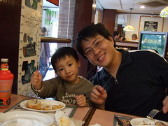

元旦假期在家裡跟陳嬤家吃吃喝喝混了兩天  
總算在2007開年的第一天出門溜達去  
徹爸說"來去國父紀念館吧"   
還記得阿徹一歲時在國父紀念館留下那可愛的倩影  
而且徹爸還說"來吃加州風洋館吧"  
哇~開年第一天 徹爸就很慷慨喔  (好的開始要繼續保持下去阿)  
考量了停車跟交通問題    
最後決定搭乘捷運到國父紀念館   
先去吃多年前耳聞許久的蘇阿姨披薩屋然後再去紀念館放風  

12點正出了捷運站   
走在雲淡風輕的光復南路上(真的覺得台北市的人行道超優)  
看到紀念館停車場前大排長龍的汽車 真是慶幸沒開車  
還誇大的跟怕坐捷運的阿徹說"你看 幸好我們沒開車 要不然就要排這麼長的隊伍停車"  
到了蘇阿姨披薩屋後  滿座沒有4人位  
還在猶豫掙扎要不要放棄披薩 改吃隔壁的M時  
幸好老闆幫我們在門口&窗邊喬出了個四人座  
然後望著菜單 徹爸不知如何點起 當然又是賢內助的我出手嚕  
"大蒜麵包 生菜沙拉 五塊炸雞&薯片  小的海鮮披薩 兩杯可樂加一杯柳丁汁"  
哇哈哈~好像點了多了點  
  
第一次拿刀叉的阿徹 開心的切著薯片 啃著大蒜麵包  
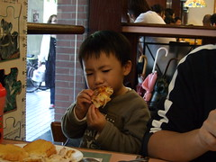  
  
小愛也乖巧的吃著碗裡的麵包雞肉 或是望著窗外來來往往的人潮  
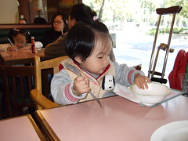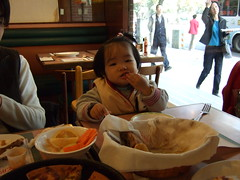  
而我跟徹爸則是努力的啃著高熱量的炸雞   
最後看到熱騰騰 鬆厚的披薩上桌時 心情與胃口達到高點  
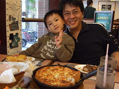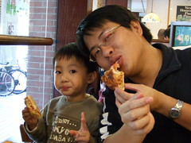  
  
但批薩真的太厚實了 一片下肚就讓人宣告投降  
剩下的半個披薩只能打包帶走  
席間聽到有人在打電話說"還沒停好車喔 先讓弟弟來吃東西..."  
我們又跟阿徹機會教育了一番"如果開車 我們現在也還在排隊 沒有披薩吃"  
希望阿徹以後可以多認命點坐捷運  
  
吃完披薩1點整 太陽正火辣的高掛天空  
不過冬天裡曬太陽還是讓人覺得溫暖又幸福  
徹爸拖著吃飽飽的大肚子 陪著阿徹放風  
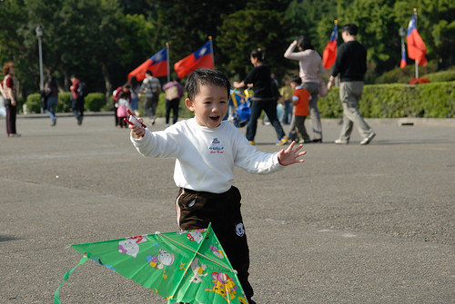  
  
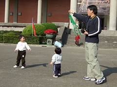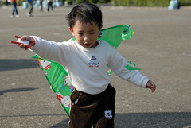  
  
小愛也在廣場裡隨意走隨意看  
這樣來來回回走了一小時  
總算腿痠了 要上推車坐了  
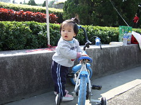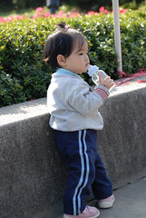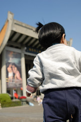  
  
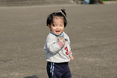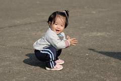  
  
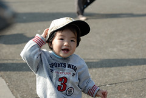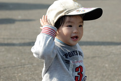  
  
  
然後進到館內吹冷氣看憲兵交接  
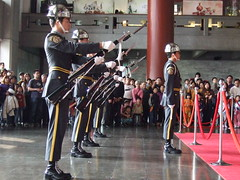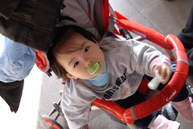  
  
阿徹一開始看的目瞪口呆 但後來還是被槍靶擊地的響聲嚇的掩耳落荒而逃  
然後四個人就又慢慢的散步到捷運站 打到回府睡午較嚕  
真好2007年的第一天 曬到太陽 吃了大餐  也走了不少路～
