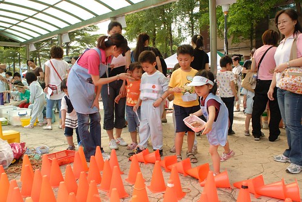
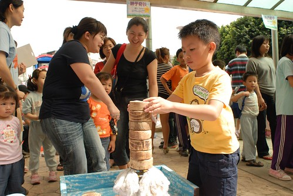

5/1阿徹小學校慶的那天下午剛好也是晨暘兩年一度的園遊會活動(跟運動會輪著舉辦) 兩年前的那次徹家因為剛好去台東綠島旅遊而錯過 所以這回可是相隔四年之久 阿徹第二次 小愛第一次參加園遊會 (上回阿徹才在幼幼班 小愛還是不滿一歲的奶娃哩) 兄妹倆可是超期待的ㄋ ...阿徹甚至說"今天我會很忙 玩的很瘋很累".. 真的! 早上下午這樣各一場下來 我跟徹爸很忙很累   傍晚回到家倆人得躲到房間小憩休息 可是她們兄妹倆直到吃晚餐時都還是勇猛兩條龍阿!!! "動頭"真是比爸媽好太多了..... 

園遊會的形式是由老師們擺設十幾種小遊戲關卡 加上簡單的魯味飲料販售 主要就是讓小孩子像在市集中(就是夜市啦)玩樂唱跳外加吃吃喝喝 就像徹跟愛回嘉義時 常去公園玩打彈珠 套圈圈 畫沙畫那樣(上回有沙畫說) 對在台北生活的小孩來講 其實很難得有這樣的機會這樣玩吧 所以我想每個晨暘的小孩應該都很期待這樣的園遊會 準備大玩特玩....

活動下午一點半開始 而地點剛好在我們家附近的華江公園 我們遲到了幾分鐘才到達 到達時小朋友已經集合先來個帶動唱外加遊戲

在學校的愛愛給人的印象其實是活潑開朗外加小大方的 可是只要有我或徹爸在的時候 臉皮就會變的很薄 很彆扭 那天到達會場後 愛的害羞精果然便跑出來作祟 不願意跟著小朋友排隊唱遊 玩遊戲得哥哥牽著 甚至後來的闖關活動有拘緊有害羞 完全的出乎我們的意外....(以為這是她的場子說)

拿著事前買好的點卷(一張250) 我們從Freda的彩繪攤子開始 (可以留意後面照片裡愛愛或阿徹手上的小花就是Freda的傑作) 而第二攤位是黏土老師的黏土磁鐵製作

園遊會裡愛愛明明心裡就很開心 可是卻常露出這樣拘緊的笑容

要不然就是這樣的無辜表情.... 這真的跟當年的阿徹哥哥一個模樣阿..([blog.yam.com/hmchen1975/article/6010568](http://blog.yam.com/hmchen1975/article/6010568))

不過幸好愛愛儘管害羞拘緊 仍很樂於嘗試每個闖關活動

Elieen老師的吊水球 

Candy老師的圈圈樂 

因為是熟客(老生啦) 所以丟之前得先幫忙撿15個圈圈

Jennifer的疊疊樂 

關主對小班的要求是六個及格 可獲得小禮物一枚 過了及格數後 每多疊一個可多獲得一個小禮物 愛愛四平八穩 沒有什麼似的疊了八個積木  所以獲得了Jennifer關主的三個小禮物 其實我們心裡很懷疑 這可能是Jennifer照顧自己人的大放送...

小一生阿徹的標準是要疊9個才及格才能獲得小禮物 阿徹哥哥當然輸人不輸陣的硬是得想辦法疊10個才有面子嚕

恭喜阿徹也成功疊了10個 獲得禮物二個

獲得關主三個禮物 大大鼓勵的愛愛似乎更有勇氣信心接下來的闖關活動了 還露出自然又開心的笑容跟她的Jennifer合照

然後是貓咪老師的吹麵粉 

有騎車有訓練的阿徹 心肺功能果然有好 大氣一吹球就從起點飛過終點了 而尚未磨練過的愛愛 吹氣如絲阿 

儘管賣力 球怎麼好像還是都沒動的樣子哩  看的阿徹哥哥似乎都想噘嘴幫忙了 

最後由阿母親自下場幫忙完成任務 (結果姑娘怎麼就在打混啦) 

Apple老師的擲骰子  點數大於6方過關 

Ella老師的擊水球 

完全沒法讓愛愛自己擊破的水球 輪到阿徹果然大力一敲便水花四濺

Jessica老師的擲水杯 這就要點力氣拿捏的技巧了 所以愛愛反到比阿徹哥哥擲的遠 (因為阿徹哥哥起先力氣太大水杯都打翻了 後來只敢小小的擲出去) 

Alice & Gorden的九宮格 阿徹很出乎我們意外的中了七格還八格 給他拍拍手~ 

小愛也有過半的成績 

Tina的XX遊戲(哈哈 取不出名字) 

你看愛愛表現的很棒喔 讓後面排隊的爸爸看的嘴巴這麼開

最後是Lisa的踩高蹺  力氣小的愛愛當然又得靠媽媽幫忙才能完成任務了 (阿徹愛愛脖子上掛的是提早(偷跑)去領的闖關完成的糖果花圈) 

而阿徹哥哥當然是獨自完成嚕 

不過講真的還真不好走哩... 

總共花費2個多小時總算完成全部的14關卡 (250元買一下午的歡樂+買袋的小禮物) 今日園遊會大成功! 老師們辛苦了!!  感恩哩!!!

