前幾天阿徹問"為什麼會有世界末日 世界末日會怎麼樣..." 一旁的愛愛也跟著問"什麼是世界末日?" 阿徹說他有個同學很希望世界末日 因為這樣他就可以不用上學了 我說可是世界末日可能沒房子住了 可能好多人死掉了 可能再也看不到爸爸媽媽了.. 兄妹倆一致的點點頭說"對阿 世界末日好可怕的..." 因為同學討論的關係   阿徹對世界末日朦朧半懂 有點害怕卻似乎也有那麼一點點的期待 誰都無法具體形容世界末日會怎樣 所以我猜小孩子的好奇心應該會很想知道到底世界末日是怎麼一回事吧! 但我一如往常的跟阿徹說 每天做好該做的事 該玩的也認真玩了 其他的很多事 等時間到了就自然會知道了  懂得了 或是就會了... 不過這幾天跟阿徹說這週六有什麼計劃時 阿徹常笑著說"要等星期三沒有世界末日再說.." 而且這幾晚 阿徹還多要求了徹爸的睡前抱抱(往常都只需要我的睡前抱抱) 甚至父子倆還煞有其事的約定如果周四早上還有看到彼此要給彼此一個大擁抱... 縱使我本來就不把這預言當真 但現在的地球隨時會發生什麼事真的都很難說 所以多及時行樂 多跟親愛的人抱抱吧!

前陣子四月寒流時才在嚷著今年的春天真不像樣 好冬天阿 結果怎麼過個母親節後 就如川劇變臉般的馬上變成酷夏啦! 今年的春天真的不見了!! 不過阿徹很是開心夏天的到來 因為可以去玩水嚕 不管是溪邊的 海邊的 還是自來水博物館的... 就趁這酷夏的開始涼爽一下 出清去年去坪林玩水的照片!

對於小時後玩的印象 除了陽明山的花鬧鐘及小人國外 最深刻的便是每年夏天陳爸都會帶我們到山裡溪邊烤肉玩水  特別是三峽的樂樂谷 這幾年或許是看著孫子的長大  大到是我記憶中跟爸爸感情最好的那年紀了 每到夏天 陳爸陳媽便會說"找一天一起去山裡烤肉吧!" 其實我們這些大人都吃的很少 水也玩的很少 但一樣的心情 一樣的想給孩子/孫子一個快樂戲水的夏天回憶! 不過戲水的地方從以前的三峽 這兩年變成去坪林...

去溪邊玩水 小漁網當然是很重要的東西 於是去年在坪林街上一口氣買了4根 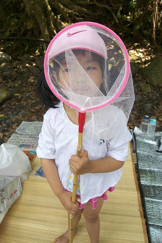 每次肉都還沒開始烤 小孩子們就迫不及待要趕快下水去玩 個個蓄勢待發~  前年去金瓜寮溪的天山青水農場烤肉 去年因為電話要預約營地時便已客滿 於是我上網找了個還頗獲好評的青山農場 只是當天過坪林後又沿著北宜公路開了好久的車 陳大哥 陳二哥都越開越不對 頻打電話問後方的我們"確定地址沒錯 確定有這麼裡面" 後來我們也越開越久後 總算明瞭為什麼陳大哥們會有這樣的疑慮了 青山農場真的好遠 遠到都快到頭城了... 不過這裡戲水的區域大很多 溪水清澈 而且林相很好  我們沒有在主要的營區區域玩水  而是在水較淺的地方讓小孩玩 每次到溪邊 小人們總是會先搞個攔水壩  尤其是阿徹 挖的好賣力阿!  好像就是得先做個這個壩他才甘願再去玩別的  阿徹還真有點像野孩子  或許正確說法是真不像台北小孩 曬得黑咪嘛七又活蹦亂跳的像個小猴子 不過我喜歡這樣好奇又能玩的小男生  愛愛沒有哥哥那樣好能耐 但在野外也很能優游自得 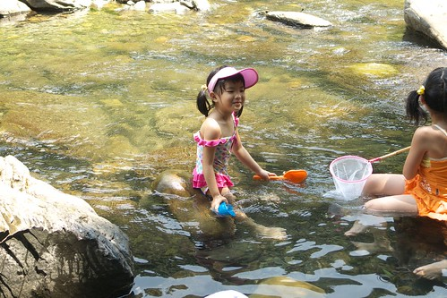 如果可以 小孩子是巴不得一直都泡在溪裡的 不過我們通常會要求下水1個小時左右 便上岸休息一會 因為怕他們曬的太黑 而且需要她們上岸幫忙吃東西阿 上岸後小人們玩玩撲克牌 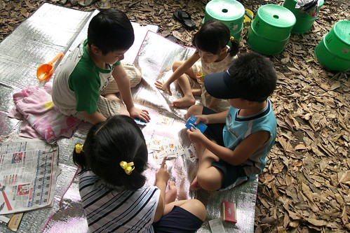 吃吃東西 玩玩小遊戲 一夥小孩子隨便玩隨便就開心 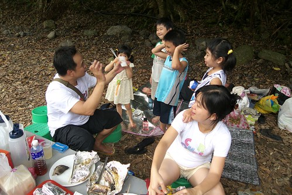 小男生的頭髮才稍微乾一些 肚子飽一些(或許說不餓些更貼切點)便又開始嚷著可以再去玩水了沒 大人一開始總是一再的拖延一下 真的拖不下去了便再整隊出發 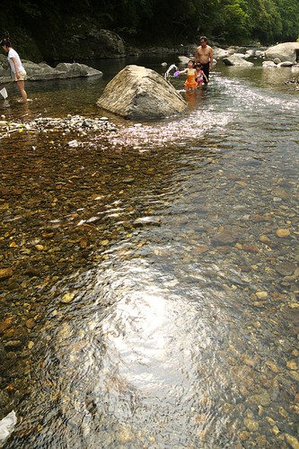 雖然夏天的溺水事件不算少 可是只要家長多用點心觀察環境及陪伴 很多意外是可以避免的.. 所以想玩的還是要去玩 而且我們玩的水有夠淺吧! 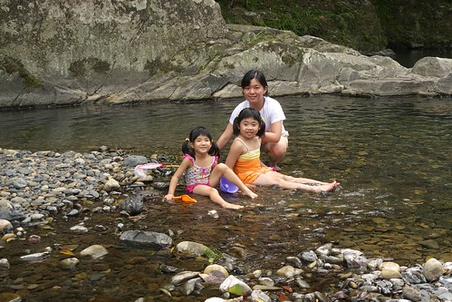 不過小孩子們還是玩的超開心 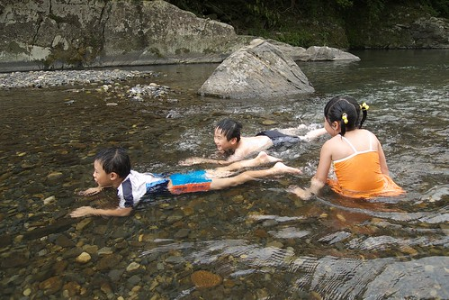 還假裝游泳哩 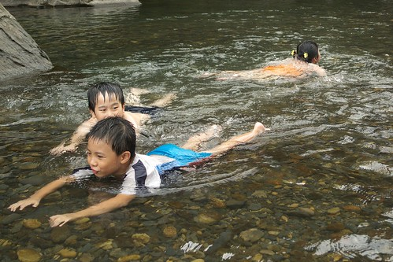 沒有消毒水的嗆鼻味 天然的水最好最舒服了 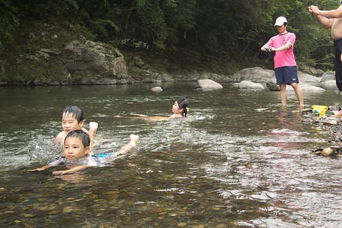 而除了泡水之外 還可以拿著網子抓小蝦小魚喔 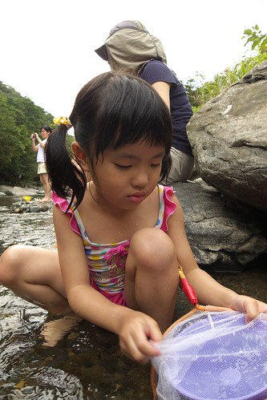 魚蝦很難抓但是很有趣 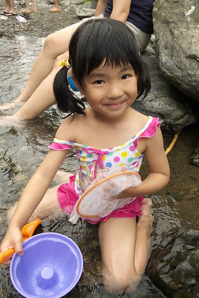 連我們大人也享受這樣的樂趣 (話說同時間陳爸陳媽在溪邊揀起野菜來了)  (自拍二人組又出現了)  就這樣小人們來來回回共戰了3回合  最後因為午後雷陣雨只好帶著依依不捨的心情回家了 好玩嗎? 真的好玩! 所以阿徹已經開始嚷著今年要再去溪邊玩水嚕~ 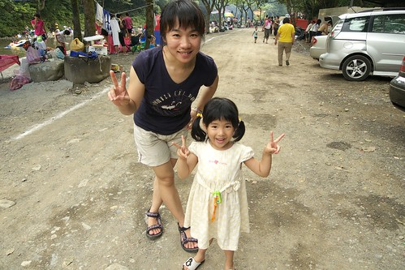

再追加個一樣去年的夏天 我們一家子還曾經興沖沖的帶車子去騎金瓜寮溪自行車道哩  山路起起伏伏的 騎的還挺過癮的 不過阿徹就又騎的苦哈哈了(還真騎到吐了)  直到回程時 沿路的下坡加上下到溪邊玩水去  阿徹才又恢復他的猴子本性 看~ 他真的很愛築攔水壩 就算露著小雞雞也超級賣力的 (因為只打算來騎車 沒帶替換衣物 所以只好清涼下水了)  那天雖然又是騎車騎的熱又累 但最後在溪邊的這麼小憩讓人暑氣全消了 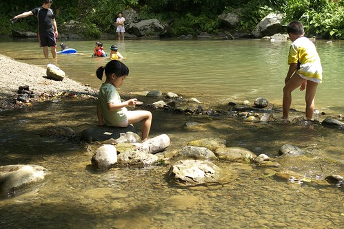 玩石頭  抓小蝦  很好玩! 今年的夏天還要再去!! 而且最好還能常常去!!! 勉勵ing.....
