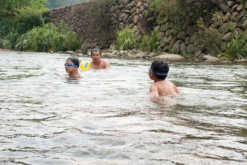

阿徹今年的暑假 除了安親班每週兩次的游泳課外 水玩的很少 自來水博物館沒去 外澳沙灘沒去 坪林也沒去.. 這麼多該去的地方沒去 阿徹卻只唸著"好想像去年那樣去溪邊烤肉玩水喔" 真巧! 就在阿徹嘀咕完的那週末 大舅舅也提到今年夏天沒去溪邊 於是配合了所有人的時間以及阿嬤對於農曆七月的禁忌 我們在小朋友們開學後 九月的第一個週日相約一起去坪林烤肉玩水!

那天大家約好上午十點坪林見 鑒於不知道北宜高會有多塞 我們八點多便從板橋出發 想不到一路順暢 不到九點我們便抵達坪林 剛好我有備而來 前一晚有上網查了查坪林的步道 於是趁著這有點刻意 剛好老天又配合的一小時空檔 走了趟水柳腳登山步道 步道就在坪林中油加油站牌樓旁的產業道路上去 我們把車停在加油站後方後 便徒步往步道口方向走去 步道口之前有段不算短的 很不像往步道的路 感覺我們像是私闖人家農地一樣 徹爸懷疑著我到底有沒有找錯走錯 一直企圖用手機上網找資訊 而一心只想著趕快衝去溪邊的阿徹 則苦著臉一直哀哀叫 於是我更是矇著頭猛走.. 直到在步道口看到明確的指標標示後 更是不管三七二十一的徑顧走著 (後來我還跟阿徹烙狠話 "如果你們這麼不願意陪著我去山上走路 那我以後假日把他們跟爸爸丟在家裡 我自己去" 阿徹總算才認命些)

水柳腳步道其實算是條產業道路吧 只是沿著路旁築了個其實有點奇怪的階梯  沿途的景致還算有"青山"  可構成踏青的要素 只是路上遮陰的地方並不多 (幸好九月也算入秋了  走來不致於熾熱) 且這裡應該真的人煙罕至吧 因為走過樹下時常會被蜘蛛絲給牽絲到  其實會來走這 最主要的原因是步道的終點可盡覽坪林的好視野  不到30分鐘的路程 汗都還沒流 就從繁華的加油站商圈走到山頭俯瞰一切 (這一刻 我有種洗刷"冤"情的感覺  真的不只是因為我愛走..)

 山頭上其實蠻熱的 除了涼亭的這一特定的角落裡有陣陣涼風(角度偏一點就沒了) 我們四個人於是一起窩在那小角納涼休息  達到媽媽的目的後 阿徹總算鬆口氣 會笑了 (臭小子)  徹爸應該也鬆口氣 不用看老婆的臭臉色了 (真的ㄇㄟ... 我是有先做功課的 而且抱著探險的心情享受走路的過程不是很好嗎)  在山上停留10分鐘後 我們便起身下山趕赴10點的集合  這次烤肉戲水的地方是由陳大哥決定打理的 選擇了金瓜寮溪畔的"鐵馬新樂園" 阿徹問"為什麼每次來的地方(農場)都不一樣阿"   我說可以多嘗試多比較阿.. 不過今日農場內的人真的很少 連我們在內只有約兩組的客人 冷清到讓人忍不住狐疑這農場會不會有問題阿 後來我說"阿 可能因為剛開學 大家暑假剛玩完 加上要收心啦" 講完 陳大哥說"怎麼我們的小孩都不用收心?"  嗯! 這真是個好問題! (阿徹的心一年到頭都在玩上 怎麼收阿) 不過既然暑假過後 能有比較好的旅遊品質 那以後就都約在開學後的第一週烤肉戲水好了!

農場的腹地不算小 環境也算整潔清幽 老闆幫我們安排在下溪邊樓梯口附近的營區休息 烤肉 小人方便上上下下 不想下去的大人也方便在上觀看  鑒於往年我或陳嬤都會準備過多的材料 今年乾脆讓農場老闆幫我們準備一切 而且讓老闆準備食材 還可省了人頭費 場地費 停車費...  算是很經濟又實惠的安排 (老闆還送了一大鍋料好實在的綠豆湯哩) 農場準備的食材 加上陳嬤準備的竹筍湯 香魚 白飯 水果  以及我跟陳大哥帶的蛤蠣 蝦子 甜不辣 以上一切搭配出剛剛好的食材   讓今年有烤肉的樂趣但有野餐的愜意! 不過這些都不是小人關心在意的事  小人到達農場後就迫不及待的往水裡衝嚕!  每年一次去溪邊 大家都越來越有備而來了 除了鍋勺 魚網  還有蛙鏡 游泳圈.... 而且三個小三生都算會游泳了 玩的更是不亦樂乎阿  若不是我們的強制要求上岸休息  小人們大概會泡在水裡一整天吧 那天總共下水三個時段 每個時段一個半小時左右   中間上岸30分鐘休息吃東西 預計要讓小人上岸前 大人加足火力的烤好一堆要小人吃的東西 待吆喝一聲 小人上岸後便能大快朵頤 飽餐一頓(服侍皇太子應該就像這樣吧) 玩水很餓的小人們個個吃的津津有味 只是填飽肚子後 便又一個個開始嚷著"可以下去玩水了沒" 非得逼著大人們(尤其我這壞姑姑 壞媽媽)板起臉 規定下水時間 孩子們! 你們有沒有玩的這麼誇張 這麼開心阿! (阿徹跟阿瑜一起看科學漫畫 打發等待的時間)  (愛愛跟萱萱姐姐蹲在岸上 期盼看著溪水...)  待解禁令一下 一夥人便又往水裡衝嚕!! 小人除了游泳外 撈小魚 玩遊戲  阿徹還撿了顆石頭 賣力的要磨出水滴形狀  正中午1點多 日頭赤炎炎 小人們這樣曬著太陽 泡在水裡 有夠"熱"血的春青阿!  另一邊 愛愛跟萱萱姐姐還有徹爸比賽著堆石頭  萱萱小心謹慎的  愛愛認真的  一顆顆 堆起她們的石頭積木  看著愛愛的石頭 徹爸笑說"最後一顆也太小了吧 像是偷作弊"  這是徹爸堆的石頭 就是因為徹爸堆的九顆 刺激著兩姊妹拼命的要堆出十顆好贏過徹爸  愛愛今天玩石頭 玩水玩的很開心  最後一個時段時 還high到也要戴著蛙鏡玩水 雖然愛愛因為害怕 還無法像哥哥姐姐那樣惝泳水中 但相信再過一兩年後一定也能越來越如魚得水的  而至於阿徹... 黑溜溜的樣子 東跑西跳的樣子 活生生就像個野孩子阿(怎麼可以這麼黑 這麼野阿???!!!)  孩子們最後的時間裡 盡情的玩著水槍  兩個男生還打起水槍仗  徹: 看我射射射!!!  瑜: 阿徹 水沒了吧! 看我怎麼猛烈反擊! (射的真準 直中阿徹的眼睛) 看著照片裡萱的背影  我猜想她的心裡應該在OS著"阿徹 阿瑜 你們真的很調皮耶!"  不過這樣的戲水天真的很好! 如果可以 希望每年都可以給這幾個小朋友這樣美好的夏日回憶!!

PS. 那天早上 溪邊的蜻蜓挺多的 而且還大辣辣地停在徹爸腿上  連做恩愛的事也在徹爸的大腿上.... 
