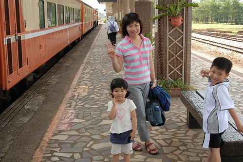
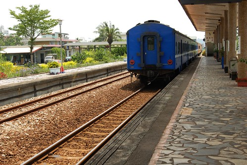
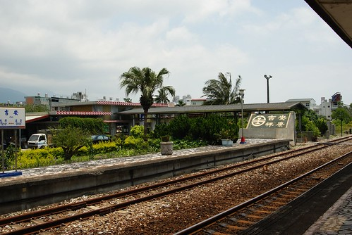

平常上班日在辦公室吃中餐時 我最常配的"菜"是Kimo新聞 第一個點選的分類是生活  然後是旅遊 每當看到有興趣的旅遊相關新聞或介紹時 我便會把相關網頁存到我的最愛中 或是就把哪個地方什麼時候有什麼好玩的事就記在腦海裏 人很奇怪 對於不感興趣不想記的事 不管怎麼樣永遠就是會記不住 但是偏偏對於一些鳥事一些小事卻總能過目不忘 有辦法在日後一堆雜訊中還記起這樣一件事...

很久以前看到介紹花蓮旅遊的新聞說 可以來段吉安到壽豐站之間的平快火車之旅 全台就剩東部幹線有平快火車的行駛 而這小段路線中可以飽覽花蓮的田園風光 因此這列平快火車就此烙印在我心中  直到規劃這回的行程時總算"派"上用場..

其實本來的行程規劃是先去住後湖水月 最後一晚才去理想大地最後好好的享受一番的 但卡在上下或北上的平快列車總共只有5個班次 而且扣掉一大早或晚上過後的車次 只剩10點半多的那個班次是適合我們作息也適合當作旅遊時段的 徹媽為了想要從容不迫的搭火車以及避免不必要的多繞路 可真是快想破頭 幸好第二天在合歡上時我突然靈機一動的想如果更改後兩晚的住宿地 那麼一切的難題便可迎刃而解 於是緊急電洽後湖水月是否可以更改(延後)住房時間   在獲得正面答案後又趕緊更改理想大地的住宿時間 當一切搞定後 我才好好的跟徹爸解釋說明清楚  連徹爸都忍不住說"媽媽 你好棒喔" 哈哈~我也覺得對於在台灣玩這事我真的還挺棒的說.... 

6/2 (星期二)早上9點半多離開理想大地 剛好去壽豐火車站搭乘10:40分往北的平快列車

(難得看到還插有國旗的車站 心裏小小感動了一下) '

覺得花蓮這幾年的觀光一直有在發展進步中 不管就軟硬體來講都讓我們有不一樣的感受 這一兩年花蓮很推廣雙車旅行 也就是單車+火車 所以除了在山線或海線沿路的警察局都可以看到"鐵馬驛站"的服務招牌外 在火車站內也都有大篇幅的當地風景特色照 以及相關旅遊摺頁的提供

我想假日時分應該吸引很多單車好手來花蓮進行極限挑戰的 只是今日是非假日所以火車站依然像前一日的鯉魚潭一樣 空空空阿 其實外面的太陽很烈 可是我坐在車站內的大廳裏沒有冷氣沒有電扇卻覺得好涼爽阿 這涼爽的感覺讓我更加期待喜歡今日的小小火車之旅

剪了票 要進入月台等火車了  ... 這種走向月台的感覺跟這幾年在台北或板橋車站地下黑鴉鴉的感後完全之不一樣

很多人懷念/享受的火車之旅應該是在像這樣的鄉間這樣的小站吧

站在月台回頭看火車站的主建築物 大大的"壽豐"兩字讓我的心頭莫名的溫暖

平快號喔~ 距離上一次撘平快車已經是10多年徹爸當兵的時候我們跟同學一起去宜蘭探海軍同學的兵

火車準時的轟巄轟巄的進站嚕

哇賽~好久不見 超有Fu的電風扇   真的還會轉阿轉的喔

打開車窗 我們要好好吹著風享受這難得的平快火車之旅

噓~不要告訴別人這是小愛第一次搭火車喔...

阿徹很好奇為什麼我們要來坐火車 也應該有點納悶坐火車也算玩阿 (火車應該只是交通工具阿)

但是他還是很開心 好奇的拿著徹爸的papaGO 看著上面的車子跟著火車在跑

小愛則像很多故事書上畫的坐火車去旅行的小女生一樣

有點害羞 有點期待 有點開心 ...

全家子今天真的是來火車"玩"的

志學站到嚕~這裏好像離東華大學不遠的樣子...

有人下車了 我們還繼續我們在火車上欣賞沿途的美麗風光

壯闊的山谷 

青綠的稻田 

鄉間的平交道口 

媽媽不良示範的帶著阿徹小愛一起把手伸出窗外 感受風過手的感覺

這也是媽媽第一次這樣單純的"坐'火車玩 感覺真的很不錯說

可惜我們只坐了30分鐘就到了我們的下車站 吉安站 (下一站花蓮應該就不好玩了)

下次再見到這藍色的車影不知道會是什麼時候了...

原來吉安代表著吉祥安康

進入地下道要穿越月台出站了

地下道內首先迎接我們的是可愛的"稻米伯"

然後是大幅吉安鄉旅遊導圖

通往車站大廳的穿堂

行前徹爸上網查火車時刻  打算11點10分到達吉安後要搭11點40分南下的莒光號列車回壽豐 可是怎麼查怎麼問就是沒這班南下車 徹爸看了站內的各種版本以及他手上的火車時刻表後 總算才明白他載錯了 原來他一個沒注意竟然載到6月中以後才施行的時刻表

(在徹爸焦頭爛額的釐清火車時刻時 我們三人又在火車站"玩"了) 

花了20分鐘搞清楚狀況也明白最快的南下列車要到1點30分才會有 只好找個地方消磨這多出來的兩小時空檔 只是正中午烈日當空實在不想曬在戶外

翻了翻隨身攜帶的旅遊書 想到美賢曾經提過的鬱金香花園餐廳剛好就在吉安 因此趁著這多出來的時間 我們去了我們平常根本不會專程去的這類花園餐廳

因為實在太熱只想躲在室內 因此即使我們10點才剛吃完早餐現在還飽飽的 我們還是進入餐廳點了我們的中餐

不過餐點上來後 我們還是很努力的吃...

正中午12點用餐時刻 可是倘大的餐廳裏只有我們這一組客人 我真的很好奇這樣的營運收支怎麼可能平衡ㄋ? 也許也許因為是非假日吧 假日人潮就多了 可是光靠假日應該也很難支撐吧 而且他那看起來似乎有點荒廢的戶外庭園實在不像假日時會遊客如熾說..

去餐廳樓上上廁所的時候 順道幫阿徹小愛兩人拍的外景婚紗照 (她們婚紗照的招牌動作)

原本餐廳用兒童餐會贈送(小)旋轉木馬乘坐卷 可是非假日未開放店員便改送兩瓶魚飼料可餵魚 看著那爭先恐後搶食的魚群(為了搶食水花可以濺到如我的身高) 我更加覺得這裏的"不樂觀" 覺得餐廳的餐點/花茶飲還不錯 價位也算便宜 如果真的就這樣"頹廢"下去實在很可惜說 而且旅遊書上介紹說 這的主人為了習得種植鬱金香的技術札重金且不遠千里的赴歐洲 努力的讓花園裏四季開著不同的美麗花卉 如果真是這樣  我真的希望餐廳經營者可以再多用點心好好維護 改善戶外的庭園景觀 其實看的出來這裏本來一定很美麗 只是台灣很多地方很多建設的"之後"維護力好像都會少那麼一點  真的很可惜說 (徹爸回來後跟老家是花蓮吉安的同事提到這家餐廳時 他同事竟然說那不是荒涼像廢墟了嗎?! )

用完餐 讓小愛們各花了20元坐坐小火車解癮後 Call了載我們來的小黃司機伯伯載我們回車站 結束在這短短1個小時多一些的停留 (司機載我們來後就回家休息 等我們用餐完畢再來載我們) 對了...這也是小愛第一次坐小黃 她超開心的 因為她最愛的車就是黃色的車 每次在馬路上看到小黃都會開心的大喊 黃色的車耶...

回到吉安車站內候車時 才赫然發現剛去的那個城堡也在大廳內的照片上ㄋ

回程要搭的是下午1點31分往台東方向的莒光號

坐在壽豐或是吉安火車站的大廳時 覺得超涼爽舒服的 當我坐在那時 什麼也不想 什麼也不急 就只想放鬆的享受一種很特別的"舒適感" 舒適到讓人很想就躺下來睡她個一覺會更好 哈哈~

不過時間到了 還是得去搭車 繼續我們的行程... (知道阿徹要去哪嗎? 要去尿尿啦~ )

在月台上又等候了10多分  無聊的母子三人玩起划拳遊戲

左一拳 右一拳  大家一起縮一拳...

阿徹受同儕影響 已經會玩很多拳了 殭屍拳 漢堡拳 母雞拳...

小愛還在低階層次 只會瞎玩  不過那天發現她竟然也會玩殭屍拳了 為娘真是有點被嚇到 小女子智商有長大了喔...

火車準點的到站了... 轟巄轟巄的又嚇的阿徹摀起耳朵   

今天的平快火車之旅很小品很出乎我們的進度掌控 但意外的愜意舒服與愉快~  I LIKE IT!

回到壽豐站 我們又要開著我們的小紅繼續往我們的下一站去..

