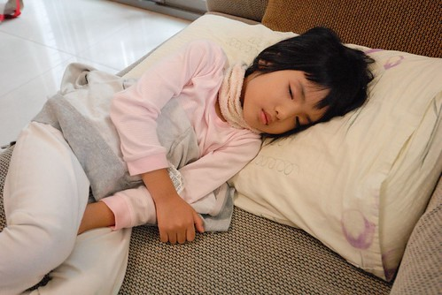
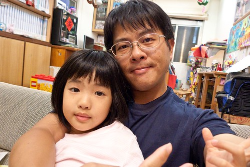
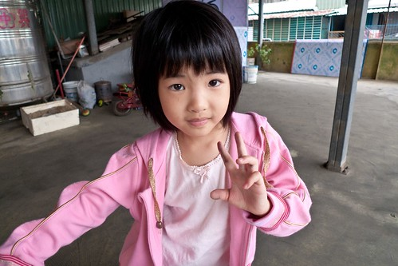
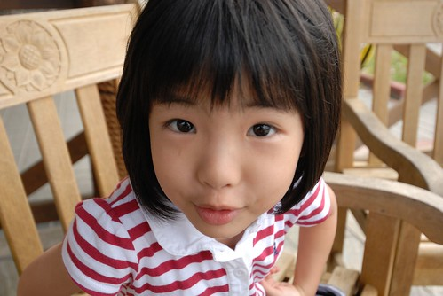
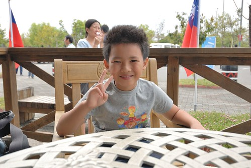
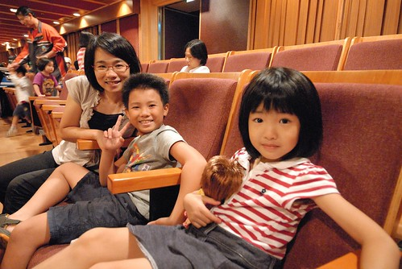
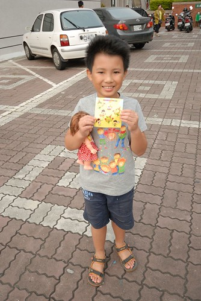
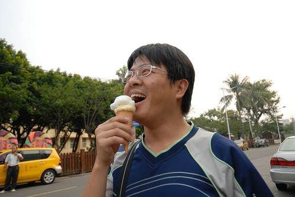
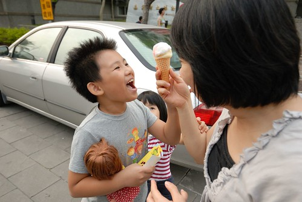
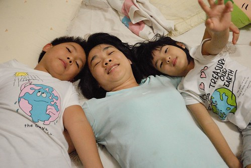

今年的秋天 天氣很怡人而且還持續很久... 但是我們一家子卻在今年的秋天破病不斷 從10月初的愛徹分別因為高密度的吐或拉而在半夜或假日掛急診 到11月初的我與他們輪流發燒 我還破了這輩子記錄的燒了四天 距離上次發燒已經10多年了 我幾乎忘記發燒是什麼感覺了 而平常對於徹愛發燒異常敏銳的手(一摸就知有無上38度) 卻摸不出自己的燒... 也許這就是所謂的父母! 難怪最近跟徹爸兩人常會驚嘆著"我們竟已當了快10年的爸媽" 真的, 好快! 好不可思議!!!

對於小孩的生病 我們雖然會擔心但不算緊張型的 一方面覺得感冒這類的小病像是在練功夫 培養日後抵抗力的 再則覺得偶而的來場小病倒也是訓練小孩心志的好機會 尤其更能顯現一個小孩的堅強度 我們家對於生病人的叮嚀(或許可以說是教誨)便是"不要唉唉叫 多休息" 所以徹愛生病時都算是有好品性 總能認命的多休息 在自己喜歡的地方 用讓自己最舒服的姿勢休息著  而平常活蹦亂跳 小嘴講不停的徹愛在這時後則顯得靜懿 特惹人憐愛 雖然生病真的不好 但我們總忍不住想說"安靜的模樣真可愛 真讓人想親親抱抱"  10月初 愛愛的那場病從週末延續到週二 我跟徹爸分別請了一天的陪病假 媽媽陪或是爸爸陪 愛愛都很開心 都好像是兩人之間的小約會  爸爸在的那天 還特意的帶著愛愛上頂樓騎車 抒絡筋骨 流流汗 (用心的好阿爸)  吃的都不知道跑哪去的愛愛 這幾年的體重一直以一年一公斤超緩速的增加著 雖然明白愛愛的發展與健康都很正常 體重輕是無法勉強的天生註定 但我還是與愛愛約定好 "希望她多吃飯 上小學時可以有18-19公斤" 對小學充滿憧憬的愛愛也努力地讓自己盡可能的多吃一點 然後每天上磅秤量體重 而一直在16點多上下徘徊的體重 總算在生病的前幾天衝上了17 那天我跟愛愛兩人好開心阿! 阿母我有種總算破了17魔咒的喘口氣 但想不到幾天後 才不過兩天的時間就吐掉了一公斤 阿母我忍不住哀嚎"這一公斤的肉要養多久阿?!" 仰天長嘯~~~~ 而大病初癒後的愛愛 臉又顯得更小了  剛當爸媽時 每次小孩(阿徹)生病總是異常的緊張擔心 對咳不斷的小孩 心疼但愛莫能助 對拉不停吐不停的小孩 擔心沒吃東西沒體力 總無法毅然執行斷食法 後來隨著"經驗"的累積 明白咳嗽時拍痰的重要 小孩稍有痰音就照三餐拍 而上吐下瀉時 狠心的全然禁食是治療的唯一且最佳方法 做爸媽的訣竅就是這麼親身經歷 一點一滴地在累積

愛愛病後的一週換阿徹上吐下瀉 那天雙十節回嘉義的路上 我們沿途找了五次休息站/加油站好讓阿徹... 鑒於愛愛時有點大意 這回我們更是狠心 不給吃就是不給吃 連水都管制 前一週超羨慕愛愛可以喝果汁口味電解質液的阿徹問"那我也可以喝像妹妹的那種果汁嗎" 我說"等到你真的很嚴重一定給你喝的阿" 結果阿徹三不五時碎念著"我的手指好像有皺巴巴的了"(愛愛太久沒吃東西 會有這現象) 哈! 阿徹好像真的很羨慕生病人才會有的福利! 不過看著大家吃正常的飯 而自己只能以10CC為單位的喝著舒跑 還是不免哀號.. 可是阿徹還能笑得出來 代表生病EQ有及格  很奇妙的是 原本拉不停的肚子卻在早已安排好的近兩小時音樂會中很安分 讓阿徹得以開心享受一場打擊音樂會  而由此也可見一個人生病時 意志力是多麼的重要阿!  那天聽完音樂後 爸爸買了一隻叭噗吃  阿徹看的大叫"我也要吃"  媽媽說"那假裝給你吃一口"  徹心裡可能OS著: 嗚.... 看著別人吃冰 而自己只能流口水 怎麼這麼殘忍的爸媽阿!  雖然下面這張照片裡 徹爸相機把我的雙下巴凸顯無遺 但我喜歡這張照片的感覺! 一家人都健健康康且緊緊依偎在一起 真好! 

後記: 阿徹又吐又拉的雙十假期後第一天上學日 老師在連絡簿上寫 "今天阿徹巨細靡遺且生動的敘說他吐 拉 痛三樣都有, 雖然講的是不好的事,但可愛的模樣讓我忍不住想笑..." 原來因為有同學也上吐下瀉 老師請這些生病的人發表心得 阿徹便唱作俱佳的好好分享一番了 阿母我真是完全可以想像阿徹說的模樣也可以體會老師想笑的心情!
