很多人說台灣好小 台灣有啥好玩 其實只要對的天氣 對的心情 到哪都好玩

12月中的時候因為徹爸要帶小兩去大安郵局出關 於是我們一家子趁這機會順道到好久(5年夠久了吧) 沒去的大安森林晃晃 不同於五年前對於此森林公園光禿的印象 發現這裡的樹也跟我們家的阿徹一樣長高又長壯了 而幾株變色的落羽松更增添些許浪漫的氣氛 走在這樣的公園裏會覺得這公園真棒 這城市真棒....

湊巧的我們去的那一天剛好是2009台北花卉展開幕的前一天 所以第一時間看到了許多美麗的花卉佈置

展覽的規模比印象中曾經看過的各縣市(人工)花展都要來的大 而且很多主題佈置都有與公園的草坪 綠樹等搭配結合 整體感覺還不錯說 只是這種人工花卉終究不是徹家的菜 所以徹爸照片照的很少

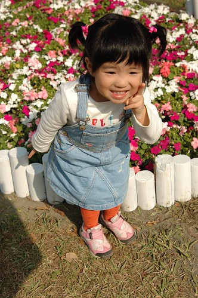

冬天裏曬著太陽是件幸福的事 但讓人走沒多走就想坐下來休息曬太陽   一整個的讓人懶洋洋

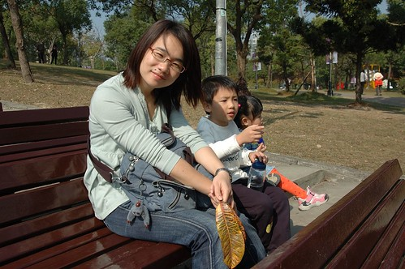

哈~其實只是單純的覺得大安森林公園的Fu很好 想推薦給大家 有空又無聊的時候可以去走走 但遊記寫著寫著竟然嚴重的詞窮 所以以下純為貼圖紀錄( 還有獻寶啦)

+++++++++++++++++++++++++++++++++++++++++++++++++++++++++++++++++++++++++

很喜歡看小愛的側臉 覺得鏡頭下的側臉更顯現小愛獨特的靦腆氣質

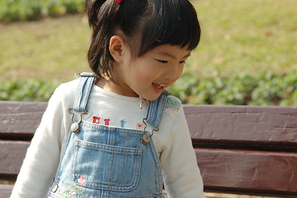

是唄~ 正面的小愛看起來比較蠢

陽光下的小孩 怎麼拍怎麼可愛 怎麼陽光

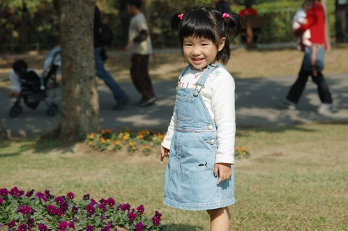

徹爸說 其實這樣的照片騙人家說這是日本 應該也不會太超過吧 真的! 走在這公園的感覺真的挺不賴的啦

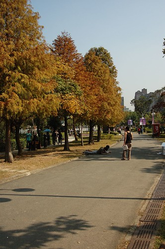

阿徹到戶外有嚴重的撿"寶"(垃圾)習慣 沒撿個幾片樹葉 幾根枯枝回家好像對自己交代不過去

而小愛也會有樣學樣的跟著哥哥一起撿垃圾

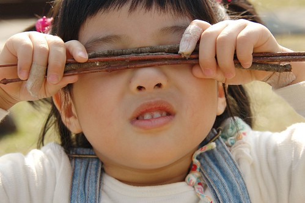

雖然撿的時候阿徹常會說 回家後要拿來做什麼做什麼 但回到家後 "寶"往往就被他遺忘在一角成為垃圾

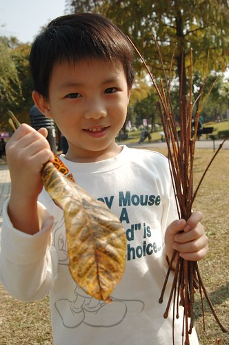

除了撿垃圾外 兄妹兩現在在戶外也很愛畫沙畫

拿著樹枝在沙地上 畫畫圖 玩玩圈圈叉叉 這就是徹家式的畫沙畫

公園裡沿著湖畔的樹上 發現很多蹦蹦跳的松鼠 松鼠的數量讓人很難相信這是一個人來人往的城市公園會有的事 而湖畔樹上也有很多鳥類棲息 這個湖的生態真的很豐富 我想來這的人類也一定很善良 才會有這麼多的生物願意寄居其中

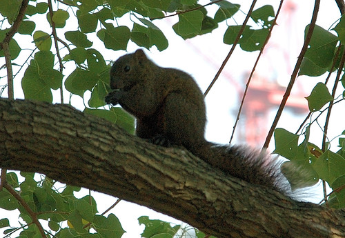

相較於花卉展覽 其實徹家最愛的還是這種自然的元素

綠意盎然的阿勃樂其實也別有一番風味  尤其樹上又結實纍纍的

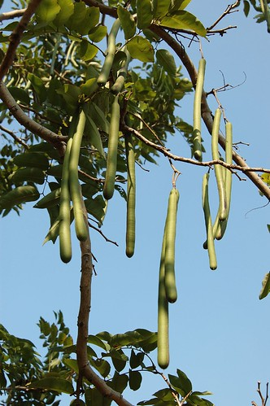

冬日裏的太陽 讚阿 溫暖阿... 我跟阿徹都喚他為冬獅子 (小7的星芒效果是不是跟小兩的感覺不太一樣ㄋ)

小愛很幸運的撿到一根阿勃樂的長果子 阿徹哥哥羨慕的要命 可是小愛很小氣 不管哥哥怎麼求他 不借玩就是不借 還隨便拿了跟小樹枝就要打發哥哥

有了這根長果子 小愛的心情開始High High High....

小愛說她要把這果子帶去學校給阿嵂看 給Eilien看 帶去學校的那天被Freda看到 Freda笑說你們家都很愛撿奇怪的東西喔

如果可以 我想阿徹小愛應該也會很愛把石頭都搬回家的

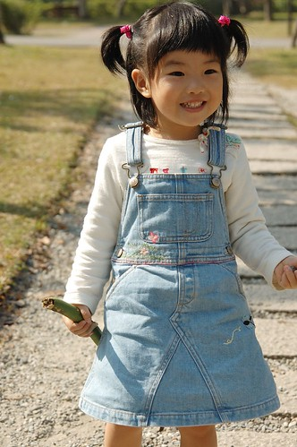

回家前經過了遊戲區 當然讓阿徹跟小愛放風去玩耍了一下 雖然人很多 但這的小朋友都蠻有秩序可以依序排隊玩耍

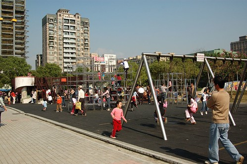

阿徹已經大到可以自己一個人毫無阻擋的爬上爬下嚕

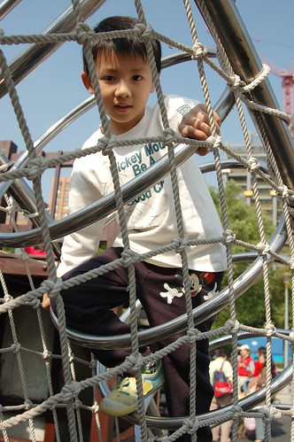

他已經不若他自己嘴巴上說的那麼膽小了

YA! 攻頂成功 快要上小學的小男孩果然越來越不一樣了

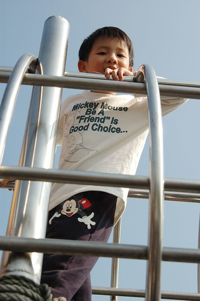

走在這樣的森林公園裏 徹爸竟也失去他的理性與實際 脫口說出"這的房子不知道貴不貴" 呵呵~ 殘念 殘念阿... 在台北市算是中低收入戶的我們 還是偶而來這走走 做做白日夢就好

