生活在台北裡 宅宅徹家最喜歡的週六就是窩在家各忙各的 直到晚餐時間 才不約而同結束各自的"工程" 一家子邊吃飯邊聊著天 說著明天的計劃 討論著當下的漫漫長夜要如何打發 兄妹倆 甚至加碼的父子女三人 wii大戰是最常度時間的方式 偶而讓徹愛看一部平常無法一口氣看完的卡通電影 甚至配上個鹽酥雞 這樣的夜晚很墮落但絕對讓徹愛拍手叫好且回味無窮... 有時後 我們卻想來場撲克牌或大富翁遊戲 是打發時間也是一家子黏在一起的最簡單方式!去年暑假 一家子瘋狂的迷上大老二 每晚總要廝殺個幾來回方肯罷休 後來因為愛愛太常墊底 於是不太喜歡跟我們玩這她總是輸的遊戲 前一陣子 我們來了場好久沒玩的排七遊戲 才發現 這簡單的排紙牌遊戲竟然可以這樣吪虞我詐 考驗兄妹情 父(母)子(女)義  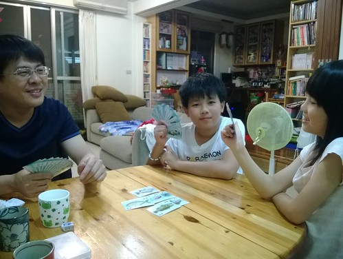 看著徹愛賊頭賊腦 算計著如何出牌 蓋牌 對我與徹爸來說 才是每次陪著她們玩時最大的樂趣! 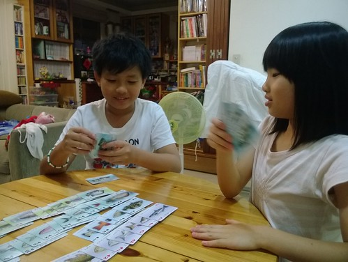大富翁是我們每隔一陣子就會來一場的遊戲 除了之前介紹過的背包客自由行 [blog.yam.com/hmchen1975/article/36836264](http://blog.yam.com/hmchen1975/article/36836264) 這一年還多了個"孫子兵法"讓我們選擇 如徹爸說的 大富翁真的很厲害!  讓我們從小玩到大 還依然毅力不搖甚至不斷推新 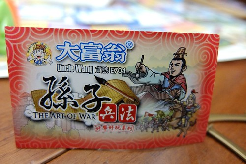 春秋戰國時代 各梟雄的兵法與戰火 如何重燃於當世 我們家 這樣的主題  讓大富翁迷的我們 初見面就二話不說買回家 一樣的2-4人的輪流丟骰子 數格子 執行買東西 機會 命運 的遊戲架構 但遊戲規則卻變成買兵法卡 募兵 執行軍機 與戰場上的決生死 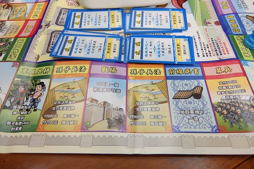 每個玩家有兩顆棋 一個放在棋盤上廝殺 一個放在計分欄上一步步往20分目標前進 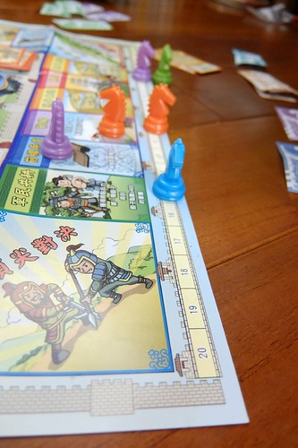 要上戰場拿分 不只要運氣 更需要的是擁有真槍實彈的實力: 兵力與兵法 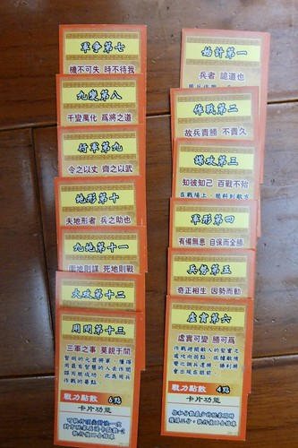 不同的戰場需要不同的兵法卡與兵力數 獲得的分數當然也從3到6分不等 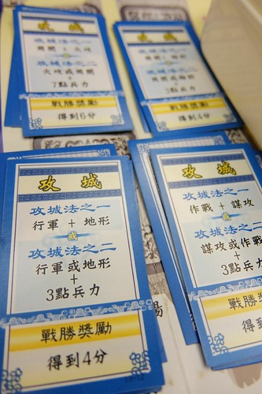 一開始玩沒抓到竅門的我們 傻傻不懂每張兵法卡的最適用時機 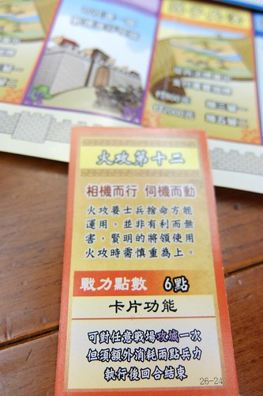 後來徹爸抓到訣竅 總用下面這張兵法作為他拿取冠軍的最後一搏 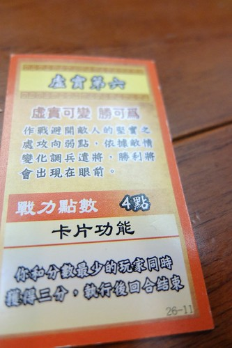 軍機卡則如大富翁遊戲中的命運 是老天爺的眷顧也可能是天外飛來的橫禍 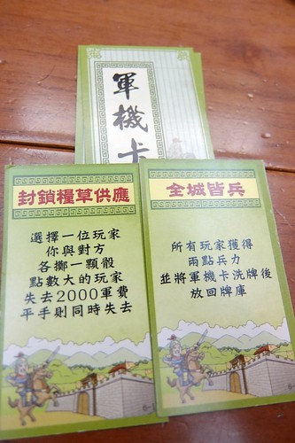 徹哥每次玩遊戲都好認真 只是運氣跟實力都不甚佳 從沒拿過第一名 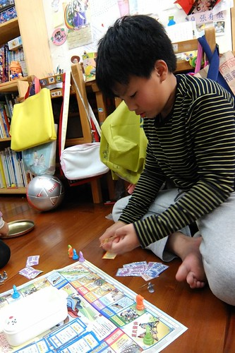 愛愛跟看了幾回後 便獨當一面自己成一家 所謂新手的運氣總是特別好  當家的前兩回都很不客氣的大勝我們(徹爸有很明顯的疼女兒也是主因) 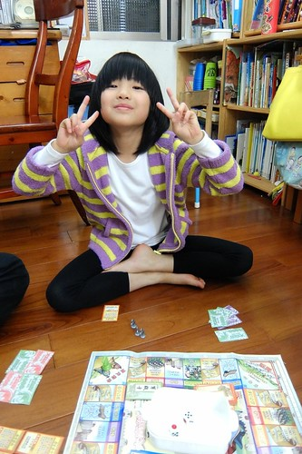 不過遊戲總是幾家歡樂幾家愁 徹愛獲勝的時候手舞足蹈 輸的時候也是生氣哭過 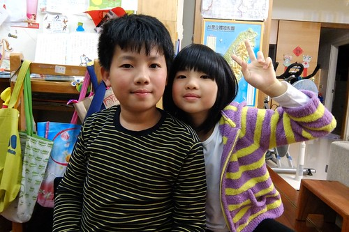 而這些都是我們家的童年家庭回憶!  那些年 我們一起玩大富翁的日子~~~ 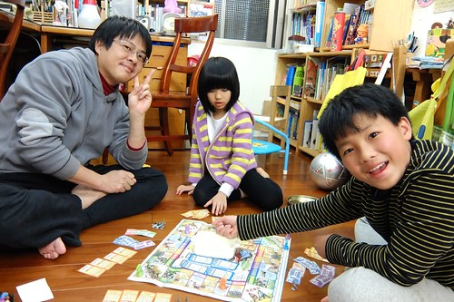
