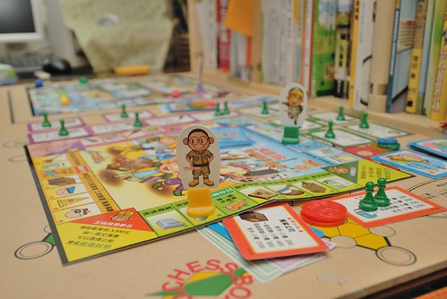
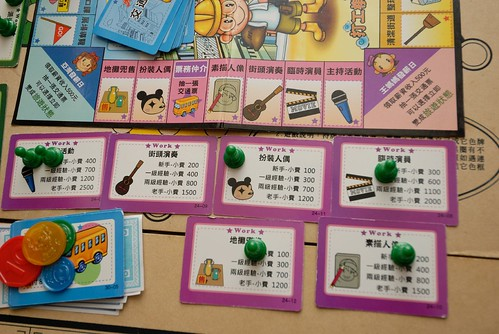
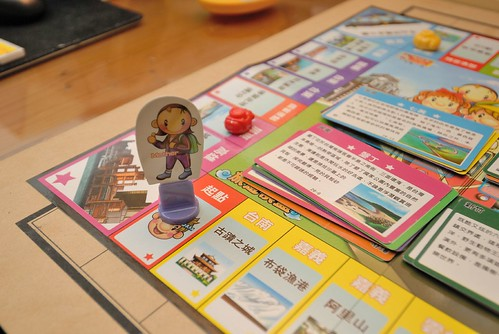
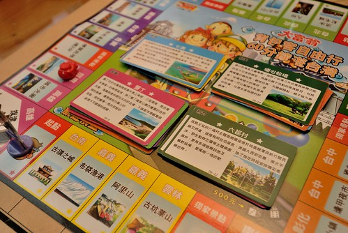

最近家務加工作的忙碌與壓力 讓我跟徹爸兩人的身心不自覺地也微恙了一下 我打趣說"我們果然還是比較適合安逸的生活阿" 沒事真的不要亂涯給阿... 最近天氣也突然的夏天了起來 而且還"啪"地一下就破35度 熱到不像話 本來就很宅的徹家  這下子又更有理由宅在家了... 除了必須的出門外 一家子寧可呆在家裡各做(玩)各的事 或是放空或是無所事事 而偶而的週末傍晚時分 一家子去5分鐘路程的公園裡 父子倆玩扯鈴 愛愛騎腳踏車也就算是我們的戶外活動了

最近遊樂少 照片也照的少整理的少 連想寫個blog都沒有新主題 就趁機來清一下早已貼好照片的草稿文 今日來紀錄(兼介紹)一款 我家覺得挺有趣的遊戲 "大富翁之背包客自由行"

我跟徹爸對於小時後玩的大富翁一直記憶深刻且回味無窮 因此當阿徹上小學後 智商好像開始適合玩大富翁 我們買了第一盒的大富翁 遊戲就是單純的在台灣各縣市間擲骰子、走方格、買土地、蓋房子 沒啥經驗的阿徹還很有實驗精神地嘗試了幾種玩法: 不買地拼命存錢 vs. 拼命買地 就是想盡辦法想要地買的多 房子蓋得多 錢也存的多 曾經還玩的太認真 玩到他好像真的家破人亡一樣地嚎啕大哭 實在有點好笑 不過我跟徹爸一致認為大富翁是個可以練習加減法以及培養投資概念的好遊戲 因此後來我們又陸續買了 大富翁的幾個不同遊戲: 美食大主廚 幸福人生以及背包客自由行 美食大主廚的玩法又不同於傳統的大富翁  但一樣很簡單且甚至更有趣 是很適合小學生的一款遊戲(徹爸一直說該先介紹這個的 可是沒有照片怎麼介紹阿?!) 而網路上頗多人推薦的幸福人生 我們則覺得遊戲規則太多太複雜 不符我們遊戲時就是放空的原則 且對小學生阿徹來講真的過難 更別說可以帶去安親班與同儕共樂了 而半年前買的背包客自由行則獲得我們三人一致認同的最好玩...  網上的遊戲簡介"玩家扮演背包客，在各地的知名景點之間旅遊 拍下美麗風景照，來紀錄旅行的美好經驗 依照每個景點的熱門程度不同，獲得的分數也有差異， 最先獲得40分的玩家就是規劃最好的背包客" 哇! 跟"玩"結合的遊戲耶! 這真是太適合我們家了 而且還是台灣從南到北 從西到東的風景景點  真是倍感親切! 不過人生哪有那麼好 日子盡是在旅遊???? 旅遊可是要摳摳的哩! 所以人生還是得先努力賺錢存錢 存夠摳摳了才能帥氣地背起包包去當逍遙背包客阿! 這款遊戲是大富翁首創的雙棋盤玩法 包含一張旅遊地圖及一張打工地圖  而玩家最多有四位 每位玩家都有自己的專長類別 例如我的角色是王媽媽 我的專長是藝術表演 所以我的打工機會就會是這類的工作 (話說 地攤兜售歸在這類還挺妙的) 每當我自己停留在這排上的任何工作格子就代表我在打工 因此我可以累積該工作的經驗值 而若別人停留在這些格子上 則代表她們給我工作 因此我便可以依照我該工作的經驗值跟銀行領取報酬(報酬是銀行給的喔! 不是停留的玩家 所以每個人打工賺的錢就只是單純的拿去旅遊時花費)  而除了當別人停留在自己的格子上時可以領取報酬外 每當經過自己的起點時也可以領取500元的月俸加上一張交通票卡 交通票卡做啥用ㄋ?  旅遊時 運氣不足或腳力不足時很重要阿! 只是前提還是得有一定的經濟基礎啦 因為想搭交通工具是要付錢的 而且付的越多搭的工具越好也才可以飛的/走的更遠阿  當在打工地圖自認為存夠經費去趟豐富的旅遊後 便可以在經過自己起點時選擇出發去旅行 旅遊地圖上有兩個起點可以任一選擇 然後於下一輪時從這起點開始旅程 在旅遊地圖裡 每次擲骰子前都要先付給銀行500元的旅費 我跟徹爸常很機車的注意對方有沒有付旅費 每次抓到對方沒付錢 就很不得了似的大喊'猴~你沒有付錢' 然後對方只好摸摸鼻子乖乖付錢 或是大聲反駁'我有付了啦' 這也是玩這遊戲的樂趣之一 呵呵!  旅遊地圖上的景點在遊戲開始前先隨機的分成四疊  不同疊分可獲得5-8分 每疊的第一張卡片上的景點會放著一台照相機以區分 每當有玩家走到該景點獲得該景點的分數後 照相機變會換到同一疊的下一張景點上 而遊戲的比的就是誰最先獲得40分機點 或是時間終止時誰獲得最多的積分(要得到40分真得要激戰2-3小時)  

這個遊戲我們真的絕得挺好玩的 而且很反應一個人的價值觀及生活與花錢態度阿 特別是跟我們家的低級小學生一起玩時 整個過程高潮迭起 大笑 讚嘆或是哀嚎聲此起彼落 很妙很有趣  而智商還不到的愛愛 雖然還沒自己獨當一面的當玩家過 不過幫我們丟丟骰子或是當銀行她也樂 甚至當我們激戰到第二天的第二小時時(我們通常會分兩個晚上玩 每次玩個一鍾頭左右)  銀行金錢進出頻繁到讓愛愛忍不住抱怨'好忙喔 ' 讓她都沒有時間做她本來的正事啦!  一家子的回憶除了在旅行中累積 也在於每天在家裡的一點一滴...... 所以再忙 也要每天抽出時間笑著跟孩子說說話或是共同參與一件事! 共勉之!!!!
