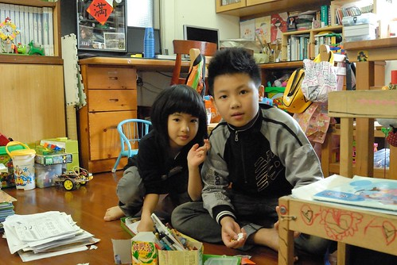
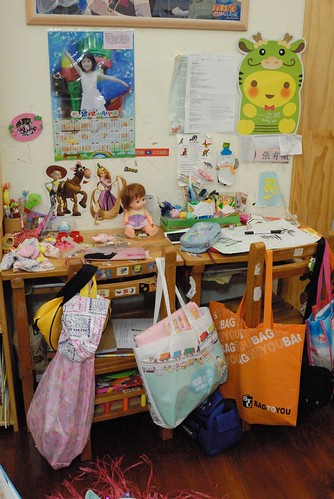
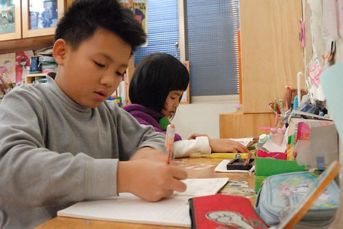
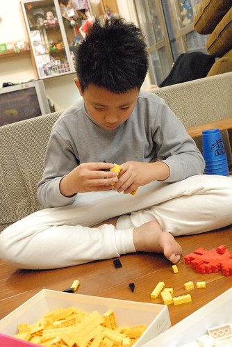
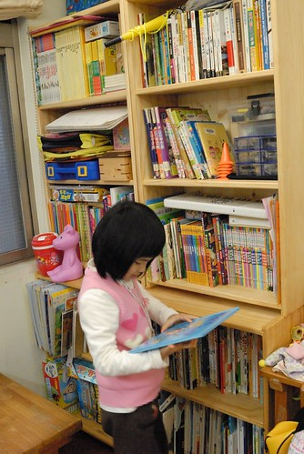
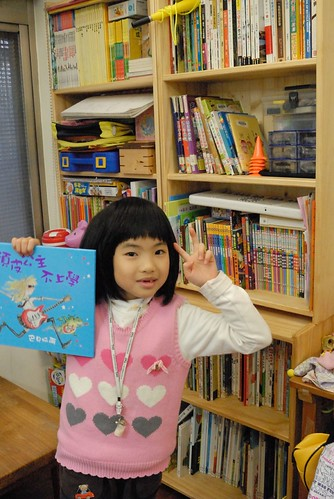
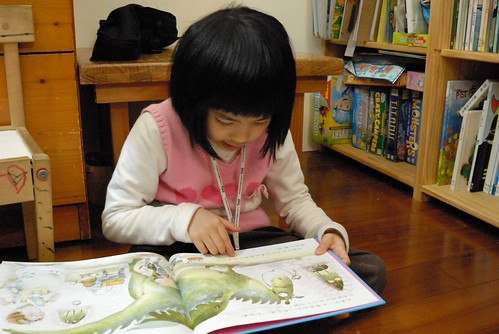
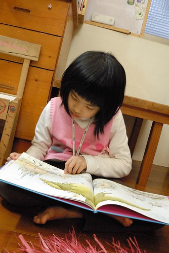

前幾天走在屏東老街上  不時聽到賣春聯與賣糕餅店家傳出的恭喜發財歌 年節的氛圍讓我忍不住想起小時候過年的忙碌與熱鬧 很久沒有感受到這樣的年味了 尤其這幾天徹愛又在嘉義等著我們回去 今年真的份外有返鄉團圓的過年心情阿~

小時候家裡在傳統市場裡做生意 過年前是一整年中特別忙碌的日子 年前一周總得清早四五點就起床幫忙(爸媽當然是半夜就起床) 常忙到過午後才能好好吃一頓飯 可是不管怎樣忙怎麼累 我們總會喬出一兩個下午大掃除 把家裡所有的門窗洗過 桌椅擦過 放眼所見能洗能擦的都要擦洗過  真的就是俗話說的"除舊布新" 但是自己有了小家庭後 卻好像從來沒有為了過年而大掃除 一來除了該掃的平日就會掃外(不會掃的也從來不會掃) 最大的理由(藉口)就是我常說的名言"過年只有一天 可是日子每天都要過"  不用為了一天這樣勞師動眾..

今年家裡依然沒有大掃除的大動力與大行動 但看著家裡兩個小學生在學期末帶回厚厚一大疊用過的書籍 作業本與考卷 特意空下一個上午 讓兄妹倆好好把他們的遊戲區 我們的書房整理過  一開始兄妹倆哀嚎著"為什麼要大掃除" 但隨著一疊疊的可回收紙張(尤其是考卷)與書本的丟出 兩人卻反倒越是開心與高昂(應該跟焚書有異曲同工之妙)  母子三人一起忙碌兩三鐘頭後 看著好久沒這樣整齊舒爽的書桌書房 很是得意與開心 雖然就如一旁也在整理儲藏室的徹爸說"原本七箱的東西整理後也還是七箱" 但我們明白東西已經更是有秩序的歸放好 以方便我們日後的使用 也雖然整理好的書桌 果然不消一個鐘頭就又被小主人放的凌亂 但我們知道收拾是為了放更多的東西....  整理好後 站在客廳大門一眼望向我們的書房 我滿意的不得了 讓徹愛也一同站在同樣的地方欣賞他們整理後的書房 兄妹倆的成就感果然達到高峰 得意的不得了 接下來的兩天 兄妹倆也更是喜歡坐在他們的小書桌前寫寫弄弄  家裡的小學課課桌椅已經用了好多年 當然清楚早已不敷徹愛的使用 但我也明白再大的書桌永遠也不夠 所以除了陸續開放給她們各自一層書櫃與大書桌抽屜的使用權外 我們一直喜歡這樣剛剛好又適用的書桌 而且我喜歡大家一起坐在餐桌寫功課  窩在家裡任何椅子或地上看書 小書桌主要就是給徹愛一個歸屬感 讓她們有個屬於自己的小角落 每當看到兄妹倆在自己的位置上安靜又專注地做著自己的事 我總忍不住多看幾眼 陶醉於這個家所能給予他們的小天地  家裡的擺設向來以實用導向 不擅也不喜做太詩情畫意的佈置 因此家裡裝置的變動頻率非常的低 尤其我們又是屬於用好好且看的舒服就不會想改變的懶人 但只有我們的書房例外 這幾年一直在改變 在進化  以前徹愛年紀小 我喜歡稱這空間是遊戲區 而徹愛也愛在這的地板上做任何遊戲 看書 寫字 畫畫等小人會做的事 但在徹愛成為小學生 家裡的書也不知道為什麼的永遠不夠放後 一架架書架陸續的進駐 而我也開始喜歡稱這裏為書房  雖然書房大半的時間還是遊戲用途 但真的絕對是打發小孩無聊的最好地方 因為媽媽總會說"去~ 去拿本書看 安靜下來"  而小孩真的就安靜下來.. 起碼不敢再唉無聊了(我們家是不准喊無聊的)  愛愛的後半學期開始學國字後 閱讀注音的能力加強也加速許多 也總算開始漸漸能自己體會閱讀的樂趣  一個家就如一個人的人生 很多事要順其自然 慢慢的發生 改變與成型的 真高興我們的書房越來越有一回事了~
