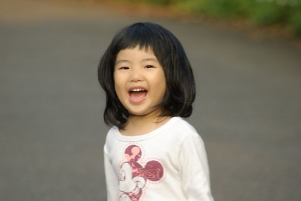
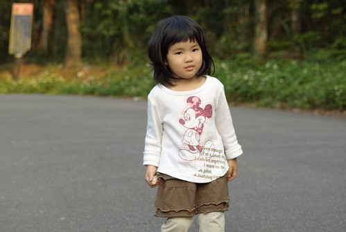
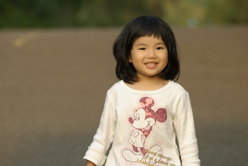
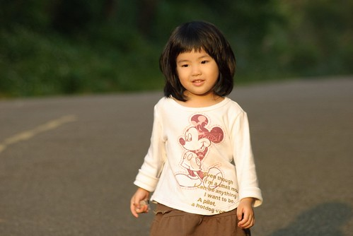

聽了好久的咳嗽總算很多天沒再聽到 而吃了好久的藥也總算即將進入倒數 希望這一波真的就這麼過去了 小愛又是健健康康的一尾活龍了!!!

  受爸爸哥哥著迷火影忍者的影響 小愛最近也有了一個唯她獨享的"忍術" 那就是當哥哥不跟她玩 不給她玩的時候 只要爸爸提醒她說"用你的忍術" 小愛就會大聲的說著"那我晚上不要跟你睡喔" 果然小愛的忍術一出招  哥哥馬上就束手就範 目前哥哥對小愛的這招忍術完全無藥可解 還蠻慘的…

小愛最近又更愛吱吱喳喳的講個不停 會主動的跟我說"媽媽 我跟你說喔 今天在學校…" 或是硬要我聽著她斯理慢條的"敘述"一件事或一個情境 如果有時間 耐性可以好好的聽她講說整件事 便會發現"哇! 腦袋瓜真的有在長喔~" 除了詞彙越用越多 越趨大人(哥哥)的用法外 因果關係等連接詞也用的越來越像樣了

只是小愛跟哥哥都愛說話 因此兩人常會為了媽媽該聽誰講而爭的大小聲 這大概是他們兄妹倆最常吵而也最堅持不讓步的一件事吧!!!

PS. 照片攝於大崙山產業道路上  希望這遊記可以不要拖太久..........
