鑒於近兩次40公里騎乘後 徹媽的膝蓋都會深感不適 總算讓我們下定決心買台好一點的單車作為徹媽的座騎 考量了價錢以及合適性等因素 最後我們選了美麗達Jeliet 1.0 跑了內湖及蘆洲店也經歷等車以及在家調整準備期  總算在3月的最後一天出門試車 騎著我的新愛駒跟徹爸來趟關渡單車小約會~~~

徹爸通勤代步用的'sorry' 以及我的新歡'小藍'  有沒有給他跟人一樣速配 呵呵~

兩台車擺在一起明顯覺得我的車小很多 不過或許該說是徹爸的車太大隻了 Anyway, 以後就是這兩台車跟阿徹的小紅一起出門尬車嚕 以後小愛就由徹爸負責騎載(為此徹爸又斥資買了一個兒童椅) 徹媽不用辛苦的練腿力了 我甚至跟阿徹放話說'以後媽媽可以在前面騎的更快 等著他來追了 哇哈哈'

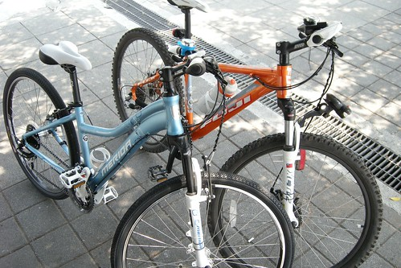

3/31上午10點多 徹媽第一次全副武裝的騎車去...也是茱麗葉小藍的首騎喔...

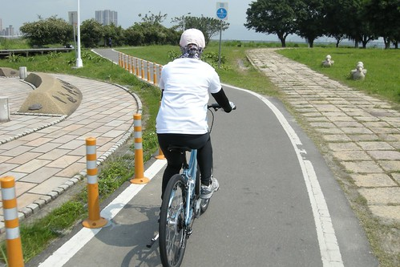

騎到目的地關渡間 我們休息了兩次 之前我很常跟徹爸說 我很材也不懂什麼叫做好騎的車 可是今日我第一次覺得自己腳下的車真好騎 而且我第一次騎車可以感受到我的心肺也在運動  咻咻咻的~有點累 但是很過癮 因為逆的風 所以時速大約只能保持在18-19上下 再快就超出負荷了

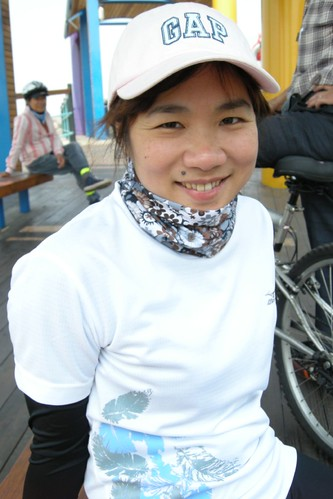

騎了一個半多小時看到關渡宮嚕  我的首航當然得留下一各地標紀念照

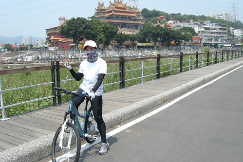

我跟徹爸都很期待這次的首騎之旅 徹爸還事先跟家住關渡的同事打探哪有好吃的 最後我們選了一家便宜又好吃的簡餐店用餐 真不知道是約會太開心還是騎車太累抑或是餐真的很好吃 我們兩人吃的津津有味 飯後甚至還一起去合嗑了一碗紅豆牛奶冰 (等會還要騎20公里回家 兩人這樣吃真不怕死  果然氣管不好的徹爸回程時呼吸不太順)

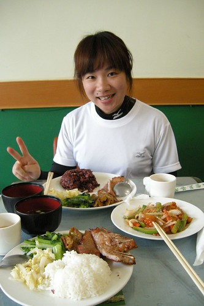

而酒足飯飽之後到關渡宮附近找了各涼蔭處 休息看海 這種非假日的忙裡偷閒小約會 感覺真是愜意阿~~~

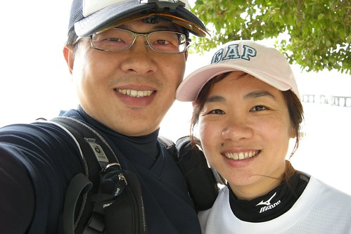

為了宣示我想練車的決心 我也稱呼徹爸為一聲'師父' 徹爸說 他還得回家去問看看他的大徒弟也就是我的大師兄'張阿徹'願不願接受我當他的師妹 不過徹爸說我這短腿跨在車上的模樣跟張阿徹還真是給他有夠像的...

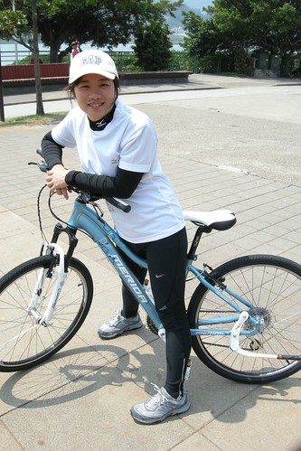

往回騎之前 我們先往前多騎了一點來到關渡橋照相留念 YABE!!!

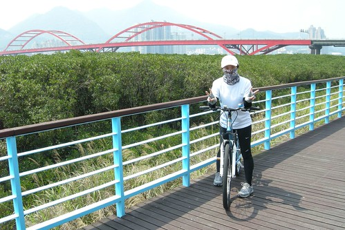

下午一點太陽實在烈 所以除了原本的裝備外另外再多加了一個徹爸的酷墨鏡 (等我更上手後再來敗一隻)

徹爸買的運動專用墨鏡果然利害阿 讓我一路可以跟上徹爸的速度(上橋段除外)  甚至用24-25的速度騎了3-40分鐘喔 我個人也還不懂這樣到底有多快 是難還是簡單 只是覺得跟著徹爸的背影 專心努力的騎著車的感覺很舒服很開心

烈日當頭 趕緊騎回家衝個涼 看日劇嚕~

只是徹媽目前的功力平地騎乘沒問題 爬坡就得好好加強訓練了

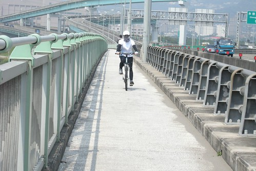

希望有朝一日 我就可以不用這麼狼狽的牽車 可以給他一股做氣的衝上去~

最後我們花了一個小時多一些些便抵達板橋的家   今日40k 處女騎大成功!!!

\-------------------------------------------------------------------------------------------------

趁著這篇試騎文 順道清了一下去年徹爸自己去大稻埕探路時的照片 透過照片會覺得這個城市是有在進步的 尤其在當腳踏車成為全民運動的時候 同時透過這些照片跟大家分享美麗的台北水岸自行車道~

之一  萬板路接近音樂公園處的自行車道

之二  音樂公園裡自行車道

之三 華江橋水門

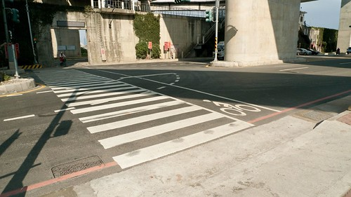

之四 大漢溪堤外 萬板橋往華江橋段

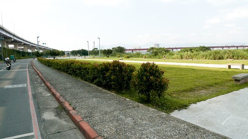

之五  華江橋自行車引道

之六 華江橋引道入口 (我得牽著上去 徹爸自己騎時可以一口氣抽車上去)

之七 抵達橋面前有一小段路得自己扛一下車

之八 在橋上望下去的堤外風光

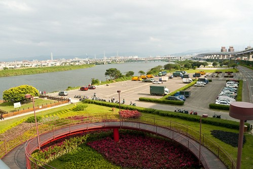

之九 在橋上望去的河岸風光

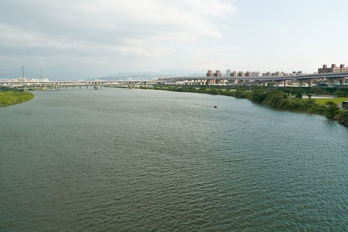

之十  腳踏車其實是其在原本華江橋的人行道上  不是很寬敞但也夠兩台車會車 只是對阿徹這樣的小朋友來講 光是要從家裡穿過市區到華江橋然後再上橋再騎在車聲哄哄的橋上粉累 所以試過一回後 就沒再讓阿徹自己上橋了 (徹爸又說了 就是因為這樣所以才要車架阿...)

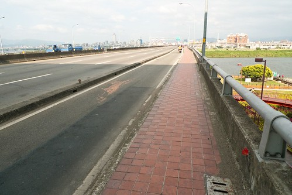

之十一  華江橋台北市端的自行車引道口

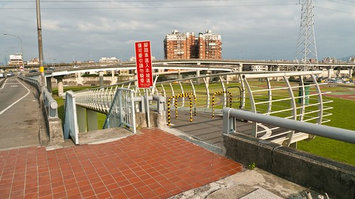

之十二  橋下依舊是美麗的棒球場

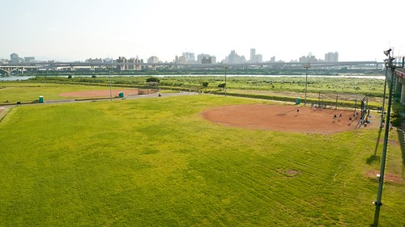

之十三  台北市這端的引道明顯比台北縣端好騎多

之十四 隨手拍之一

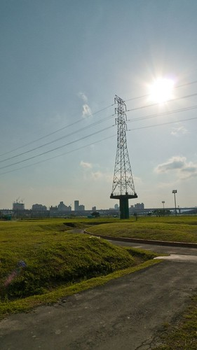

之十五 隨手拍之二

之十五 隨手拍之三

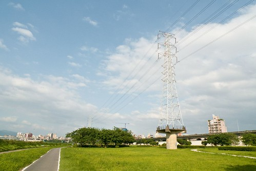

之十六 隨手拍之四

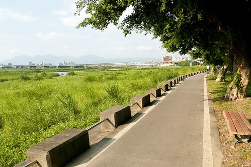

之十七 隨手拍之五

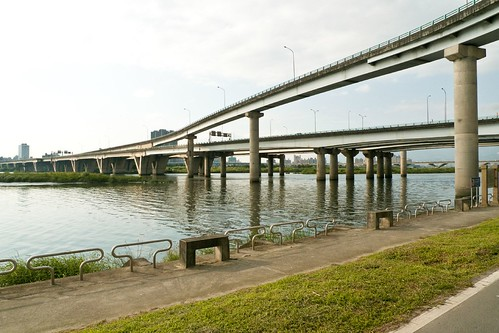

之十八 大稻埕碼頭

之十九 大稻埕碼頭之二

之二十 隨手拍之六

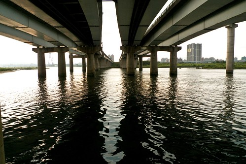

之最後  台北也是很美麗的一座城市吧!

