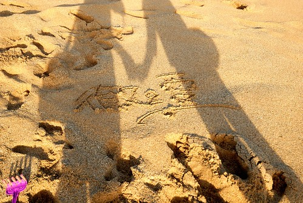
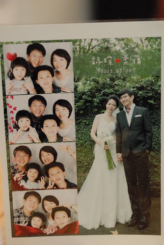
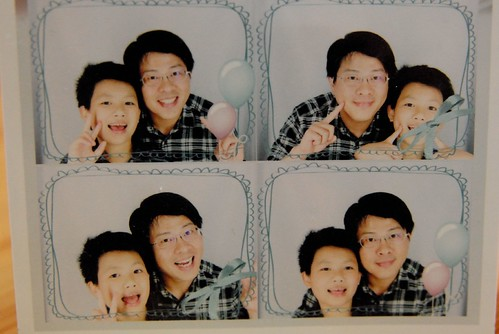
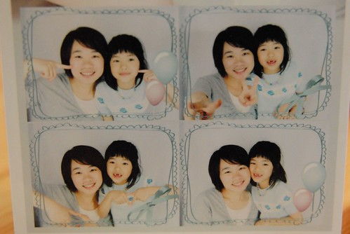
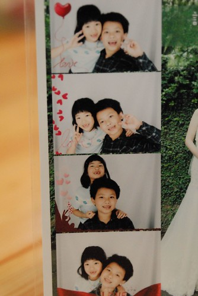
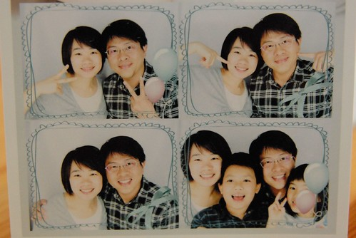
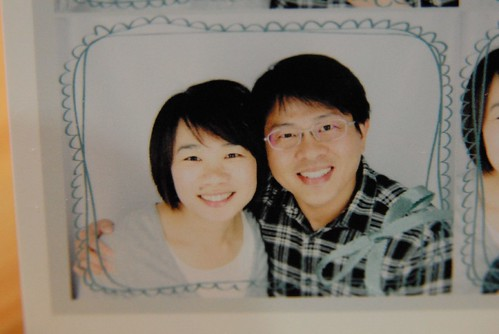
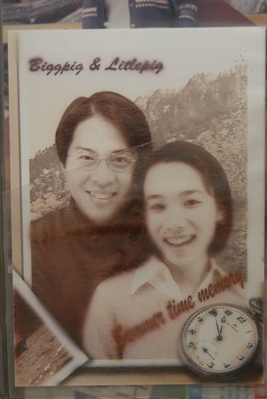

最近家裡常出現這樣的對話 男聲: 情人 來~ 我幫你OOO   女聲: 情人 謝謝/ 我愛你~ 看著徹爸跟他上輩子的情人這樣甜來蜜去的 我心裡沒有不是滋味只是有點好奇那我ㄋ? 因為明明兩人最愛的都是我阿 直到昨天 我聽到老情人對我喊"愛人 ..." 我才恍然明白原來我是"愛人"阿 這時候一旁臉快抽筋的阿徹問"那我ㄋ?"  沒想到徹爸立馬回應"什麼都不是" 嗚嗚嗚~ 如果我是阿徹一定很難過 妹妹是爸爸的情人 媽媽是爸爸的愛人 那他呢?! 真的好大的問號阿! 希望阿徹能明白爸爸媽媽也是很愛他的 只是愛的方式跟愛妹妹不一樣 沒有甜言蜜語 但一樣的堅如磐石 此情不渝 天長地久 海枯石爛~~~  

月初去參加了徹爸以前同事的女方歸寧喜宴 因為新郎跟我們一家子都熟(是來我們家頻率最高的訪客)  我們很難得的一家子一起盛裝去喝喜酒 婚禮很溫馨但也因整場的卡拉OK歡唱而穿插點搞笑(這大概是我們看過的兩家子長輩玩最開心的喜宴) 而更令我們感到新鮮與開心的是場外提供的大頭貼照相機 我們遵照新郎行前指示"多拍點 多玩點"  拍的不亦樂乎  第一張的四個人拍的有些拘謹 不好意思  拍完這張想說今天就這麼一張做紀念就好 沒想到徹爸父子倆中場去上洗手間時竟然偷偷跑去拍  還拍的帥氣又可愛  看的我跟愛愛好吃味 於是我們母女倆也來個女女版  然後徹愛二人再來一組 兄妹倆應該拍的很開心 還換POSE哩~  最後 最後 最殺的來了...  哈哈 我自己好喜歡阿!!!  後來徹爸把兩人這大頭照放在MSN  有同事笑說"怎麼拿10年前的照片出來" 哇哈哈~~~ 算是駐顏有術嗎?! 對照真的是10幾年前 我跟徹爸還青春時後的第一張也是唯一一張大頭貼照 有啦~ 歲月真的有在我們身上留下痕跡 一種更見成熟與自信的心  而話說大頭貼照機應該都是美人機來的吧!  人都被拍的這樣水噹噹~
