這兩天真的有冷的感覺 不單單只是涼爽了... 接下來的幾個月真的得看老天爺臉色過日子了 藍天白雲的好天氣就要好好把握出門踏青去 再不去公園跑一跑 跳一跳 流個汗都是難得的幸福 就如10月中在宜蘭的那天 我們把握住發威的秋老虎 再一次在外澳沙灘留下美好回憶! 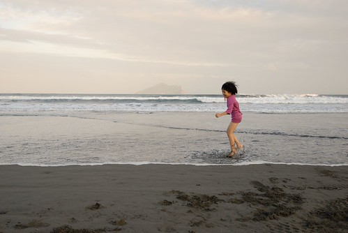

那天中午的30度高溫我心裡就盤算著或許可以讓徹愛去外澳玩玩沙 而連著幾年都來外澳抓夏天尾巴的徹愛(話說怎麼我們每年都來外澳抓夏天的尾巴阿?!) 也很清楚蘭陽博物館再過去一點就是他們很愛 每年都期望著來玩沙的外澳沙灘 雖然5點離開蘭陽博物館時 已經開始起風 有秋天早晚的涼意出現 但我還是像徹爸說的"寵小孩" 讓徹愛去那片熟悉的沙灘上玩沙 踏浪 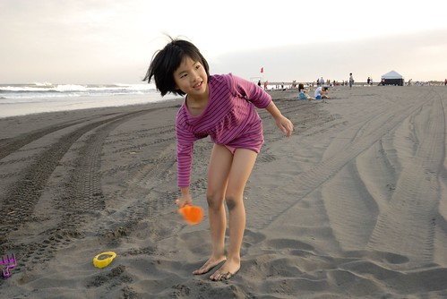 玩沙玩具一直放在車上 所以工具不是問題 而至於戲水的裝扮也一切從簡的 愛愛只消把裙子綁高 而阿徹也只不過換條四角小短褲 然後兄妹倆就在不顧世人眼光的率性與涼爽下 衝衝衝 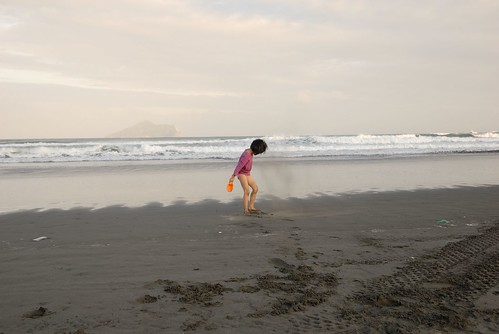 外澳的沙很細很綿 我們喜歡走在浪可以拍打到的地帶 觸感舒服的就像走在地毯上 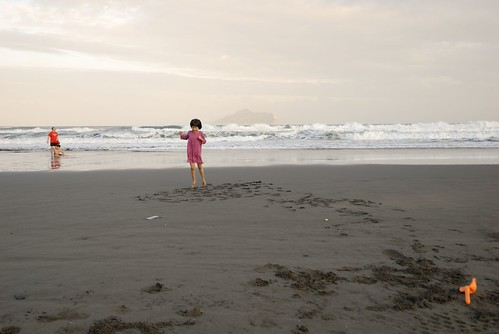 站在這片沙上 小孩子很難不開心 很難不愛上玩沙 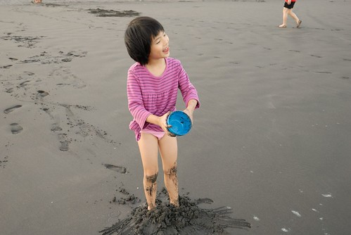 雖然有那麼一點冷 但愛愛玩的好認真 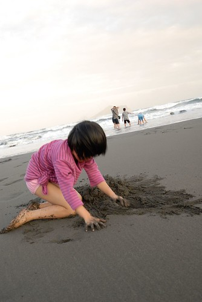 愛愛還開心到應我們要求的來個歡躍一跳 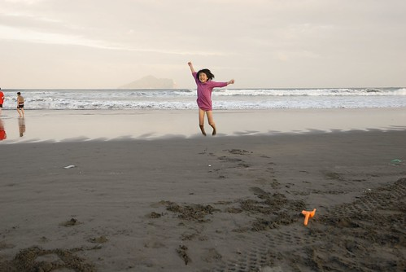 真的 其實可以放手玩的地方就是小孩子最喜歡玩的地方 不管在台灣的北 台灣的東還是台灣的南 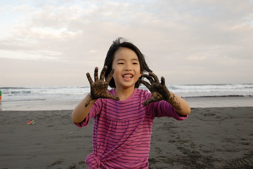 而那個這幾年長大很多的小學生阿徹也還是一如往年玩的很賣力  很執著 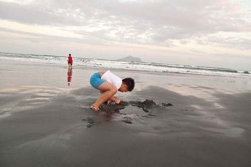 很令人羨慕他的傻與真 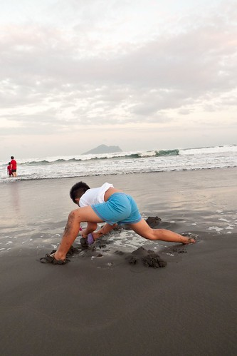 (徹OS): 媽媽 你又在說我壞話 你壞壞 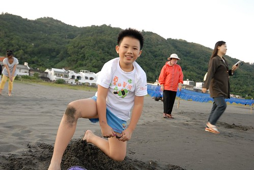 回家後我跟阿徹聊起這回的旅行時 我跟他說 "媽媽真的好喜歡看到你們這樣玩沙 這樣開心玩沙的模樣" 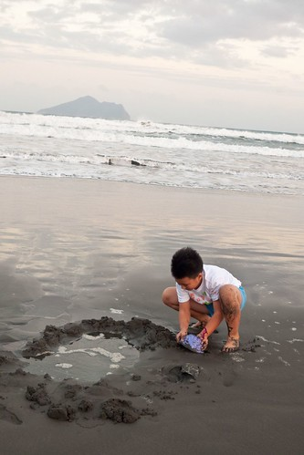

不過小人努力玩沙的同時 我跟徹爸則是坐在我們的隨車小椅子上笑看一切 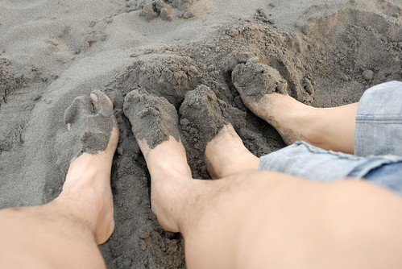 兩人看著小孩說說笑笑 好不滿足... 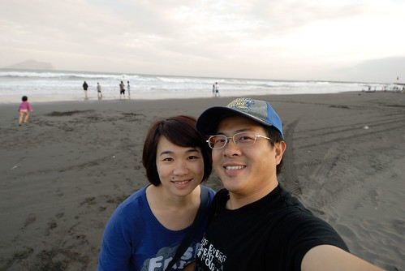 只是還真的蠻冷的  尤其風大時吹來的沙打在臉上還有點痛 (每次起風時 我們便提醒徹愛的臉要順著風向) 我的心裡更加佩服遠處玩沙的兄妹倆了

  冷到徹爸忍不住回到車上拿大家的外套 把自己裹緊緊 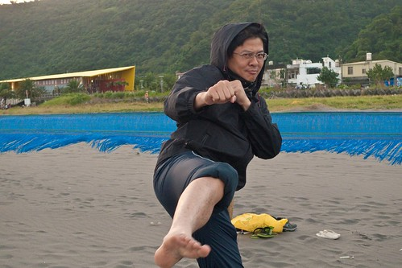 同時開始喚著小人"差不多嚕 天快黑了 而且變冷了..." 只是興頭上的小人哪會覺得冷 就算順從的讓媽媽穿上羽絨背心也還是要繼續的玩 (愛愛這身玩沙裝扮也真夠屌的了) 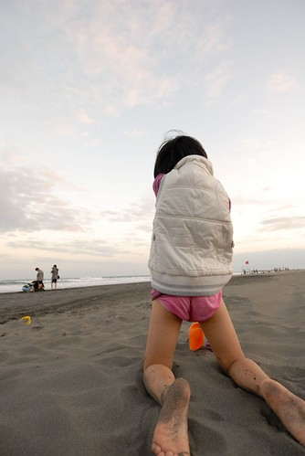 我們沒很認真的督促小人結束 還開心的玩起跳躍連拍 (話說興頭上的徹愛會這樣配合當然是在我們的脅迫之下(不拍就走嚕).... 嘿嘿) 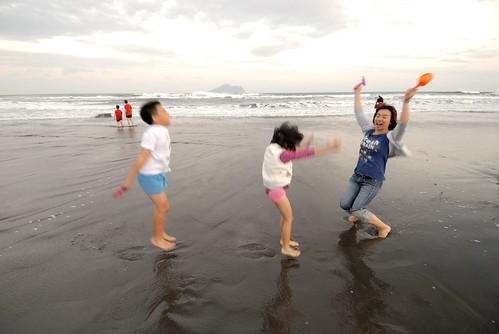 我們還真沒看過夏天熱烘烘的外澳沙灘 但我喜歡每年在這片沙灘上所抓住的夏天尾巴 秋日傍晚 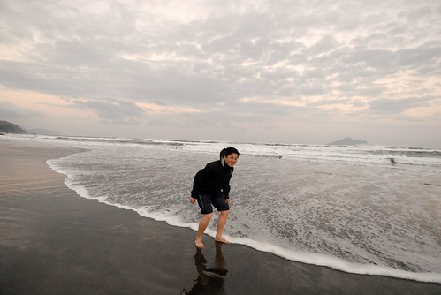 真開心! 這回宜蘭小旅行直到最後都這樣美好 這樣令我們難忘~

PS1. 我們玩了幾段的連拍 用相機連著看就像看動畫一樣很是有趣

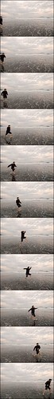 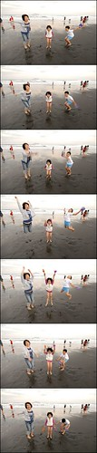 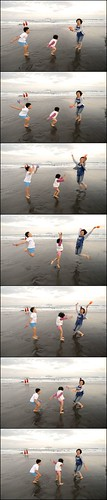 PS2. 離開外澳準備回台北前 我們掙扎了一下要不要留在外澳吃飯 所幸最後在媽媽英明的指導下我們在外澳的"請上座"餐廳飽食一噸 也避開了高速公路的車潮 這是不在店裡菜單上 但寫在黑板上的菜: 那個魚 我問老闆娘那個魚是什麼魚 老闆娘説"ㄟ..就是那個魚"老闆娘也一臉困惑要怎麼形容 不過老闆娘說魚肉吃起來像水晶魚那樣 小孩子應該會喜歡 恩~果然那個魚真的好嫩 尤其鹹酥做法完全把美味鎖住 只是那個魚的尺寸跟水晶魚實在差很多 完全出乎我們意外的大阿 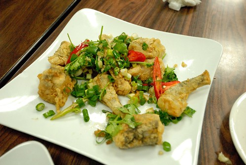
