本來要用武陵農場來作為今年夏天的Ending 但沒想到我們那一路從二月延到六月然後八月底 到最後通牒的九月中的訂房 最終還是因為夏天盛產的颱風而一直取消 到底未成成行 我跟徹愛的心裡好低落 怎麼夏天就結束了 而今年我們都還沒去過武陵耶... 也因此更是渴望且刻意的選在秋老虎正旺的時後來個宜蘭溫泉小旅行! 星期五下午四點從阿徹學校出發的一天一夜小旅行 長度剛剛好 溫度剛剛好 心裡也被填的剛剛好~ 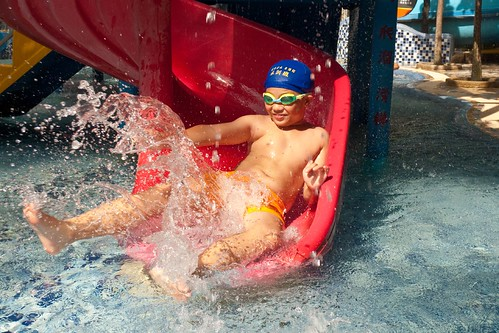

每次旅行前徹愛都會很熱切的問著"這次要去住民宿還飯店" 總要我多說點即將入住的民宿或飯店的事情 雖然徹愛常也很喜歡媽媽帶他們去的各式各樣民宿 但徹愛總也念著最是喜歡那有溫泉的飯店 所以這回算是慰勞徹愛開學以來的努力所給的小獎勵 我誇大的跟阿徹說"這是送你們的禮物阿" 阿徹開心到眼睛都笑瞇了... 我上網研究比較一番後 選擇了SPA設施相較豐富的中冠飯店  然後PAYEASY訂房把徹爸今年的旅遊補助用光光 難得住飯店的徹愛果然從飯店大門口就開始興奮的哇哇叫 而晚上與隔天一早的泡湯玩水更是讓他們不亦樂乎 High到高點 高興的直呼"真是太好玩了 太滿意了" 猛問"下次還可以再來嗎?" 孩子~ 你們知道的.... 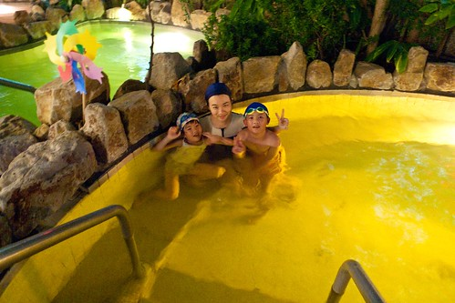 秋天的傍晚 泡在溫泉裡 頭是涼的但身體是熱的 真的很是舒服 宜人的泡湯好時機  尤其在經歷一週辛苦的工作與課業學習後的週五夜晚... 瞧~ 泡在玫瑰花湯池裡的阿徹有多麼的享受與放鬆阿 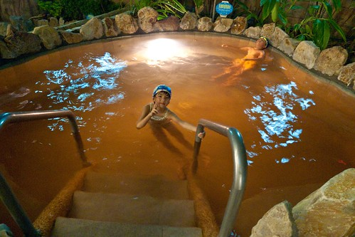 只是泡完湯 我們也飢腸轆轆餓翻了 來到一家疑似是我們8年前第一次家庭花東旅行時曾經吃過的涮涮鍋店 一家子飽餐一頓  然後涼風下 散步在假日鼎沸但今日安靜的礁溪街上  回飯店前 看到這攤濃濃歷史味的攤子 我們駐足觀賞阿公那俐落刨花生 包冰淇淋的好身手 還忍不住買了一捲嚐鮮  這是我們第一次用宜蘭特有的方式吃冰 很獨特但很棒的組合吃法!  停留宜蘭還不到三小時的時間 但阿徹卻已經滿意到不行(小學生還穿著制服褲子ㄋ)  不過向來不太習慣飯店的我與徹爸果然依舊不太習慣飯店 尤其這次飯店房間的空間配置真的怪奇怪 兩張床正對著梳妝床櫃子 兩側則是廁所與浴室 而電視更是大辣辣地作為中心點 真的是很奇怪 我努力的揣摩著當初設計者的可能用意...  好在我們家向來很隨遇而安啦 如果沒睡好就回家再補眠就好 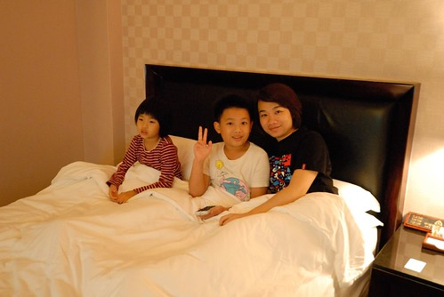 第二天因為要在11點退房前再一泡 所以我們照著平日上學時間起床 期待著早上再次泡湯的徹愛延續著前一天的高亢 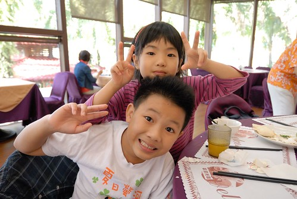 倆人還猛玩著愛愛那顆垂吊著的小門牙 (PS. 最近的照片中 這顆小牙齒常出現喔)  九點吃完早餐 阿徹便開始嚷著"去泡湯了" 好說歹說的給肚子30分鐘的消化時間後  徹愛開心的換上泳裝玩水去  同時我跟徹爸則不想再一大早"從頭來過"的濕淋淋 兩人各自帶了本書 找了個涼爽舒適的位置 愜意渡過 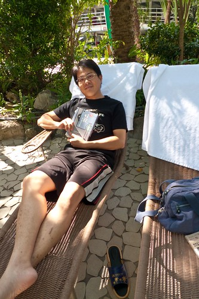 曬著太陽的戲水 更是讓徹愛如魚得水  兩人盡情的在沒什麼人的水世界裡玩樂 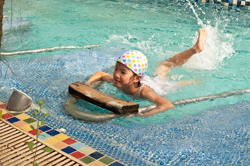 開心到讓我根本沒看什麼書 反而拿著相機追著他們跑  雖然我們不太喜歡房間的設備 但飯店的SPA泡湯設備很是令我滿意 不只設施多 整體的維護也做的非常好 尤其兒童戲水區是我見過最乾淨的一家了  兒童區還會定時有灑水的設定  小孩更是high翻了  而且飯店內還有一座5層樓高的滑水道 從前一晚就開始關注他的阿徹 有點期待但又存著很多的害怕 等到開放時間時 看到幾位小朋友滑下來後都笑瞇瞇的說好好玩 然後立刻又往樓梯衝 說著"還要再玩" 阿徹也忍不住心癢的去滑了兩趟 兩趟下來後果然跟前面每個小孩一樣馬上轉頭再去排隊 但我們一直等不到阿徹的第三趟下來 直到他略白著嘴唇從樓梯下來 說"我還是不要了" 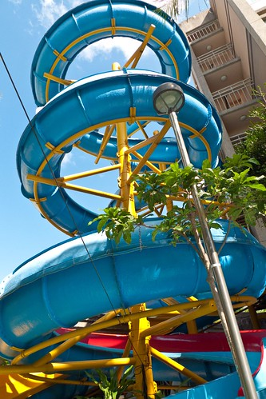 不過阿徹能突破心防 自己挑戰滑了兩趟我們覺得已經很厲害了 而阿徹則回味無窮的直說"下次我要再來" 不過爸爸說下次再來要滑10趟才行 ㄏㄏ 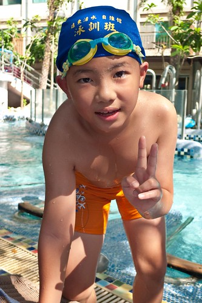 經過這個暑假YMCA一個月的游泳課後 阿徹總算真的會游而且享受水中樂趣了 因此玩累的時後 阿徹會放鬆的仰漂在水裡  那下水前刻意股足氣的泳褲 遠遠看就像一大浮在水面上的大屁股 很是好笑  不過看著阿徹能在水中這樣休息 這樣愜意 真欣慰他游到這一步了 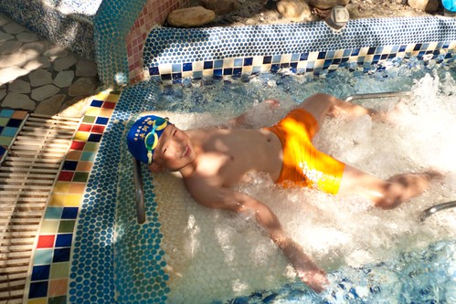 至於小一生愛愛 我相信很快的她也能像哥哥這樣的優游自得  一大早一個多小時的戲水讓兄妹倆好開心好滿足  也難怪阿徹在回家後給這次的旅行打了99分 很棒的溫泉小旅行ㄋ~ 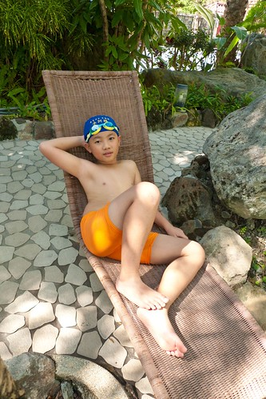
