延續著小學生們在頭城老街的好奇心與好心情 我們接著來到蘭陽博物館 夯好一陣子的蘭陽博物館 這回我才總算突破心房 決意不管人潮多寡非來走一遭 建築物本身果然不論遠看 近看 怎麼看 哪裡看 都很壯觀 很漂亮 但館內豐富的蘭陽歷史 甚至是農業與漁業的發展介紹更是讓我們如入學術墊堂 滿載而歸 真高興這回我們沒再錯過她 有了這麼棒的博物館之行! 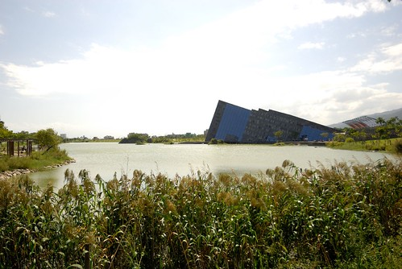

博物館週遭的停車位不多 我們只好把車子停到烏石港內  徹愛看到一艘艘開往龜山島的遊艇   大喊著"我們要坐船.." 我跟徹爸紛紛搖頭"坐船這種事是需要點心理準備的 可以擇日再安排" 徹愛卻還是一直嚷著"想坐船去烏龜島阿" 孩子!乖~ 我們才剛吃飽而且最上層還飄著芋冰 實在不需要這樣衝動  真的! 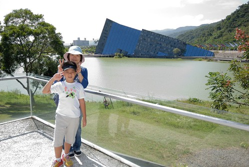 從遊客中心走到博物館的這段路有點遠 尤其好到像夏天的天氣讓人走得滿身大汗  但這段路卻可以讓我們一路欣賞著各個角度的蘭陽博物館 尤其遊客中心右後方前面這段 我覺得是蘭陽博物館最美的角度  而且隨著越接近博物館 心中竟有著來朝聖的小小情愫  然後當踏進博物館大門時 我們果然震驚的忍不住"哇"出聲 真的是很當代藝術的建築 置身其中應該很難不被懾服吧  買票的時後看到下午兩點開始發放互動劇場的號碼牌 對劇場一向來者不拒的徹愛 當然是不管怎樣也要先去拿票  來到互動劇場外面的二樓 哇~視野又不一樣了 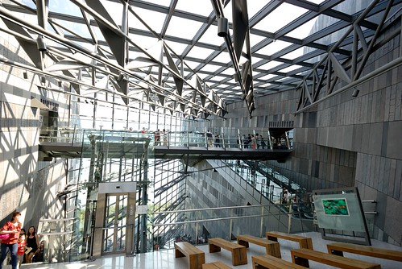 一般正常人如我跟徹爸肯定是先沉浸在這好氛圍中 但愛愛卻只惦著要排隊 即使還有10多分鐘才發放而且沒有任何排隊人潮 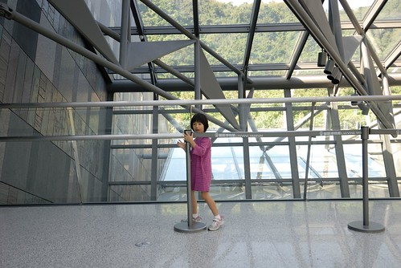 每次要排隊看展覽或劇場什麼的 我們都會跟徹愛說"如果真的想看 決定要看 那就花時間排隊" 而只要徹愛決定且貫徹排隊意念 我跟徹爸也總是盡力支持 (雖然有時後會忍不住分析優劣比較一下) 對徹愛來講 這也是一種有所得有所付出的訓練 而排隊的時間裡 一家子聊聊天 玩玩小遊戲(今日遊戲是愛愛快掉的門牙) 其實也過很快 我們拿到下午第一場的入場票 因此進場前的10多分鐘得繼續打發ing 這時候 拿到票的愛愛也才願意好好看看劇場外的裝置 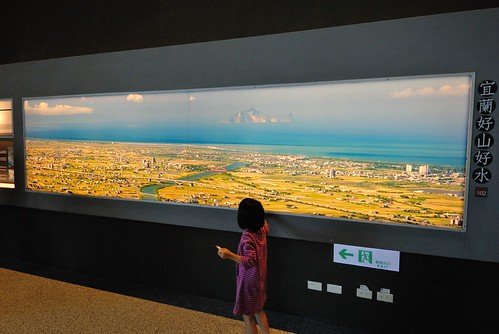 等候中的父女倆之一  之二 感情好像很親密的樣子 讓我忍不住拿出相機偷拍 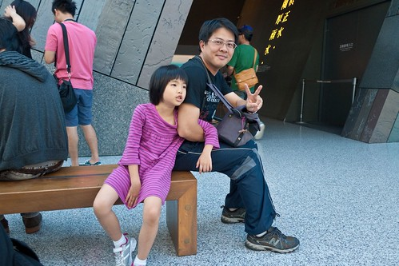 等候中的小學生之一 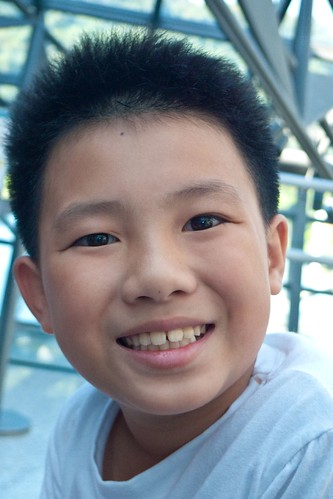 之二 每次旅行中看到小學生這樣開心的笑容 媽媽就也跟著很開心  互動劇場有點像是花博那時後的3D影像劇場 內容主要為台灣形成 蘭陽平原演進 蘭陽動植物..的介紹 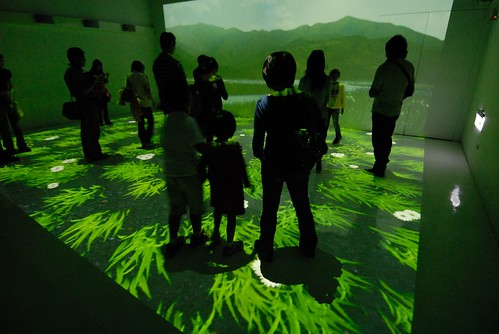 雖然影片解說的速度過快到讓人來不及聽完全 但透過這樣的互動方式的確大大吸引小孩的專注力與了解  15分鐘左右的劇場很快就結束  接著我們也總算要開始逛博物館了  

蘭陽博物館真的很豐富 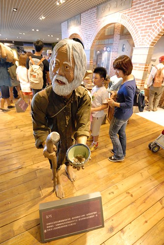 從蘭陽平原的形成 地理天氣的介紹到歷史的變革 文化的演進 生活的改變都有詳細的展示與說明  特別是漁業的介紹非常的詳細 讓喜歡吃魚的我們了解許多 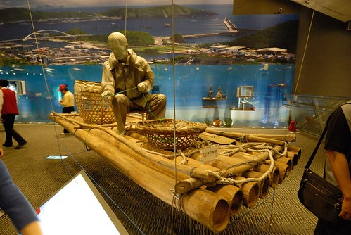 小學生識的字比較多 感興趣的事物也變廣泛了 而對事情的瞭解也漸漸有深度 也就因此很出乎我們預期的 花了兩個多小時才把所有展覽大致看完 過程中 我跟徹爸配合著小學生忽快忽慢的腳步 也隨時充當最佳私人解說員 認真的與小學生們研究/說明各種她們好奇或不明白的事 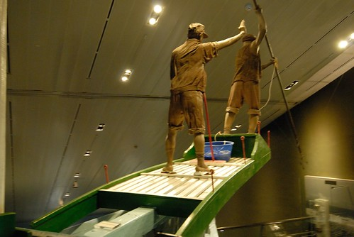 雖然兩小時下來 我跟徹爸還真有點累 但我們很喜歡今天的學習  這裡真的是個適合帶小學生 尤其是開始上地理/鄉土/文化的小四生  保證可以開他很多眼見  不過前提是小學生的爸媽真的得耐操耐棟還有耐問 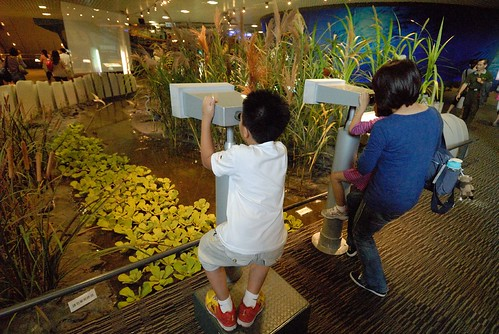 然後照著小學生的tempo不疾不徐地看完整個博物館 保證大大小小都不需此行!  結束主展館的參觀後 我們接著去兒童探索區 入口處有個可愛的火車貼圖似乎帶領著小朋友們來趟知識之旅 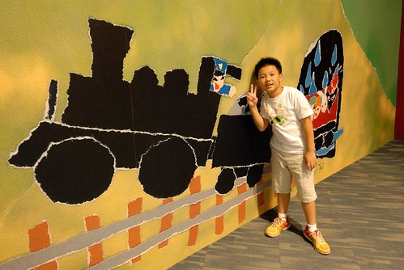 小朋友 趕緊找個位置坐好了 我們要出發了喔.... 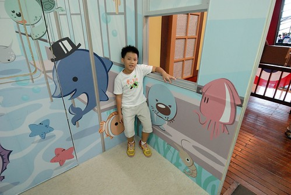 雖然兒童區真的相對薄弱 但一個個可愛有趣的空間佈置卻是讓小人們開心不已 像蝴蝶飛的似周旋於各個遊戲間  而同時間 我跟徹爸總算有機會 有地方可以坐下來喘口氣 休息一下 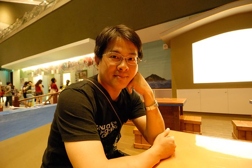 看的出兩人都有倦容了 呵呵~  不過看到這艘船 兩人還是忍不住搞笑一下來個鐵達尼號經典畫面  好不浪漫阿... 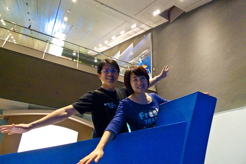 小學生們又在兒童區內嘻遊半個多小時  加上最後離去前還又在紀念品商店裡尋寶一番 完全出乎我們預期的 我們在蘭陽博物館內足足待有3個小時 一個下午的光陰 這回門票的CP值真的很高阿! 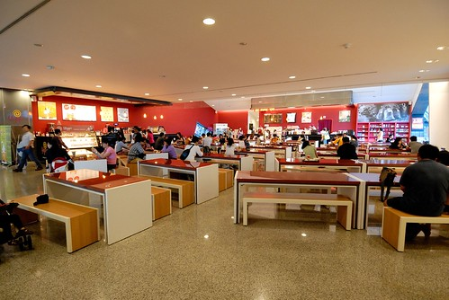 離去前走到博物館的戶外前庭 最後好好感受博物館的美麗  以及眼前的這片寧靜畫面 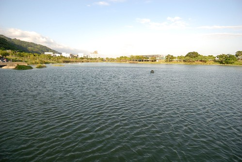 真的是很棒的一個博物館之旅! 就如在館內透過不同玻璃窗 框出一幅幅令人驚艷的圖像 我們catch到了~ 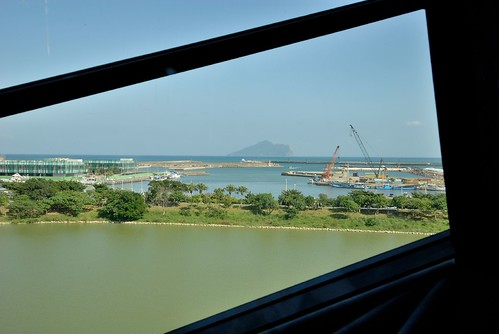 後記: 離去前看到有個阿伯在賣草編的創作品 我們忍不住買了隻松鼠 栩栩如生的模樣真的是超級可愛 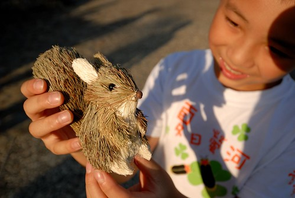 而意外多了個紀念品的小學生更是開心滿意到最高點! 
