當想要看山玩海但卻又不想一番折騰到花東時 一小時車程就到的宜蘭無疑是我們的最佳選擇 雖然原先預期的稻草多多龍 冬山稻草人與稻田 一個都沒去 沒看到 但這樣隨心所欲的漫步在頭城老街 暢遊蘭陽博物館以及最後的外澳沙灘 成全了我們一場有深度有歡笑 難忘的小鎮小旅行! 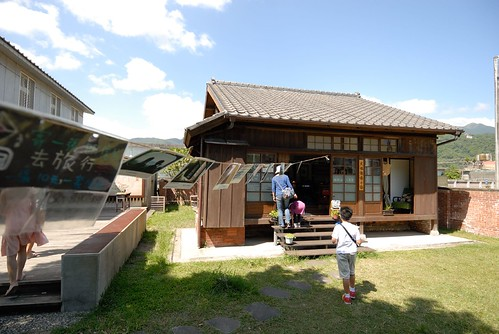

離開溫泉飯店後 原先只是要去頭城的和平街屋看看 但因為停車位不好找(老爺停車規矩很多) 我們繞了大半圈把車子停到了火車站附近 也因此才多發現了火車站旁的文創園區以及頭城老街 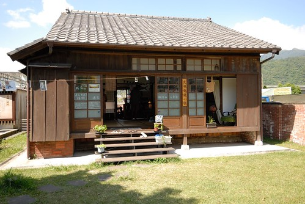 停好車 我便迫不及待的往文創區裡的這間小木屋裡鑽 對於這樣濃濃日式風格的木造屋 我難擋誘惑 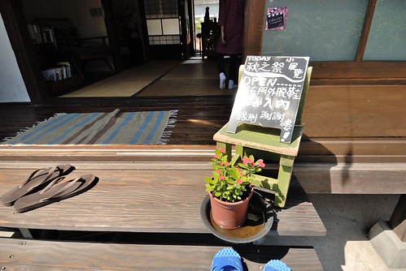 工作室的主人正與訪客在榻榻米上分享對於生活 對於土地的看法與願景 我們不好意思打擾太多 靜靜的翻看一些陳列後悄悄的離去 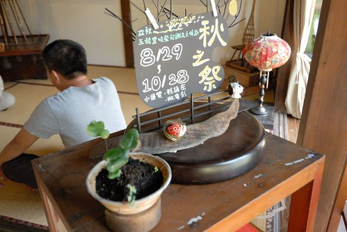 謝謝徹爸知道我對於這類建物的喜好 總是幫忙安撫焦躁的小人 讓我慢慢的走 好好的看 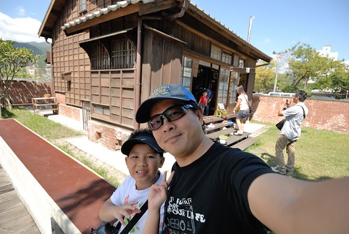 雖然我喜歡木造屋的歷史感 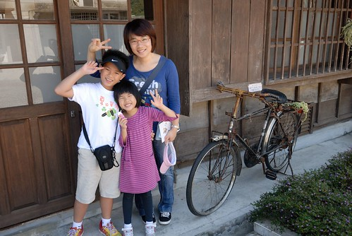 但我心目中最夢想居住的其實是像這樣簡單又堅固的小樓房 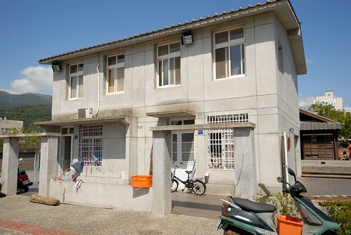 每次我總忍不住站在房子門口 假裝 想像 有一天我站在這樣的家門口 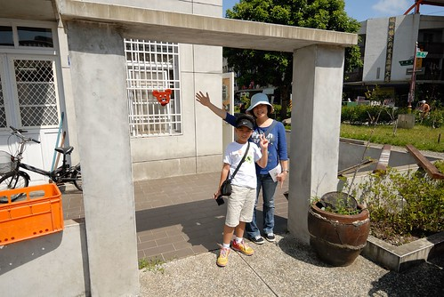 接著從火車站走過一個市場 穿過一些小巷來到頭城的老街(和平街) 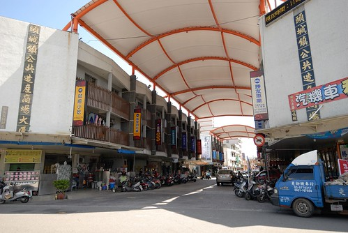 正中午日頭赤焰焰下的散步其實很考驗小孩子的韌性與爸媽的耐性 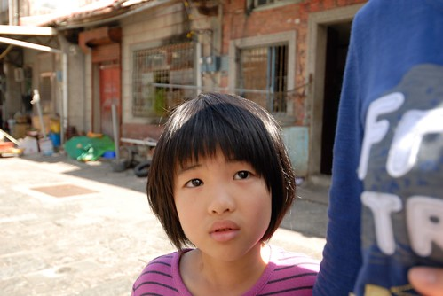 所幸在還沒有大爆點前 我們抵達了來這的最大目的地"和平街屋"  大門口桌子上的蓋章處與一隻會移動的可愛木烏龜馬上吸引了徹愛的注意力與喜歡 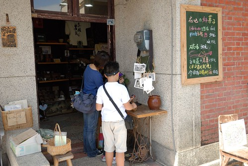 因為店內有其他客人與主人聊著天 於是我們還是靜靜的看著店內陳列的各種書籍與小東西 而後來主人亦很熱情的跟我們介紹著各種好物 頭城的歷史... 甚至還很不好意思今天天氣太熱 要不然我們就可以坐在屋外的長凳上小憩 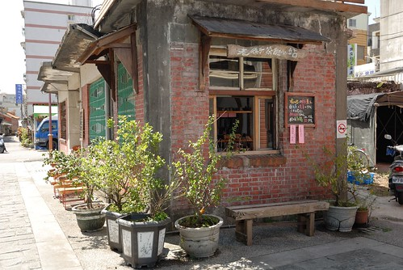 雖然老房子的主體大半已被拆除 僅留下這很小比例的側房 但我們還是很喜歡這樣的小屋子 尤其是廚房區(茶飲小站)  那個光與風都很棒 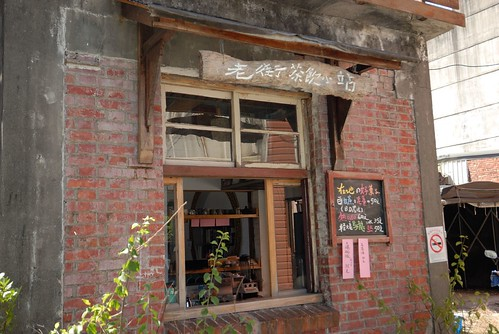 這次來頭城才明瞭頭城曾是宜蘭的第一大城  而百年前城內水路四通八達造就那樣的繁景 直到20世紀出的一個大颱風大淹水改變了宜蘭的水路而頭城至此沒落 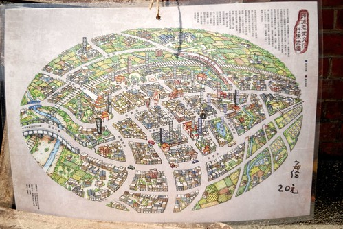 可以想像嗎 下面照片的"池塘"曾經是內海的一部份 而如今只剩排水管引水出海 那一刻我在想原來一百年的變化可以這麼大 那我們接下來的一百年呢? 老實講我連20年後都不敢想像... 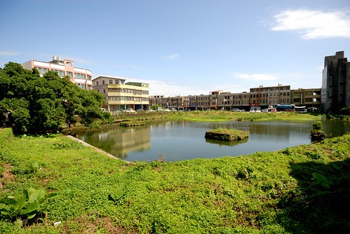 離開和平街屋 我們繼續往老街的深處走去 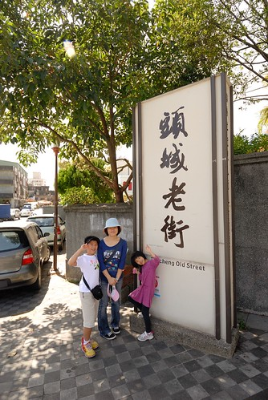 阿徹對於沿途很不老 很沒點的街道直嚷著"這裡的老街怎麼跟別地方的不一樣" 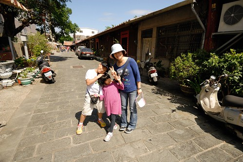 的確! 跟他去過的那些老街很不一樣 沒有林立的商號 沒有總能引起他無限慾望與掙扎的紀念品販售 這裡只是一個有很舊 很老房子交雜著的小街 但漫步其中卻似乎能感受不同的時空軌跡 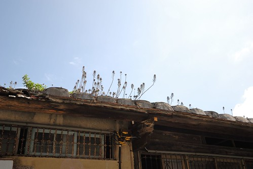 對於社會課正開始介紹著鄉土 文化 風俗的小四生來講 我覺得這是一趟很棒的"讀萬卷書 行萬里路"的體驗課 (雖然阿徹絕不可能看這麼多教課書) 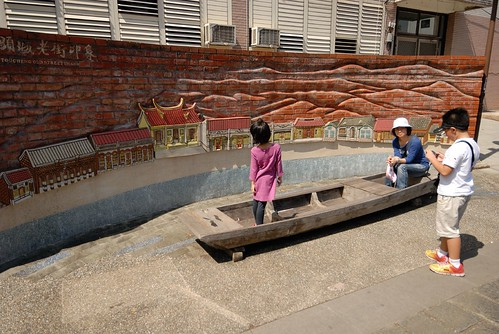 特別是各式的三合院與不同建物其背後的生活/文化差異 總能引起我跟徹爸的滔滔不絕或我們與阿徹間的熱烈討論 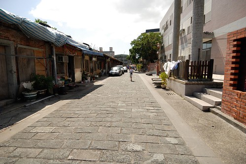 老街的盡頭有一口打水處 剛好讓滿頭汗的我們洗把臉 阿徹不可思議似的告訴我"這水好涼 好冰阿" 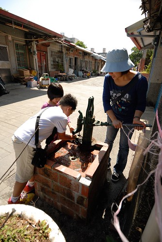 換阿徹打水讓我洗洗手 我說"好像沒你說的這樣誇張耶" 小學生阿徹堅持真的有那麼涼 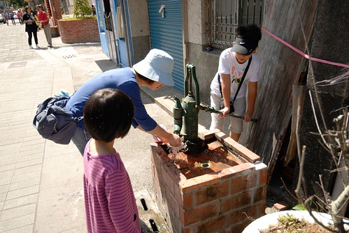 果然這是一趟很棒的小學生戶外教學!  沒想到徹家的旅行也可以這樣人文了... 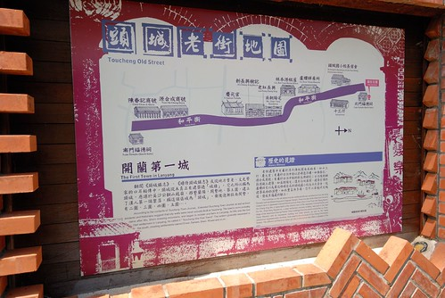 老街巡禮完 徹愛開始嚷著肚子好餓要找飯吃 但媽媽的口袋名單卻只有火車站前的炸蔥油餅 不想用蔥油餅裹中餐的徹愛讓我小嘟嚷了一下 總算在搞清楚大家其實沒那麼餓 其實最想來的是碗剉冰 要不一杯飲料也可以後 我們買了蔥油餅 帶著飲料進到火車站內嗑中餐 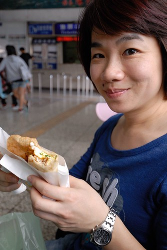 火車站外頭 阿公賣了幾十年用豬油半炸半煎的酥脆蔥油餅果然好吃 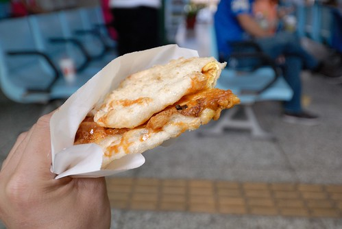 吃完蔥油餅 我們接著跟火車站外頭用小推車賣著的阿婆買芋冰 明明一支只有10塊錢 實在很是便宜的價錢 但阿婆每一球都挖的好紮實 交給我們後還叮嚀著旁邊的要改緊吃免得滴下來了  我OS著"阿嬤 誰叫你的一球這麼大一個" 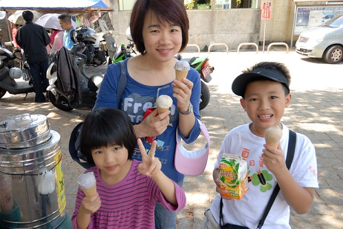 我們坐在一旁的樹下 各自享受著一人一支的芋冰 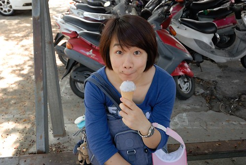 阿嬤的芋冰不只有著徹爸喜歡的芋冰該有的軟餅皮(正宗芋冰的店裡可就沒有了) 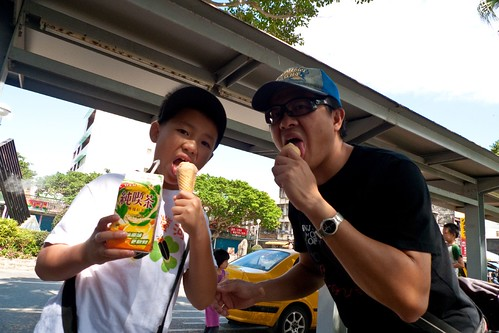 在這更還多了份隨性與愜意 以及充滿溫度的滿足感 很棒的芋冰~ 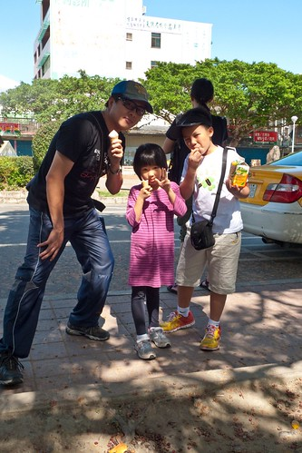
