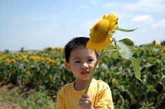
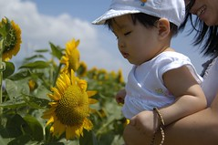
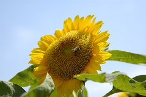
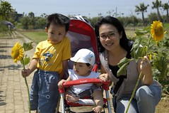
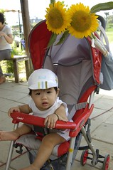
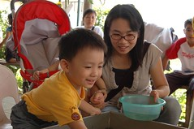
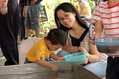
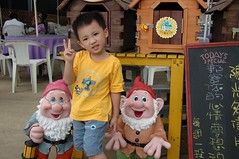
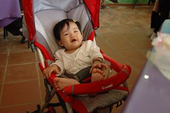
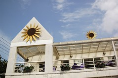

一直很喜歡在夏天去旅行  
尤其是秋天的花東 真的只能說讚讚讚...  
既然無法去花東 那起碼也要趁著秋高氣爽去外頭走走  
否則實在太對不起自己 對不起這樣的好天氣了

我向來對於黃色的花海有特殊的偏好與執著  
透過徹爸看了一堆別人家在向陽農場拍的向日葵照 實在心癢癢的  
因此起個大早 準備妥當 大手牽小手一同去郊遊

這幾週的高速公路車況不若往常擁擠  
約莫40分鐘即抵達桃園觀音鄉向陽農場  
在荒蕪的郊外停好車 ㄟ...花田在哪 望不到哩...  
跟著指標走到農場  
嗯~果然照片是會騙人的  
照片裡的田大多了 花也美多了  
不過農場裡乾淨的環境倒也讓人清清爽爽  
尤其微風徐徐吹來 哇~ 真的是舒服暢心底

逛花田 玩撈魚 閒晃逛 吃飯 剪花  
(帶回家後才發現家裡竟然沒有可以迎接嬌客的花瓶)  
加上開車時間 我們的秋遊只花了4個多鐘頭  
下午2點多回到家後 全家又一起午睡2個鐘頭  
(哇哈哈!秋天不只適合旅行 也是個睡大覺的季節阿)  
然後回陳嬤家吃煮好的豐盛晚餐  
真是好個充實又懶散的週末阿~

秋老虎還是讓人眼睛張不太開

最佳伴遊小妹往往只有坐在推車的命

不限時間+塑膠漁網 讓小孩玩的愛不釋手(幸好免錢 魚不可帶走)

阿徹最近照像常會出現這樣刻意的表情 實在很僵哩   看著大家享用午餐的小愛依舊只能乾瞪眼食她的粥

就是這樣的藍天白雲讓人想往外跑
