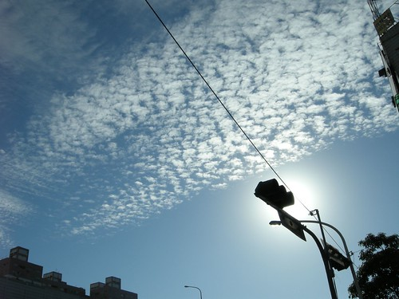
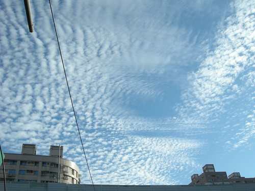
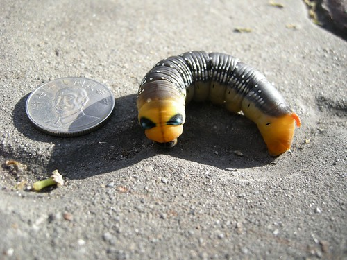
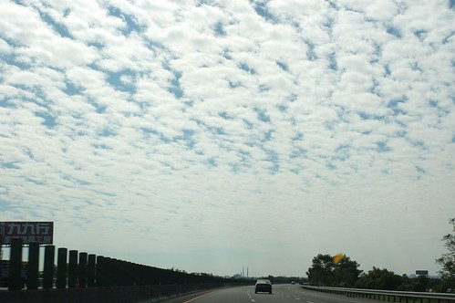
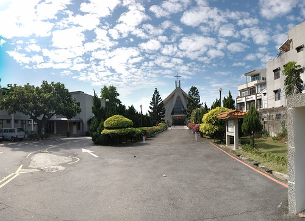

這是昨天早上徹爸帶著阿徹小愛去上學時 阿徹要徹爸拍給媽媽看的天空 很乾淨 很淡雅 很舒服的天空... 媽媽上班的路上也有發現一直抬頭看喔!!!

我相信很多人根本忘了台北的天空到底長怎麼樣了 其實...這兩年台北的天空乾淨很多說 走在台北街頭常可以看到很漂亮很乾淨的藍天白雲 反倒是每次開車回嘉義經過台中時覺得台中的天空越來越灰蒙

昨天父子們還拍了張毛毛蟲照片 是在他們上學路上發現的一隻疑似已死亡 長的很像鹹蛋超人的超大毛毛蟲

雖然工作忙碌 生活忙碌...但別忘了生活的初衷 多給自己一些悠閒 去留意欣賞週遭萬物 快樂 驚喜就是這麼來的....

12/1天空出現笑臉星星月亮的那天 在分隔島上等著過馬路的我們忍不住興奮歡呼 隔天看到笑臉變成臉長長倒著的哭臉(阿徹形容的) 阿徹說這不可愛 他比較喜歡昨天的笑笑臉 是阿....誰都喜歡笑笑臉的....

(攝於11月初回嘉義的高速公路南部路段)

(攝於嘉義輔仁幼稚園)

你多久沒有抬頭看看天空了?!...........................................................................................................
