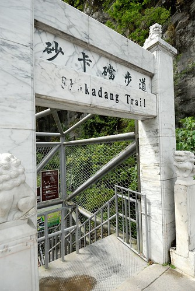

7/10兩天的小旅行 我們整個的待在太魯閣中... 雖然想走的白楊步道及九曲洞步道都封閉未開放 讓人小小失望 但走了燕子口 走了一半砂卡噹 也算是對的起太魯閣了 而看了好多好多的山 放了好多好多的空 就又更是超級的對的起自己了!  

第一次遊太魯閣是在我高中畢業旅行的時候  記得短暫停留走了燕子口 而第二次是懷愛愛7個月大的時候 去了布落灣以及天祥的祥德寺 除此之外 太魯閣都只是我們路過或是過門未入的地方... 但是三年前看過玟姿在布落灣山月村的照片後 便把山月村放進我的口袋名單 且心中一直記得這件事... 總算今年的六月中 不知怎的突然好想去山月村 好想去那裡放空... 於是一樣利用徹爸的payeasy訂了6月底的房間 那時 還想說趁著阿徹考完試 等著放暑假前 犒賞他讓他放個假的 怎知臨時殺出個'可能會來的颱風'來攪局 於是我們的太魯閣只好被迫延後兩週 結果 這回要出發前兩天又來了個颱風來襲否 週日關鍵 但就算不來也有豪大雨的新聞 挖勒~ 老天爺考驗個太平山不夠 還想考驗我們對太魯閣的熱情阿 (話說我們一直很想去太平山  有一年暑假訂了太平山莊 結果因為颱風被山莊強迫取消 隔年再次挑戰 先住在山底下的民宿 結果隔天一早到了仁澤才發現因為前陣子的颱風坍塌而封路封山了 就這樣我們家還一直跟太平山無緣中....) 幸好週日早上出發時 天氣還不錯  我暗暗祈禱是氣象誤報 而往宜蘭, 花蓮的路上 車也出乎意外地少 我們笑說大家應該都被颱風嚇的呆在台北吧 只要不下雨 我很樂見因為颱風所帶來的較好旅遊品質的...(我好像在痴人說夢話)

前一晚 我第一次上太魯閣國家公園網站 認真的看相關資訊 並且參考旅遊書 選定了幾個步道: 清水斷崖 白楊 以及九曲洞 就如每個介紹太魯閣網站上所言 太魯閣之美是要深入步道中才更能感受的... 耳聞清水斷崖很久 這回才明瞭原來清水斷崖指的是一段路 而之前在蘇花上所看到的幾個遊憩區都是為了看清水斷崖的 這是我們第一次停在蘇花的休息棧觀賞清水斷崖的壯闊  原本想停在仁和或是崇德附近 走步道下海邊的 這樣既可以最佳角度"仰望"斷崖 亦可身臨其境地好好感受太平洋 但是可惜我們一整個地不太進入狀況 不是錯過便是尋覓不到 最後只剩下在匯德所照的應景地標照  早上9點半出門  到達太魯閣入口時已是中午一點 進太魯閣前 就近在中橫入口處附近的藍藍餐廳用餐 旅遊書上介紹 餐廳用附近漁民所補魚貨的料理新鮮美味 且老闆娘會依客人人數及成員給予點菜數量上的"真誠"建議 真的! 我們點的每樣菜跟湯都好好吃! 而在點菜時 老闆娘真的超熱心且真誠地解說適合我們的菜色與份量 我們點了一盤炒牛肉 不只老闆娘叮嚀有黑胡椒的辣 小孩子可以嗎 連掌廚的老闆娘兒子也出來再次確認 有黑胡椒的辣喔.. 黑胡椒真的有辣! 不過好好吃! 阿徹一口接一口的吃著牛肉洋蔥 再配上一杯又一杯的冰開水 然後還不忘直喊好好吃 好辣... 讚! 以後來花蓮可以列為入花蓮後的第一餐或是出花蓮前的最後一餐  飯後徹爸要去小7買茶喝  想喝思樂冰的阿徹大慷慨的說 要請我們四個人喝飲料 (前一天因為達到我們幫他設的暑假游泳目標後 阿徹獲得一開始約定好的獎金 所以這兩天小子超級凱的 凱到我們一再叮嚀他 錢快花完 錢快光光了 ...) 徹爸買了杯純喫茶 我喝了瓶養樂多 而愛愛則跟阿徹一起共享中杯的思樂冰  第一次大口喝思樂冰的愛愛好開心 即使是有點嗆的可口可樂也大呼好喝 我笑說 愛愛也被哥哥汙染 開始喝這種東西了...  小朋友! 喝歸喝 也要好好的欣賞風景啦!  大老遠跑來不是只為了思樂冰帶來的快樂的  原本以為會陰霾的天氣沒想到反而是越來越好  尤其2點多到天祥時 一整個艷陽高照  天祥是太魯閣裡最熱鬧的地方 人好多 賣東西的也很多 而我們會來這是為了白楊步道 依著旅遊書上的公路處找不到入口 只好到天祥管理處問看看 結果原本就在公路旁的入口處以及只有1.8公里的白楊步道一整個的坍塌封閉了 只剩下從天祥基督教堂旁進入的替代道路 這替代道路不只得走加爬 路程還活生生的變成8公里 往返得6-8小時 挖勒~ 這也太猛的替代了 所以我們只好在管理處內看看 讓阿徹吃吃她直嚷的臭豆腐點心後便又下山了 (話說阿徹越來越胖真是有原因的 嘴越來越殘 也越來越大人化的口味了)  原本預計要走的九曲洞步道也因落石正封閉中 必須要抱怨一下 我前一天上太魯閣國家公園網站的其中一個目的就是想確認步道情況 結果在每個景點介紹時都沒有看到相關訊息阿 是躲在哪個角落以致我太笨沒看到  還是網站根本沒有明列這樣的訊息阿?! 因此離開天祥後 我們直接去今晚下榻的布洛灣山月村check-in 然後從第一天的下午3點到第二天的早上11點間 都呆在村子裡空...

第二天早上11點退房離村後 我們才又再繼續我們的太魯閣"深度"旅遊 今天熊心萬丈的想要走完砂卡礑步道 結果阿知我們才來到山月村下的布洛灣管理處後 天就開始無情的下起雨來了 而且雨勢還很不小... 看來今日接下來只能走遊客中心室內路線了  剛好遇到影片播映時間 於是我們先去看有關布洛灣介紹的影片 等待開映前 我拿著阿徹前一日購買的山月村紀念品 跟他玩起殺戮遊戲 以前那些犧牲壯烈的壯士門 身受一刀後不知道會不會像阿徹這樣大阿一口! (阿徹 你再演嘛~ 越來越會搞笑了)  後來邊觀望雨勢 我們邊在屋簷下編紮起紀念品的髮絲 山村櫃檯人員講的 這樣搓一搓 那樣同方向...即可 怎麼也這麼難阿  才中午12點就這樣打道回台北實在不甘願 於是決定去燕子口步道 想說步道沿路很多山洞可遮雨  應該比較不受天氣影響  進入燕子口後看見一座令人發毛的吊橋  原來這是錐麓古道的路口處 希望有朝一日可以如同布洛灣志工所說"這輩子一定要走過一次錐麓"  沿路上 兄妹倆一邊觀賞風景一邊把玩著他們的新歡 (所以這一天的照片中 常可見到兄妹倆在亮刀)  阿徹的紀念品全部用他自己的錢買  愛愛的刀則是山村的闖關紀念品 但是後面的鬚鬚是阿徹主動說他要出錢買給妹妹的 真是好哥哥...  我們一邊走一邊尋找燕子的蹤跡(但是都只有看到地上的鳥大便)  一邊讚嘆崖壁上所謂雁子洞的大自然力量 

 雖然沒看到太魯閣最經典的九曲洞  這燕子口就也已經夠嗆 夠另人讚賞不已了  也難怪在太魯閣裡隨處可見外國旅客 聽到內地 日本 韓國 英文等各地的語言...真是好個台灣之光!  而我們何其有幸住在這美麗的寶島 煩悶時開個3-4小時車就能來到花東 縱身大自然 遠離世俗 視野開了 心也開了... 雖然愛愛她們不懂太魯閣到底有多特別 多偉大  但凡走過必留下痕跡 相信長大後有一天她們便會懂得的 而現在只要願意跟著我們一起走在大自然裡 這樣就夠了  不過這一天她們的心思都在手上的那把刀 尤其照相的時候 超級武士的阿!  撐著傘漫步完燕子口步道 我們總算甘願下山回家了  可是怎麼才過個山頭 大雨沒了 天也越來越藍了 太魯閣遊客中心的天氣跟山裡頭的 真是差差差太多了啦 於是我們打算到遊客中心簡單解決我們的中餐後 繼續挑戰原本預定的砂卡礑  還沒下到砂卡礑 遠遠看砂卡礑 步道 聲勢就夠嚇人了  也難怪為太魯閣的必走步道  聽了這麼多年 總算我們也要來走砂卡礑 嚕~  不過砂卡礑入口後 首先迎接我們的便是6層樓高度的不太好走的鐵樓梯 愛愛邊走邊唸著說'我最怕走這種樓梯了 我的腳會發抖' 果真 他的小手一直扶著欄杆 而且小腳真的好像小小會抖 然後用著比平常慢一半的速度緩慢下梯  遠遠看小小一條的步道 其實蠻寬敞 平緩 好走的  且依磅著著砂卡礑溪而行的步道林態豐富  還可欣賞溪中大大小小的奇岩怪石  其實阿徹一心想早點北上去宜蘭玩沙的 可是無奈被思樂冰約定束縛著 因為前三天 我們母子三人看到小7門口海報寫著 7-11生日思樂冰半價 我說那天剛好出去玩就送你們一人一杯吧 但想不到 思樂冰竟成了兄妹兩這兩天旅遊中的金箍咒 每當他們誰嚷著不想走 不想怎樣時 徹爸便唱起這兩天常唱的思樂冰之歌 就好像每當孫悟空不乖時 唐三藏便念經 讓悟空因金箍咒而乖乖就範一般 那情景每每看的我發笑 只能說徹爸真是太'那個' 而兄妹倆也真是太容易就被制約了  步道全程需3小時左右時間往返 考量我們走蘇花的時間 我們預計來回共走個1個半小時內即可 我們走到約1.6公里的五間屋休憩處便回頭返程 (本以為大概是用帆布搭建的攤販 沒想到竟然是一間間可愛的小木屋  這點讚)  兄妹兩通過步道考驗 等會下山後可以領取禮物 各自一杯的思樂冰嚕!  於是出了太魯閣後就讓兄妹兩各自買了一杯思樂冰作為獎勵 而我跟徹爸則要到新城找好喝的檸檬冰 準備進入蘇花的新城路上 一家外表看起來毫不起眼的冰果室 竟然賣著我生平喝過最好喝的檸檬汁 帶點檸檬酸 檸檬皮苦與香的檸檬汁冰沙超級O.E.C  我們在店裡邊喝邊跟老闆們聊天 其實話題的起頭是 老闆看到徹愛手上的思樂冰忍不住唸著'我們這天然的才好喝 那個不好啦!' 我跟徹爸聽得也覺得怪不好意思的 不過因為得趕在進蘇花前 讓愛愛喝完 好趕緊睡覺避免暈車只好這樣大不敬了 老闆娘她們的獨家秘方就是檸檬皮一起進去打 而且還有加鷹牌的煉奶喔 老闆娘超級強調她們的煉奶是很經典 很貴的鷹牌的喔... 我們邊跟她們聊天邊很快的就把我們的冰沙快喝完了 雖然老闆一開始就交代要慢慢喝 要讓汁跟冰一起融合一起喝進肚 可是真的實在太好喝了 我跟徹爸沒三兩下就快把一杯給喝完了 結果邊跟我們聊天 手上榨汁動作從沒停下來的老闆娘就說 來再倒一些給你們 然後用著大水杓 給我們的杯子又加滿到快滿杯! 我們受寵若驚地笑孜孜 心裡高呼著'老闆娘 你真慷慨 真是好!' 不過老闆娘也說啦 因為今天是平日沒有客人才能這樣啦  像昨天禮拜天整屋子客人就沒法啦!

除了現場喝的杯裝外 還有一罐罐的冷凍大瓶可外帶 而且老闆說 團購很夯的喔 果然 後來我們看到小黑貓來收貨時 哇塞 好多箱阿  果然是名店一間阿  下回經過蘇花的前或後 可以稍微繞進新城的博愛路喝好喝的檸檬汁喔  帶著滿滿檸檬汁的酸甜香 我們進入蘇花 回家嚕... 後記: 話說這兩天吃太好吃太飽 常還沒餓就吃下一餐 導致我們那天晚上8點多回到家後只想簡單吃個御飯團或麻油麵線裹腹  原來這回旅行 腦袋很空但肚子很不空阿!
