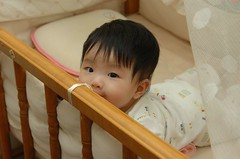

女孩跟男孩的感覺真的很不一樣~

不知道是因為老二的關係了  
還是因為阿徹太不安靜的關係  
跟徹爸一直覺得妹妹有種恬靜的氣質  
除了偶而討抱ㄞ個幾聲外

只是妹妹的好動度真的不輸哥哥

  
要幫她換尿布時 總是趁著"鬆綁"的空檔啪ㄚ的一聲就翻過去  
放在地上或床上時 更是賣力的"拖著"她的身驅去拿感興趣的東西  
現在更常常會有Orz的姿勢出現   
也許很快地她就能用Orz的來去自如了  
之前要打發或是不讓她爬時就是讓她坐著  
一開始時 她會呆坐著哭  
後來會努力伸長手要拿東西 偶而不小心就倒了  
又後來她已經會故意讓自己應聲倒了(這樣就能爬了)  
而現在他已經慢慢抓到從坐姿變爬姿的訣竅了

有天我在準備跟哥哥阿徹的晚餐時  
把妹妹坐放在大沙發上  
結果3分鐘後她竟然用雙手撐住沙發背站著對我傻笑  
哇勒~會不會太那個了點  
連徹爸也曾經看到他扶著欄杆在嬰兒床上站了起來(雙腳還有點抖動)  
看來真要來放低嬰兒床板了  
要不然哪天半夜真會聽到小孩頭墜地的聲音了  
如果放低床板後還能像哥哥那樣摔出來  
那也認了~  
只是妹阿~小不點的你 會不會進展的太快了點
