在有意無意下  星期五穿裙子去上學成了一種獎勵 一件開心的事 連老師都說"小愛好喜歡穿裙子 穿裙子的時候都好開心" 平常放學回家後若小愛耍番不換衣服 拿出裙子也一定可以馬上奏效 所以"裙子"成了爸媽手上的好武器

基於小孩活動的方便性 我跟徹爸是偏愛褲裝的 因此我很少很少給小愛買裙子 但親朋好友給了送了一大堆洋裝裙子 (人家給的女生衣服一半以上是裙子 所以每季我還是得斥資買褲裝) 所以小愛"幸福的"還是有很多機會可以穿小裙子的 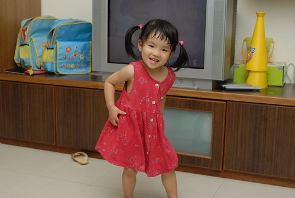

 穿上裙子翩翩起舞~ 最近的小愛很愛自得其樂的跳起舞 拍拍手 轉圈圈... 

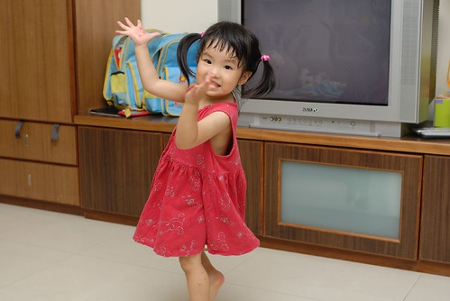

跟她說"穿裙子要綁頭髮才會美美的喔" 小愛就會乖乖的讓你幫她紮上俏麗的小馬尾

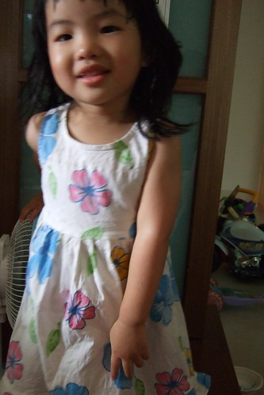

其實不讓小愛常穿裙子去上學有一個很重要的原因 就是容易鼻水貢貢流阿... 洋裝通風就算了 小愛又愛三不五時把群擺當扇子用既不美觀又不優雅 美姿美儀還需要多練練

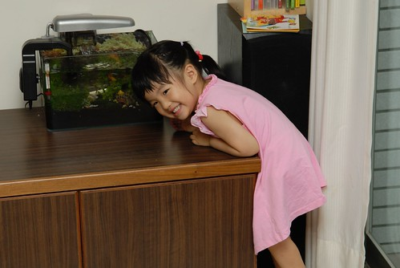

因為我不是個太愛美的女人... 所以私心的希望自己的女兒也不是個太愛漂亮的女人 啥米???這是啥怪理由與期待阿... 因為....總覺得"美麗"都是要付出代價的 雖然現階段對小愛來說 既不需要花時間維持美麗 錢花的也是阿爸的辛苦錢 但就怕從小把愛美的胃口養大了 以後苦了她自己也苦了她老公(最好不要是苦到她阿爸) 所以我們對於小女兒小女生的衣著期待就只有"乾淨整潔舒服就好"

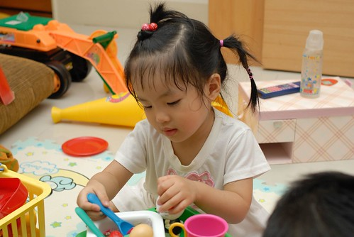

所以所以...別期待你可以像別人家女兒那樣當蕾絲公主 可以身穿細肩帶 腳蹬高跟涼鞋 偽裝為"成熟女人" 這樣的事在我們家是萬萬不可能的

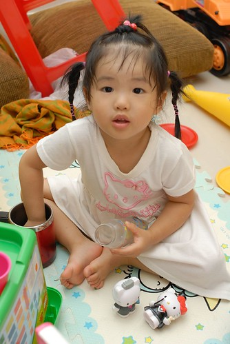

還是當個"傻愛"比較"可愛"

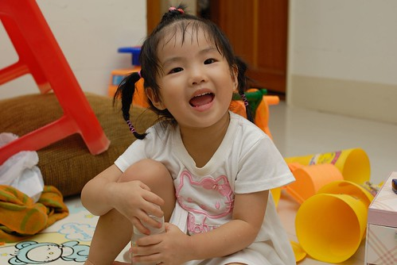

可能是媽媽的綁法技術不佳 小愛要看心情決定是否寵幸媽媽 讓媽媽幫她綁頭髮 可是老師或是別人要幫她綁頭髮 小愛卻又都一附滿心期待歡喜的樣子

這麻花辮子就是回嘉義時大姑姑的傑作

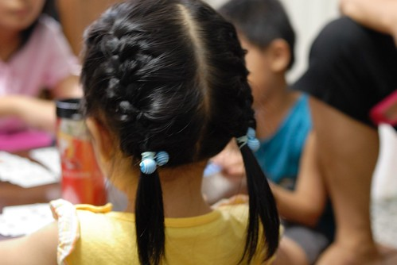

小愛好乖好乖 一動也不動的讓姑姑紮好 雖然大姑姑直說好多年沒綁過了 但還是紮的很漂亮 (媽媽多學點阿...不過也要小愛願意讓我練習阿)

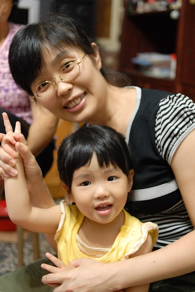

頭髮是讓女人風情萬變的最佳武器 不同髮型不同風味不同感受... 這模樣給他超級清純可愛的啦

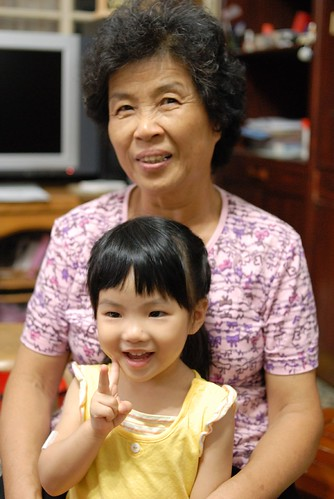

至於披頭散髮的模樣就給他...嘿嘿嘿....

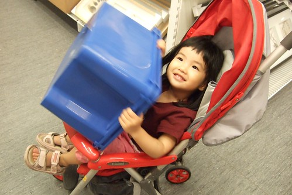

也沒醜到需要這樣遮遮掩掩啦! 小朋友

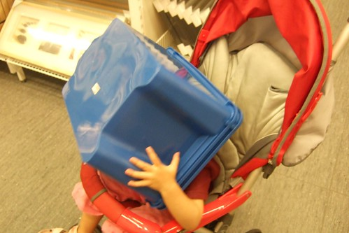

鑒於阿徹哥哥的經驗 真的覺得2-3歲的小孩最最可愛了 所以要好好把這模樣刻印在我們的腦海中 這可愛的模樣可是日後想罵小孩時的鎮定劑阿

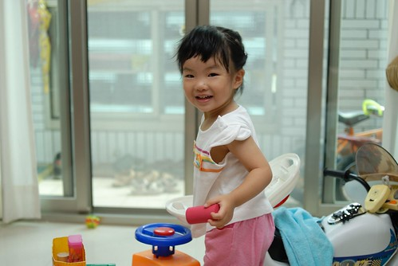

小愛越大越多人說可愛 也越多人說"像媽媽" 那我可以下結論說"媽媽很可愛"嗎? 哈哈哈~~

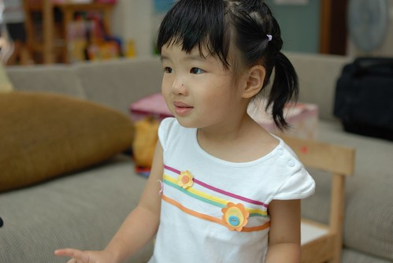

最近如果有人問我兒子好還是女兒好 我都會說"兒子可以不要生 但女兒一定要生一個" 真的~~這是我身為別人女兒 身為一雙兒女的媽媽的心得

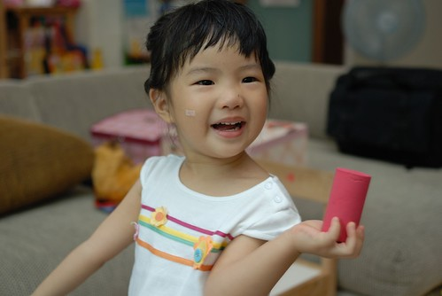

這樣的笑容就是常會讓你想捧著她的小臉親個不停

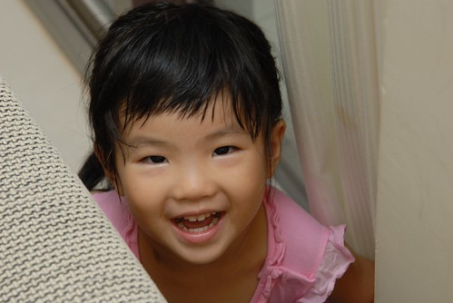

尤其是認真遊戲 認真做事情的時候 (跟哥哥在玩躲貓貓)

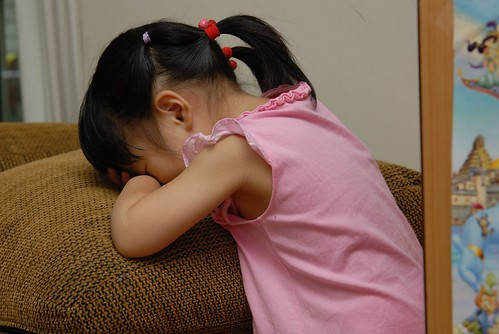

只是上有一個哥哥 尤其是小猴子轉世的阿徹哥哥 別期望這樣的女兒會有多優雅多高尚

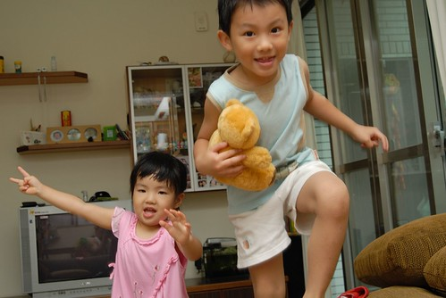

證據一

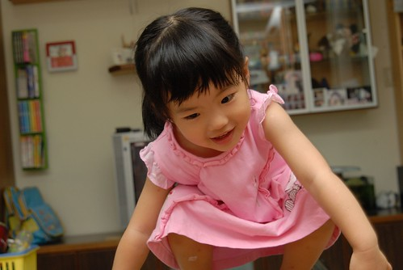

證據二

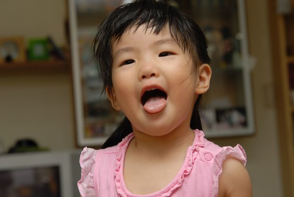

不過真的覺得阿徹哥哥給小愛的生活帶來許多樂趣 所以千萬不要問我小孩生幾個好 我一定會說"要生就不要只生一個啦"

這是阿徹哥哥用一條長披肩幫小愛做的造型

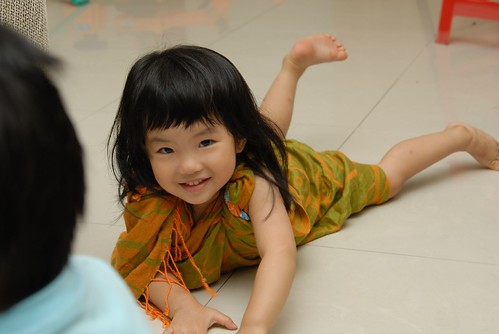

造型師哥哥很得意  model妹妹也開心

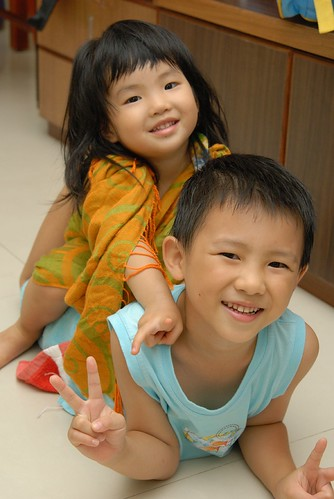

記住...記住...天使笑容的另一面就是魔鬼般的揉擰你

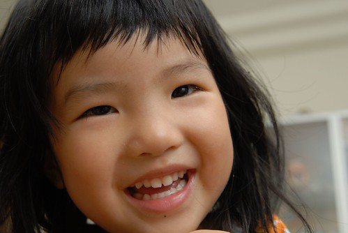

所以...所以...千萬不要被這笑容給迷惑了... 不過就算被騙了 被揉擰了我跟徹爸還是心甘情願阿 只能笑著聳聳肩 揶揄彼此嚕~~~ 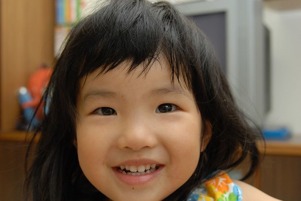
