不同於這週一開始的冬天氣候 這兩天到下週一前又是天氣晴朗(其實有點過熱了) 藍天白雲高掛的好天氣了 鑒於為了鼓勵大家多在這美好的季節出門走走 徹媽今日我決定犧牲午睡來完成這篇物物園的遊記!!! 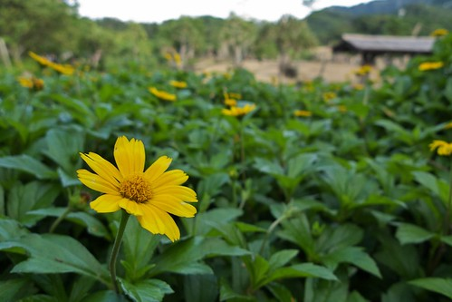

原本上上個週末要回嘉義的 結果週五晚上阿徹說他這麼週末想好好在家休息 (看來小學生的生活有趣歸有趣 還是會累人的 讓人週末只想在家好好休息) 於是我們順著阿徹第一次提出的請求留在台北好好休息 其實他的休息當然不會只是安分的都呆在家裏 我們還來個北投半日遊(遊記指日可待)外加阿嬤家遊 那上週理應回嘉義了  可是週三四張嬤來電說她們週末有事要我們再緩一週回去 於是我們又突然的多出了一個週末 尤其又是這樣好天氣的週末 週六一整天 我們去了阿徹學校參觀書展 新屋交屋後第一次去探訪 然後中午又去了木柵動物園 動物園是阿徹提出的 他說"好久沒去動物園了喔 媽媽你不是說等天氣涼一點就可以去了" 我們問 "你知道為什麼這麼久沒去動物園嗎? "(撇開夏天實在不適這原因外) 阿徹說"因為以前我每次去都會哭哭鬧鬧" 嗯~沒錯就是這樣 時隔1年半載多 希望這回去可別又讓大家敗性而歸了喔

於是上個週六下午我們在木柵動物園好好的享受 沉浸在這樣的好天氣 好藍天白雲中

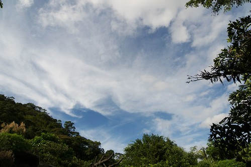

還沒出發前 阿徹就說他這回要看夜行館以及昆蟲館 所以進入動物園後我們就直奔夜行館 夜行館有貓頭鷹 有老鼠 有魚(徹爸提問說為什麼魚放在夜行館阿) 看到後頭愛愛不知道是害怕 還是昏暗的燈光作祟 加上肚子餓 他哈欠連連急著要出去

出了夜行館後 哭夭的愛愛由媽媽陪著去洗手 找地方吃中餐 而阿徹提出要去非洲雨林區走走  徹爸不知道是要考驗阿徹還是衷心滿足兒子的請求竟也陪著阿徹父子兩人去逛雨林區

同時間我跟小愛找了個舒適涼爽 view好的餐椅 慢慢享受我們的中餐(其實不過是上動物園前在小7買的范團跟麵包)

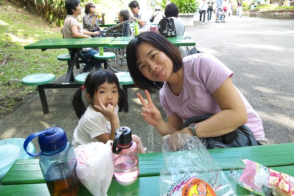

享受著這樣的好天氣 看著天上的藍天白雲

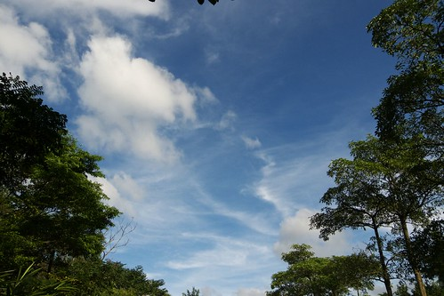

過往的人潮

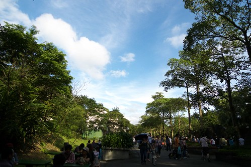

還有地上一隻迷途+搞笑的蜂

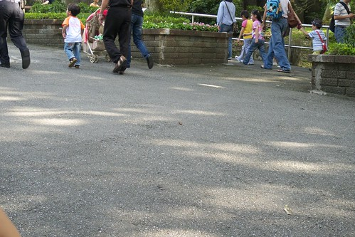

好個郊遊的FU  天時地利人和都配合的還不錯... 等一家四口都餵飽肚子後繼續往上走  因為要去坐遊園車下山(哈哈! 走上山是為了坐下山 頂好笑的)

愛愛今天很愛跟這些假動物照相 看到可以照的都會主動要求說要來一張

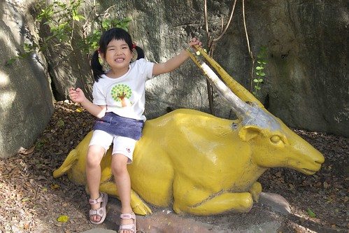

小妮子最近照相時 都會像這樣笑的很誇張很假

而沒有這些假動物相伴照相時 就得看小妮子心情 千拜託萬要脅的

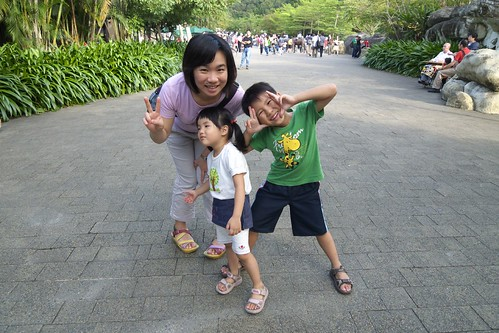

吼~ 忍不住再來張藍天白雲 今日的雲很亂無張"髮"...

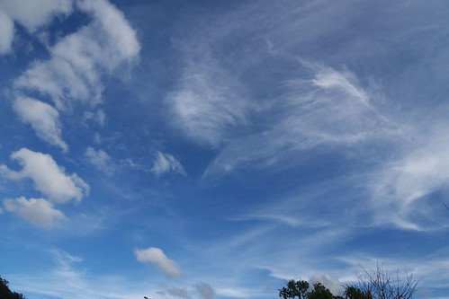

襯著這樣的藍天白雲 來張我們四個人的全家福自拍 (徹爸現在自拍的功力真的不賴)

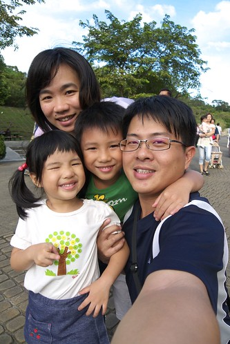

咦~ 兄妹兩看的這麼認真在看什麼阿?!

在看大象的"大便"啦~ 其實不只我喜歡秋天 我想動物們也都愛這涼爽的秋天的 動物們比起夏天那厭厭 毫無生氣的模樣 這季節顯得有生氣 可愛多嚕

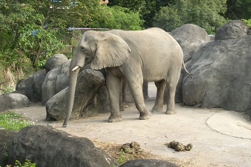

然後為了抵達上頭的車站 我們穿過了鳥園  來到企鵝館外的廣場 這時候已經是4點多些  天空開始另番味道

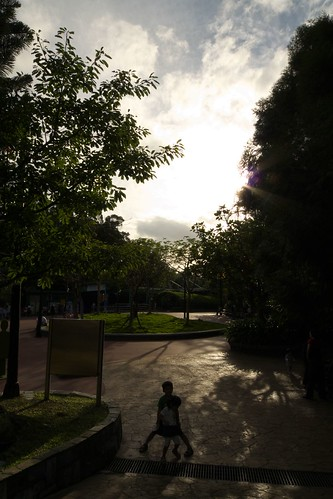

這時候的影子也都拉的好長好長

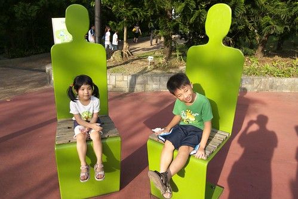

這陣子三不五時念著 "好久沒去郊遊 好想去郊遊"的愛愛 今兒個郊遊的很愉快

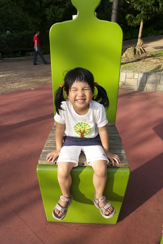

阿徹哥哥也還在他自己的掌控當中  享受他的動物園之旅

雖然今日動物園的人潮很多

可是避開胖達的地方 其實也還愜意

我們完成阿徹今日的目標之一 坐遊園火車 呵呵~

沒有太多意見 總是跟著走跟著玩的小愛也還是開心

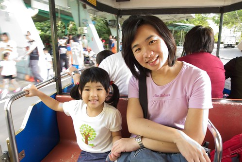

小小姑娘用著他一貫的態度 觀察/享受著發生的大大小小事

只是阿 看到動物園裏各種各樣的貓熊 愛愛就會大喊"團團圓圓耶~ 我要跟團團圓圓照相~"

(徹爸指導兄妹倆的頭從這夾縫中探出來) 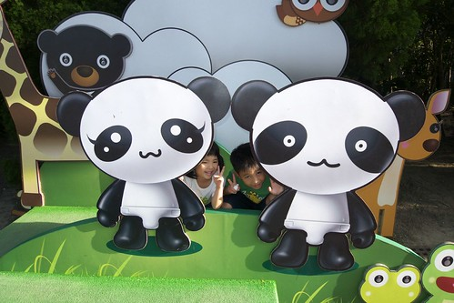

(媽媽建議的站直版 只是臉上光影有點嚴重) 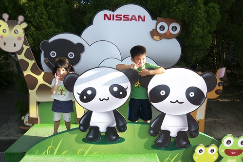

最後就是我們今日的最後一站 昆蟲館 (其實也才兩站 夜行館跟昆蟲館 遊園火車是接駁工具) 途中經過猴園剛好看到管理員在餵食 駐足觀看了一會 第一次這樣看到群猴吃飯的樣子  看到猴子們平常少見的貪食模樣 很有趣

(加油加油!  工作了好一會 告個段落 來趕著下班前完成...好久沒這樣偷寫了) 我一直覺得如果從動物園的門口把動物園切成左右兩邊的話 大門口進去的右邊塊(也就是包含昆蟲館還有教育中心等等)人潮實在跟左邊有著天壤之別 不過就也因為這樣 往昆蟲館的那段路反而別有一番愜意

鐺鐺鐺鐺~ 昆蟲館的外貿 很可愛吧 昆蟲館算是我個人還有阿徹最喜歡動物園的地方 不管就館的硬體設備 軟體設備還有"用心"的層度 我覺得是動物園中的No.1

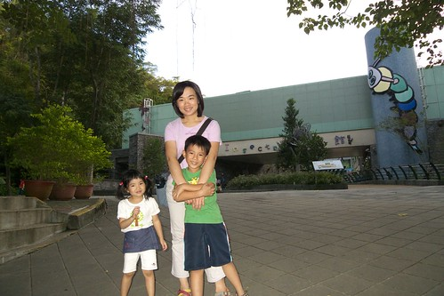

不同於其他館的地狹人稠 昆蟲館算是明亮且寬敞的 或許也有可能是因為人潮不多才造成的假象吧 Anyway 好地方啦!!!  推推推!!!! 有機會去動物園的大家記得要去昆蟲館走一走

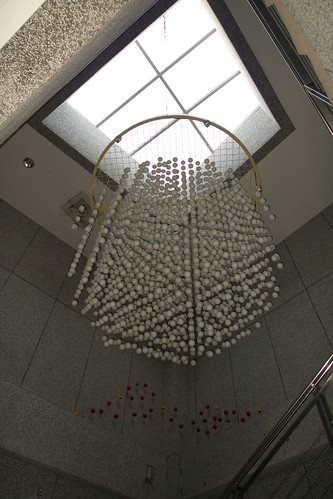

昆蟲館裡隨處可見或真或假 或大或小的各式各樣昆蟲 以及相關影片介紹

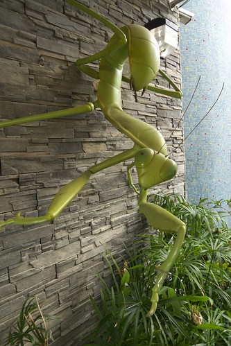

整體佈置的Fu還蠻不錯的

而且有個蝴蝶生態園區裏 各式蝴蝶(還是有點季節性跟有限品種啦)在你身旁飛舞著 隨你觀察

還有許多櫥窗裏養著各種昆蟲或介紹

(猜 圖片裏總共有幾隻蟲 我們在這櫥窗前認真的數了好一會) 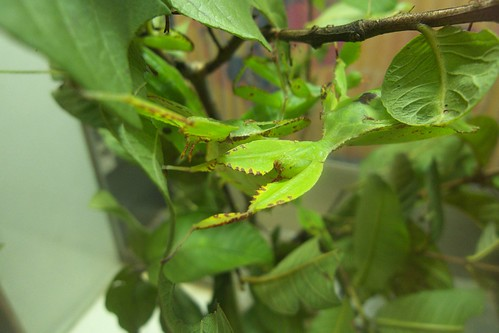

這裏覺對是讓小孩子近距離離接觸昆蟲 喜歡昆蟲的好地方

雖然有些看起來仍然怪噁心一把的 但是看久也是蠻可愛的啦

最後在昆蟲館裏的某一展地 徹爸發現了"昆蟲Life show"的3D影片放映 我們一家四口坐在矮瞪上看了三集短片 10來分鐘哈哈大笑 很有趣 因為礙於5點就要關園 雖然依依不捨還是得起身離開 不過...我跟徹爸有默契的打算買回家慢慢看  哈哈哈~而且把目前有出的1-79集全都買回家了 阿徹當然是樂壞了 只是雖然媽媽一開始心理也很想都買回家 可是一下子就下手這麼重實在有違徹家家訓 幸好再阿徹試探著問可以都買回家時 我靈機一動的用阿徹的今年聖誕禮物換半套回家(另外一套本來算爸媽的) 然後又基於公平起見 本來算爸媽的那套也算到愛愛頭上去啦 是他11月生日的禮物 哈哈~ 爸爸媽媽有沒有很會做人情 讓小人開開心心的把所有影片買回家的同時 也省下了今年的禮物錢 哇哈哈!

(出園前 如約讓愛愛去學成中心的門前跟團團圓圓照相  阿徹現寶嚕) 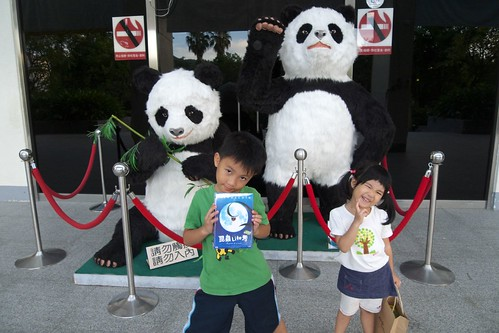

5點了 天開始有點暗了 可是還是很漂亮

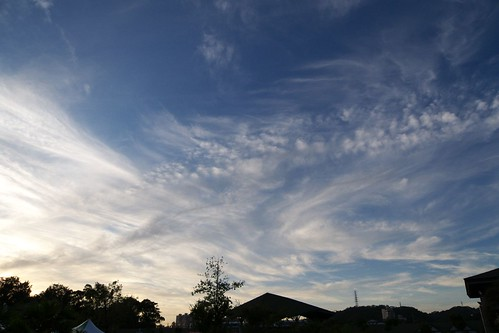

今天的動物園之旅 很愉快很舒服很愜意 且破了紀錄的逛了4小時 問阿徹說"這樣不哭哭鬧鬧 是不是好玩有趣多了" 小子當然很受教的猛點頭嚕

出動物園大門前去洗手的時候 愛愛看到這些大便又說著要照相

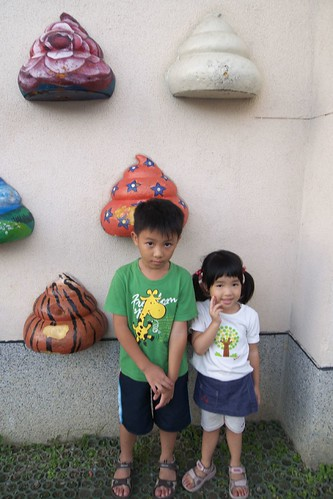

連大的也不放過  Orz

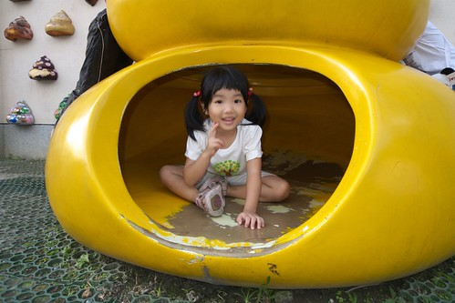

走往附近的河濱停車場時 爸爸說來一張吧 這天空顏色很美 照完給我們看時 阿徹很不同情的說"哪有?!"

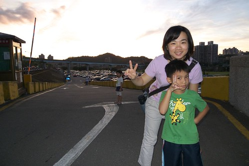

徹爸說" 再給我一次機會 這次一定可以的" ㄟ....誰叫你最近都不帶小兩出門  都偷懶的只帶小P出門 (今日照片全非單眼所拍 解析度不夠的地方請多見諒)

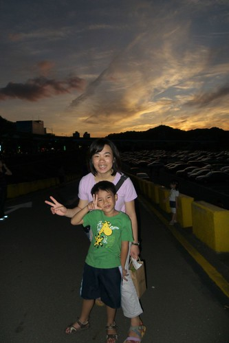

兄妹倆大手牽小手  開心又滿足的要回家嚕~~~

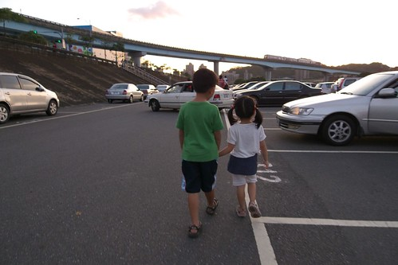

回家的路上看到這樣火紅的天空 水啦~ 大家最近真的可以多感受秋日美麗的天空喔 真的很美哩~

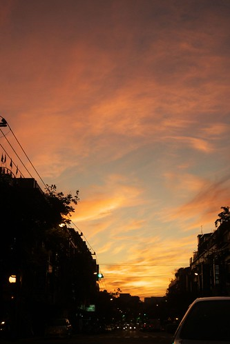
