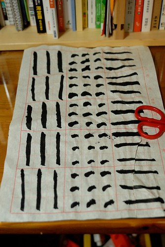
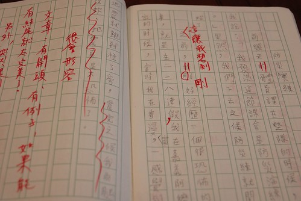
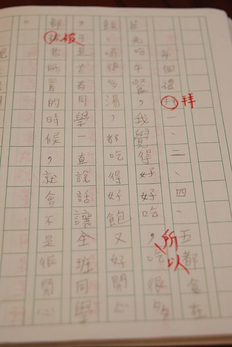
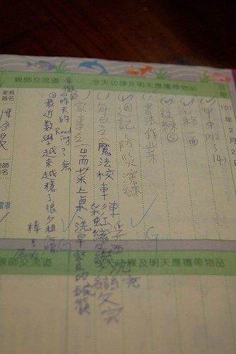

昨天晚上幫愛愛洗澡時 我大發善心的順道幫阿徹把頭洗一洗 抹 搓 沖 擦一個動作都沒少 完成後我回到廚房忙著  過了好一會 不見應該刷完牙的兄妹倆出來 我問"牙還沒刷好嗎 應該都好了吧" 阿徹說"我的頭還好多泡泡" 我納悶著"我應該有把阿徹的頭沖乾淨阿"  打開廁所門一看究竟 當我看到阿徹滿頭的泡沫 我忍不住笑喊"我剛已經幫你洗過頭啦" 阿徹說"你又沒有告訴我~"  聽到這說法我更是忍不住大笑 我說"頭在你頭上 被人抓去洗 抓去沖 然後你說你不知道 這會不會太那個了..." 阿徹可能因為害羞可能因為少男的薄臉皮 生氣到垂淚直說"你又沒有告訴我" 嗚嗚嗚~兒子阿! 可見你有多麼沉浸在你嘴中的泡泡澡幻想中  才會這麼堅持的怪我沒有跟你說我把你的頭給洗了... Orz 延續昨天 繼續來說阿徹的壞話... 今天講到作業篇

話說阿徹學校三年級後每週有一堂寫字課 上學期時 導師因為一直期望有更專業的書法老師來教班上 而書法老師卻一直沒法配法 所以寫字課一直停留在觀念性的傳授 等到下學期 書法老師來了  阿徹總算真正開始領受書法之美 當然也嚐到寫字之苦 每週除了課堂上的練習外 還有包含2-3業的書法本摩寫以及一張描邊紙練習的作業 2月底阿徹第一次在家寫書法作業 因為需要時間遠超過他與我的想像加上寫的很醜 阿徹寫到生氣 邊寫邊嘟讓著"為什麼要寫書法" "為什麼要學書法" 當然! 我肯定看的很生氣 索性完全不去看他寫出來的東西 而隔兩天後 我才恍然想起"作業應該是週五的書法課就交代了 那怎麼會是週四最後一天晚上才在寫書法ㄋ" 粗心的阿母還真熊熊差點被騙了  於是我立下規定以後週末寫完書法作業才能玩電腦遊戲 可第二次寫書法作業 阿徹還是寫到哭了 他哭著問"為什麼我的手會抖"而且他的豎越寫越胖 我忍不住請他讓我握著他的手帶他感受運筆的方式與力道 我說"書法寫醜很正常 是要花很多時間練習的 而書法的用意就在於耐心的培養" 我不知道阿徹聽進去多少 但起碼他的豎有越寫越苗條 甚至寫完後還告訴我"寫到後來我有一種開心的感覺" 阿徹一臉的不可思議 徹爸嗤之以鼻 笑著說"最好真是這樣" 不過就如我在FB寫的"阿母真的很不喜歡每週看到小孩邊寫書法邊生氣邊哭 然後字還醜到一整個不行...或許書法課其實是在考驗爸媽的耐心" 那天 我也手癢的臨摹寫了一張20年沒寫過的書法 雖然寫的也是醜  不過小4到小6每早為了躲早自習而去書法社混的小基礎幸好還看的出來... (左手拿的是阿徹寫的豎 胖瘦真是差很多 不過這就是進步!)  這是接著一週的作業 那個豎看的出來穩定許多 只是寫完作業就把作業亂丟 搞的作業破破爛爛 加上上下顛倒的紙 讓人很想先扣個20分再說  不過讓人很意外的是 接下來的書法作業阿徹都沒有再寫到生氣了  週末自己預訂好寫書法的時間 然後好好的一筆一筆完成作業 甚至寫完後還會跟我一同分享 欣賞 評斷一下 只是阿徹那收的亂七八糟的用品袋 還是讓我忍不住看一次唸一次...  三年級作業的另一大考驗就是每週一篇的週記 雖然已經很慶幸阿徹不是低年級就得接受這樣的訓練(荼毒) 但有題目的週記真的很考驗大人與小孩 雖然週記本該想什麼就寫什麼 可是我真的很難做到放水流 而且阿徹常一開始就問我 要寫什麼 可以寫什麼 寫的過程再三不五時追問著 然後ㄋ  還有什麼.. 而又偏偏每次我們兩人一開始討論(我要自欺欺人的說是討論)的10句 最後只會出現兩三句 再加上錯字問題 句子邏輯問題... 週五一整個晚上就沒了 每每看到我叮著阿徹寫週記的樣子 徹爸就笑"好像每週一次的作文課" 臉上盡是同情(也不知道是在同情誰) 不過我相信努力是會漸漸看的出成果的  尤其在我很機車的要求阿徹還必須先打過草稿之後

這是阿徹以前還不需要打草稿的週記 旁邊一堆寫給他看的字不說  還常受限於很難改的得勉強接受他寫的東西  這是經過我修改 講解之後的草稿 雖然大前提還是希望盡量保留阿徹原始寫的內容 但希望他的句子可以優美點 邏輯性流暢性也可以好一些   而再騰到週記本後 看起來便會人模人樣許多  雖然有一天我才發現 阿徹覺得有沒有打草稿的週記都差不多 但我跟他說"抄完後 你把整篇唸過一遍 你會發現有所不同的" 而我相信老師也將更能感受到他對於事件的看法與感受的 而透過週記 我也發現了許多我所不知道的學校的事情與阿徹的心情  所以雖然週記真的很令我們母子倆哇哇叫 關係緊張 但幸好總能慢慢習慣 慢慢取得平衡...  阿徹還沒唸小學時 我就在便當店聽聞媽媽們說的阿徹的國小有很多的作業 果然! 還真的比我們那年代多很多 (我跟徹爸還曾努力回想 我們小時後回家寫作業的記憶 但真的想不起有這種事說) 不過幸好阿徹是貪玩的人 為了玩他每天努力在安親班完成(有時後是趕完)他的作業 而作業很多的週末則也盡量的在週五晚上完成大半的作業 只剩週記的謄寫與書法到週六 因為他說 "寫完我就可以好好的玩個過癮了"  雖然阿徹聯絡簿上的字實在有亂有醜  但阿徹寫國語生字本的認真度進步很多 而且在看到老師給的甲上後 更是信誓旦旦想要每次得到 (話說老師評比是依據認真度 跟美醜沒絕對關係 這點要給阿徹的老師一個讚)  除了這些國語 數學 書法作業外  現在的聯絡簿其實也是個作業 尤其教育局推的所謂的"品德教育"聯絡簿 除了希望小孩每日幫忙家事服務 還得看小故事寫大道理 只是 像這樣的小故事內容會不會太艱澀了點.. 這是阿徹難得寫不出心得的故事 得經過我們的開示開穴(雖然他的心得都只有一兩句話)  而閱讀也是阿徹學校很重視的一項 除了閱讀認證 班級書箱 巡圖 閱讀單...等的鼓勵閱讀活動 聯絡簿也要紀錄每日在家閱讀的書目  真的! 現在小學生很充實但也真的很忙... 每當阿徹唉怎麼這麼累時 我總安慰他"你不用補英文課 補數學 也沒有要學什麼.. 只需做好學校的學習" 所以真的不能唉了~ 起碼他還算是個能有個快樂童年的少年維特 (阿徹插畫裡的驚嘆號 問號 滿腦線 看起來好無辜好無知阿)  每當有人問我阿徹的國小好不好時 我總說"學校算是很貪心的希望小孩五育發展均衡 (因為就社會現況與實踐面來看 這樣的期望還真是挺貪心的) 但看到學校有計劃的體育學習 音樂直笛學習 以及閱讀鼓勵..  我覺得很不錯" 尤其對於我們這種不額外才藝學習的家庭來講 這樣常規的國小教育是我們所樂見的 只是內斂的徹爸每每總是叮嚀我應該要這麼跟人家說"要說我們也沒看過很多學校 所以..." 我想教改的初衷與原本的立意都是好的 只是怎麼執行 怎麼接受全端看學校與家長的落實了 共勉之~ 阿徹加油~

附帶一個我前陣子寫在FB的"笑話"(我真覺得是笑話) 阿徹最近社會課在教縣市/鄉鎮/村里.. 昨天看到他那張大概是全班考最差的小考考卷 我沒罵他反而很是好奇(因為有82分 我才還能這樣好奇) 其中一題: 查緝通緝犯是哪個單位的責任 阿徹的答案是清潔隊 我笑翻了... 阿徹說因為他不知道通緝犯是什麼 還有一題: 古人說自掃門前雪 所以我們平日不需要與鄰居往來 阿徹答O 我說就算看不懂自掃門前雪 後面哪句怎麼看都不對阿 不過可見我們這家子平常果然很孤僻 沒在跟社區互動的... Orz 真的覺得阿徹能寫出這樣的答案很妙哩~ 該珍惜這樣的小腦袋瓜的 不過也可見阿徹上課沒有好好聽講...
