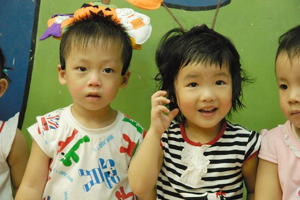
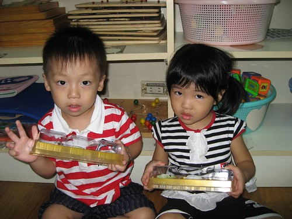
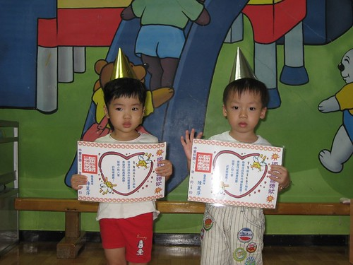

不知不覺愛愛上學已經滿一年了  
雖然偶而可以聽到他說班上的誰誰誰怎麼哭哭 誰誰誰怎麼好笑  
但她最常提起名字也講的最清楚就是阿嵂與阿琦  
尤其是阿嵂...  
問她今跟誰玩答案永遠有阿嵂 (阿琦偶而)  
問她好朋友是誰也是阿嵂  
甚至自己有時候開心的講著"我以後要跟阿嵂結婚"...  
   

真的很怪說...  
一直認得兩三歲的娃是很善變的   
起碼不會那麼快就認定一個玩伴 甚至不可思議的可以持續這麼久...  
雖然他們其實都知道班上還有好多其他同學  
但表現的卻好像班上只有她們這兩個小朋友 (所以要不熟都難)  
  
兩週前去參加家長座談會分班討論時  
因為實在沒啥好問的(平常已經有夠會跟老師拉賽 了解學校狀況了)  
但不開口又怪(因為幼幼班只有兩個家長參加 我好像是去贊助出人頭的)  
我就問老師說"平常愛愛除了跟阿嵂 阿琦玩還有跟其他人玩嗎"  
Elieen老師就猛點頭的說"對阿 他跟嵂嵂真的很好 媽媽你介意嗎? "  
然後又偷笑著說"如果你不反對 我是覺得她們兩個真的蠻配的 不論是外表還是感覺"  
ㄟ...害我急著澄清 我不是反對他們兩個湊一對  
我純粹是好奇愛愛與其他同學的互動情形  
不過Elieen老師的反應真的很好笑  
速配勒!!! 跟我一樣想太多了...  
  
徹爸常開玩笑說 愛愛有厲害 這麼小就懂得攀炎附貴  
知道要接近園長的兒子(阿嵂)還有Freda的兒子(阿琦)  
ㄟ......................................................最好是這麼有"出息"哩  
  
  
  
前幾天又跟阿嵂的媽聊到這事時  
她也說  " 對阿很奇怪  有時候老師會刻意把她們兩個分開 但常不知不覺的兩個人就又兜在一起"  
唉~ 該說她們情比石堅還是年少無知阿  
不過我們兩個一致認同 小個子的她們真的難得可以找到身材跟自己相仿的同齡小孩  
也許因為這樣 所以兩個人這麼好吧?! 或許!!!  
我跟徹爸會很樂見她們以後開花結果的...如果...  
   
(九月份兩個人一起獲得好寶寶表揚) 
