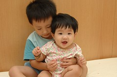
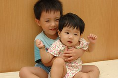

在我們家有一首"妹妹歌"  
阿徹跟徹爸常常開心時或心血來潮時便會哼起這首歌  
常一人起頭後另外兩個人便也跟著附和  
二個大人加一個３歲的小哥哥  
就這麼的對著我們家的妹唱著  
"阿妹 阿妹 阿妹 阿~妹阿妹 阿~妹 ..."

如果媽媽沒認錯的話  
我們的妹妹歌是改編自瑞奇馬汀的1998世足賽主題曲"生命之歌"  
故事的源頭好像是  
爸爸高興無聊時對著阿徹手舞足蹈的唱著"Go Go Go A LA A LA..."  
後來阿徹也跟著一起"A LA A LA..."  
後來又不知不覺變成現在的"阿妹 阿妹 阿妹 阿~妹阿妹 阿~妹 ..."  
還蠻好笑的  
但是每當我們三個人開心的對著我們家的妹唱著  
而小愛也聽的傻呼呼的笑著時  
就覺得好開心好得意　  
有種甜滋滋的感覺

常常跟阿徹說  
"妹妹是我們家的小寶貝喔 我們要保護她愛護她喔"  
雖然阿徹偶而很小氣　不讓妹碰他的玩具  
雖然阿徹偶而很調皮　把收納桶或是棉被蓋住妹  
但我相信也真覺阿徹是個好哥哥  
小愛應該是幸福的　有阿徹這個小哥哥～　

